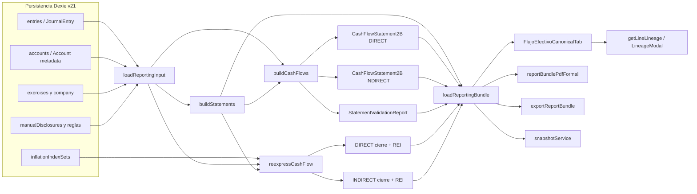
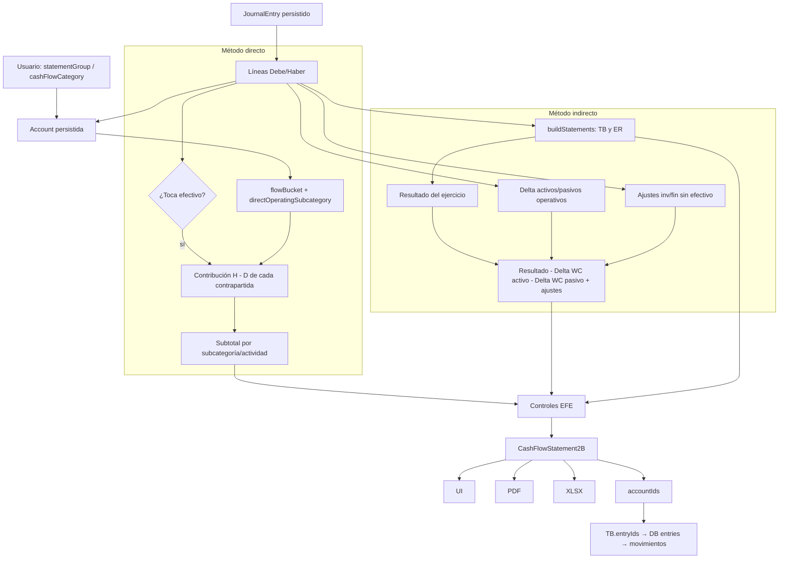

# Auditoría técnica, funcional, contable y de experiencia de usuario del Estado de Flujo de Efectivo

**ContaLivre — estado actual del HEAD auditado**  
**Fecha de corte:** 21 de julio de 2026  
**Carácter:** investigación y diagnóstico; no constituye implementación ni certificación profesional.

## 1. Resumen ejecutivo

**Dictamen:** ContaLivre está **parcialmente listo** para incorporar una experiencia de “papel de trabajo matricial”, pero **requiere cambios previos en el motor** y en el contrato de exportación. No se recomienda construir la matriz solamente en React ni derivarla del `CashFlowStatement2B` actual: faltan contribuciones por asiento/celda, fórmulas, saldos modificados, controles matriciales y una identidad histórica suficientemente fuerte.

El núcleo nominal tiene una base valiosa y verificable: `loadReportingBundle` coordina un único `ReportingInput`; `buildCashFlows` calcula directo e indirecto desde los mismos asientos, saldos de apertura y metadatos; opera en centavos; excluye borradores, cierre y apertura de los flujos; revela operaciones no monetarias; y ejecuta cuatro controles del EFE. La réplica temporal de Purmamarca produjo exactamente $10.000 de efectivo inicial, $4.000 de operación, $30.000 de inversión, $5.000 de financiación, $39.000 de variación y $49.000 de cierre por ambos métodos.

Ese resultado favorable no generaliza a todos los hechos contables. Se reprodujo una venta de bien de uso con valor contable $20.000, precio cobrado $30.000 y ganancia $10.000: el producto expuso $20.000 como inversión y $10.000 como operación, y aun así marcó todos los controles EFE como aprobados. La RT 54 TO RT 59 requiere presentar el cobro por venta del bien de uso dentro de inversión; este es un defecto contable real, no una preferencia visual.

También se comprobaron defectos relevantes en moneda de cierre y exportación: el indirecto reexpresado duplica un flujo sin clasificar en la variación; los bloqueos de reexpresión no gobiernan el estado global `VALIDATED`; PDF y XLSX omiten la línea REI aunque la variación neta la contiene; y la información comparativa del EFE no se construye. Los snapshots congelan solo el método directo nominal y el identificador de contenido no representa el contenido completo.

La interfaz de escritorio es clara, consistente con el bundle y útil para explorar directo, indirecto, nominal y cierre. El drilldown llega a cuentas, Mayor, asientos y operación de origen. No llega, sin embargo, a la fórmula ni a la contribución exacta que explica una cifra. En 390×844 se midió un recorte interno: la cabecera de actividad tiene `scrollWidth=370` con `clientWidth=310`; la prueba visual existente captura la pantalla, pero no afirma ausencia de clipping.

**Nivel de confianza: alto.** Se inspeccionaron fuentes, tipos, persistencia, exportadores y pruebas; se abrió y renderizó cada hoja de Purmamarca; se ejecutaron 423 pruebas unitarias/integradas, dos E2E en Chromium/Firefox, build, lint y cuatro pruebas diagnósticas efímeras; y se recorrió la UI local real en escritorio y móvil. La vigencia jurisdiccional provincial de la RT 54 TO RT 59 no fue investigada: el alcance normativo se limita a la baseline que el propio producto declara.

## 2. Alcance y exclusiones

Incluido:

- HEAD local, arquitectura, modelos, persistencia, cálculo nominal y reexpresado, UI, accesibilidad observable, mapeos, validación, snapshots, PDF, XLSX y pruebas;
- libro completo `Caso Purmamarca EFE.xlsx`, incluidas fórmulas, referencias, controles y render de sus siete hojas;
- RT 54 texto ordenado por RT 59 como marco principal e Informe 29 FACPCE como apoyo conceptual;
- pruebas temporales en memoria/entorno de test y datos RC exclusivamente en un perfil local del navegador.

Excluido:

- cambios de código, datos, esquema, migraciones o pruebas persistentes;
- diseño final de la futura interfaz y código definitivo;
- **NO VERIFICADO:** adopción y vigencia de la norma en una jurisdicción provincial concreta; requeriría definir jurisdicción, tipo de ente y fecha de ejercicio;
- certificación profesional de estados emitidos por usuarios reales;
- alteración o guardado del libro Purmamarca.

Convenciones del informe: **hecho** significa observado en código, archivo o ejecución; **inferencia** significa consecuencia razonada de esa evidencia; **recomendación preliminar** no es una decisión de implementación.

## 3. Identificación del repositorio auditado

| Dato | Valor verificado |
|---|---|
| Repositorio | `D:\Git\ContaLivre` |
| Rama | `refactor/fase-2f-release-candidate` |
| HEAD | `8984545765102a5f4d9b85c46234985dcdb7c7da` |
| Hora de identificación final | `2026-07-21 17:48:40 -03:00` |
| `package.json` | `0.4.0-rc.1` |
| Node esperado | `>=22 <23`; `.node-version` y `.nvmrc`: `22.23.1` |
| Node/npm ejecutados | Node `v25.9.0`; npm `11.12.1` |
| Divergencia de entorno | La auditoría se ejecutó fuera del rango Node declarado; no se cambió el entorno. Build y pruebas igualmente completaron. |
| Motor/esquema | `ACCOUNTING_ENGINE_VERSION = 2F.0`; `CURRENT_SCHEMA_VERSION = 21` en `src/accounting/migration/versions.ts` |
| Baseline declarada | `RT 54 (texto ordenado por RT 59) — alcance educativo comercial/servicios` |
| Estado inicial | limpio |

Estructura relevante: `src/accounting` contiene dominio, repositorios, ciclo de vida, inflación, taxonomía y migraciones; `src/reporting` contiene input, motor, tipos, notas, métricas, linaje y snapshots; `src/components/Estados` y `src/pages/Estados.tsx` presentan el bundle; `src/pdf` y `src/lib` exportan; `tests` reúne Vitest; `e2e` reúne Playwright; `docs/evidence/phase2f` conserva evidencia previa versionada.

Comandos disponibles en `package.json`: `npm run dev`, `npm run build`, `npm run lint`, `npm test`, `npm run e2e`, `npm run e2e:visual` y `npm run e2e:exports`.

Divergencias documentación/código verificadas:

- `src/accounting/capabilities.ts:22` declara “EFE en moneda de cierre pendiente”, pero `cashFlowInflation.ts`, el selector y la UI ya lo implementan.
- `docs/IMPLEMENTACION_FASE_2C_INTEGRACION_FINAL.md:17-31,238-246` afirma “una única cifra” y riesgos eliminados. El flujo principal sí comparte bundle, pero la auditoría halló omisiones de REI/disclosures, comparativo ausente y casos contables que validan cifras erróneas.
- `docs/IMPLEMENTACION_FASE_2F_RELEASE_CANDIDATE.md:73-74,222` presenta la UX como validada; la evidencia móvil es una captura sin aserción de legibilidad y el recorte fue medido en la ejecución actual.

## 4. Metodología utilizada

1. Inventario y búsquedas por `cashFlow`, `EFE`, métodos, moneda, reporting, trazabilidad, exportación, validación y mapeos.
2. Lectura de la cadena `loadReportingInput` → `buildStatements` → `buildCashFlows` → bundle → UI/PDF/XLSX.
3. Inspección de modelos, esquema Dexie v21, snapshots, versionado y tests.
4. Apertura de Purmamarca en modo solo lectura con `openpyxl`; apertura `ReadOnly=true` con Excel COM; exportación temporal de cada hoja y revisión visual. El libro nunca se guardó.
5. Contraste con RT 54 TO RT 59, párrafos específicos, y material auxiliar FACPCE.
6. Réplica Purmamarca mediante prueba Vitest efímera; tres pruebas adversas adicionales; eliminación posterior del archivo.
7. Suite focalizada y completa, build, lint y E2E multi-motor.
8. QA de la aplicación local en Chrome: dataset RC, ejercicio 2025, directo/indirecto, nominal/cierre, linaje, escritorio y viewport 390×844; inspección de DOM, medidas y consola.
9. Extracción y render de los PDF EFE existentes y lectura estructural del XLSX de evidencia.

No se usaron etiquetas visibles como prueba de cálculo: las conclusiones contables se basan en algoritmos, asientos, importes y controles ejecutados.

## 5. Marco contable y normativo

Fuentes consultadas:

- [RT 54 TO RT 59 reproducida por CPCECABA](https://archivo.consejo.org.ar/publicacionesedicon/CP-145.pdf), documento que contiene el texto ordenado utilizado para los párrafos citados.
- [FACPCE — aprobación de la RT 59](https://www.facpce.org.ar/facpce-aprobo-la-resolucion-tecnica-n59/), que explica que la RT 59 contiene el nuevo texto ordenado de la RT 54 y no introduce cambios sustanciales.
- [FACPCE — RT 54 original](https://www.facpce.org.ar/wp-content/uploads/2022/07/RT54.pdf), útil como contraste de numeración.
- [FACPCE/CECyT — Informe 29, Estado de Flujo de Efectivo](https://www.facpce.org.ar/pdf/cecyt/contabilidad-29.pdf), material auxiliar, no sustituto de la norma vigente.

| Fuente | Exigencia/permiso relevante | Evaluación actual |
|---|---|---|
| RT 54 TO RT 59, párr. 55-56 | Estado sintético, notas relevantes y flexibilidad de denominación/agrupación | La exposición nominal es sintética; las disclosures no monetarias quedan solo en UI y no en PDF/XLSX. |
| Párr. 58-59 | Al menos dos columnas; para ejercicio completo, comparativo precedente; para intermedio, período equivalente | ESP/ER/EEPN tienen comparativo; EFE no lo calcula. Incumplimiento de presentación formal si se emite como juego comparativo. |
| Párr. 649 | Efectivo; exclusión de fondos restringidos; equivalentes líquidos, convertibles, riesgo insignificante y plazo corto —ej., ≤3 meses desde adquisición— | El motor acepta todo `CASH_AND_BANKS` o override `CASH_EQUIVALENT`; no modela restricción, propósito, riesgo ni vencimiento. |
| Párr. 650-651 | Inicio, variación y cierre; causas operativas, inversión, financiación y, cuando corresponda, RFyT de efectivo | Nominal cubre inicio/variación/cierre y tres actividades. No hay línea formal separada de modificación de inicio; RFyT nominal no se identifica como componente separado. |
| Párr. 652-655 | Directo o indirecto; directo con clases brutas; indirecto desde resultado y ajustes | Ambos existen. Directo usa contrapartidas de asientos con efectivo; indirecto usa resultado, variaciones y partidas no monetarias. |
| Párr. 656-657 | Compra/venta de PPE, intangibles, inversiones no equivalentes y préstamos otorgados como inversión | Clasificación estructural existe; la venta con ganancia usa valor contable de la contrapartida PPE, no el cobro bruto. |
| Párr. 658 | Aportes, préstamos y reembolsos como financiación | Soportado estructuralmente; leasing no tiene tratamiento de primera clase. |
| Párr. 659-661 | Conciliación de flujos con variación mediante RFyT/RECPAM del efectivo; opciones simplificadas | REI se calcula en moneda de cierre y se ve en UI; se omite en exportación formal. No hay política explícita para opción 661. |
| Párr. 662-665 | Intereses/dividendos e impuesto separados y clasificación consistente; opciones operativa/financiación/inversión; IG operativo salvo asociación específica | El producto fija reglas por `statementGroup`; no registra política persistida ni clasificación por transacción. |
| Párr. 196 | Cobros/pagos a moneda de cierre por coeficiente de su fecha e incorporación del resultado por poder adquisitivo del efectivo | El algoritmo reexpresa por mes y calcula REI; la trazabilidad no conserva el coeficiente aplicado y los bloqueos no gobiernan publicación global. |
| Párr. 197 | Comparativos en moneda de cierre actual | No implementado para EFE. |

Clasificación de decisiones: la elección de directo/indirecto es normativa permitida; las etiquetas y modo resumen/detalle son pedagógicos; considerar todo `CASH_AND_BANKS` efectivo es una política del producto insuficientemente modelada; un futuro DTO matricial es una recomendación técnica.

## 6. Análisis del Excel Purmamarca

Archivo: `C:\Users\gonza\Downloads\Caso Purmamarca EFE.xlsx`; SHA-256 `277889BA2EE9DEFA70E18252B5027493EE65E27739997C94F53726CA4431A603`. Siete hojas visibles, sin nombres definidos y sin errores de fórmula cacheados.

| Hoja | Dimensión / fórmulas | Función |
|---|---:|---|
| `01 Enunciado` | `A1:F52`; 22 fórmulas | Saldos inicial/final, ER, anexo de costo y notas del caso. Control patrimonial cero. |
| `02 Planilla Indirecto` | `A1:L28`; 65 fórmulas | Papel de trabajo de variaciones e imputaciones por causa; control por fila y total. |
| `03 EFE Ind.` | `A1:B43`; 16 fórmulas | Exposición limpia del método indirecto. |
| `04 Planilla Directo` | `A1:J34`; 68 fórmulas | Papel de trabajo que convierte devengado/saldos en cobros y pagos. |
| `05 EFE Directo` | `A1:C45`; 13 fórmulas | Exposición limpia del método directo. |
| `Dev. A Perc. directo` | `A1:J26`; 60 fórmulas | Escenario pedagógico directo sin variaciones de capital de trabajo: devengado = percibido. |
| `Dev igual a percibido` | `A1:L25`; 55 fórmulas | Escenario indirecto equivalente; resultado $15.000 y ajustes de capital de trabajo nulos. |

### Matriz indirecta

Las filas son cuentas patrimoniales y el resultado; las columnas B/C contienen saldos inicial/final, D la variación, E:J causas, K total imputado y L control. Activos se expresan con débito positivo; pasivos y patrimonio con crédito negativo. Por eso el aumento de proveedores y el aporte aparecen como variaciones negativas en la matriz, aunque al exponerlos se invierte el signo y se muestran como fuentes positivas.

Fórmula conceptual por fila:

`D = saldo final con signo matricial − saldo inicial con signo matricial`  
`K = Σ imputaciones E:J`  
`L = D − K`

Los controles L son cero. La fila total también cierra: variaciones D suman cero; E:J asignan resultado `−15.000`, créditos `+3.000`, inventario `+10.000`, baja PPE `−30.000`, proveedores `−2.000`, aportes `−5.000`; K total `−39.000`. La exposición transforma signos: resultado `+15.000`, aumento de créditos `−3.000`, aumento de inventarios `−10.000`, aumento de proveedores `+2.000`, operación `+4.000`, inversión `+30.000`, financiación `+5.000`.

### Matriz directa

Las filas conservan saldo/variación y las columnas E:H asignan cobros de ventas, pagos de compras, venta de PPE y aportes; I total imputado y J control. El puente devengado-percibido está explícito:

- ventas $35.000 − aumento de créditos $3.000 = cobros $32.000 (`G22=F22-D5` en el puente);
- CMV $20.000 + existencia final $10.000 − existencia inicial $0 = compras $30.000 (`E32:E34`);
- compras $30.000 − aumento de proveedores $2.000 = pagos $28.000.

La fila total matricial contiene `−32.000`, `+28.000`, `−30.000`, `−5.000`, total `−39.000` y control cero; la exposición invierte los signos correspondientes para presentar cobros positivos y pagos negativos.

### Exposición versus preparación

`03 EFE Ind.` y `05 EFE Directo` no reproducen la matriz: muestran saldo inicial $10.000, cierre $49.000, variación $39.000 y causas agrupadas. El proceso de preparación distribuye cada variación; la conciliación prueba igualdad; el control detecta residuos; la exposición presenta solo información contable relevante. Esta separación es el patrón conceptual correcto para ContaLivre: futura matriz y estado formal deben ser dos consumidores distintos de una misma evidencia de cálculo.

## 7. Arquitectura actual del EFE



Fuente de verdad actual: **combinación canónica de asientos no borrador, saldos de apertura explícitos/formales y metadatos actuales de las cuentas**, cargada por `loadReportingInput`. El método directo examina asientos que tocan efectivo; el indirecto usa el resultado construido por `buildStatements`, variaciones de capital de trabajo derivadas de los mismos asientos y ajustes no monetarios. El balance de sumas y saldos se usa para el cierre y controles, no como única fuente de clasificación.

No hay recálculo contable en React. PDF y XLSX eligen un objeto nominal/reexpresado del bundle y lo aplanan. Esa lógica de selección/exposición está duplicada entre exportadores, y ambos descartan campos del modelo.

## 8. Inventario de archivos y símbolos

| Archivo | Símbolo o componente | Responsabilidad | Entradas | Salidas | Consumidores |
|---|---|---|---|---|---|
| `src/core/models.ts` | `Account`, `JournalEntry` | Hecho contable y metadata EFE | usuario/seed/importación | registros persistibles | reporting, mapping, UI |
| `src/storage/db.ts` | `ContaLivreDB`, schema 21 | Persistencia Dexie | modelos | tablas/índices | repositorios, reporting |
| `src/accounting/reporting/reportingContext.ts` | `getEntriesForContext`, `getOpeningBalances` | Período, empresa y apertura | DB, fechas | asientos/apertura | `loadReportingInput` |
| `src/reporting/loadStatements.ts` | `loadReportingInput`, `loadStatementsForYear` | Construye input; ruta alternativa de orquestación | contexto/DB | `ReportingInput`/bundle parcial | tests y reporting |
| `src/reporting/domain/types.ts` | `ReportingInput`, `ReportLine`, `CashFlowStatement2B` | Contrato calculado | motor | DTOs | UI/export/lineage |
| `src/reporting/engine/buildStatements.ts` | `buildStatements` | TB, ESP, ER, EEPN y anexos | input | `StatementsBundle` | cash flow/bundle |
| `src/reporting/engine/buildCashFlow.ts` | `isCashAccount` | Política efectiva de efectivo | Account | boolean | motor/notas/selectores |
| mismo | `flowBucket` | Clasifica CASH/RESULT/WC/INV/FIN/UNCLASSIFIED | Account | bucket | directo/indirecto/reexpresión |
| mismo | `directOperatingSubcategory` | Etiqueta cobro/pago por grupo | Account | subcategoría | nominal/reexpresión |
| mismo | `buildCashFlows` | Calcula ambos métodos y controles | input + statements | 2 EFE + validation | bundle/UI/export |
| `src/reporting/engine/cashFlowInflation.ts` | `reexpressCashFlow` | Reexpresa flujos por mes y calcula REI | input, bundle, índices | 2 EFE cierre + blockers | bundle/UI/export |
| `src/accounting/inflation/indexRegistry.ts` | registro/set/hash | Índices persistidos | DB/importación | mapa verificado | bundle |
| `src/reporting/loadReportingBundle.ts` | `loadReportingBundle` | Orquestador canónico | año/opciones | `ReportingBundle` | Estados/export/snapshot |
| `src/reporting/engine/buildNotes.ts` | nota de efectivo | Composición y conciliación | statements/cuentas | `NoteSection` | UI/PDF/XLSX |
| `src/reporting/selectors.ts` | selectores de efectivo | Reutiliza criterio cash | bundle | importes | notas/análisis |
| `src/reporting/metrics/metrics.ts` | CFO ratios | Indicadores con EFE directo | bundle | métricas | dashboard/Estados |
| `src/reporting/lineage.ts` | `getLineLineage` | Cuenta → movimientos → asiento/origen | `accountIds`, TB, DB | `LineLineage` | modal |
| `src/reporting/snapshots/snapshotService.ts` | `createSnapshot` | Congela parte del bundle | bundle | `ReportSnapshot` | Estados |
| `src/accounting/taxonomy/mappingAssistant.ts` | `analyzeMappings`, `saveMapping` | Diagnóstico/edición metadata | cuentas/TB | issues/mapping | Configuración |
| `src/components/Configuracion/panels/MapeosPanel.tsx` | `AccountMappingRow` | Editor de grupo/categoría | Account | saveMapping | usuario |
| `src/pages/Estados.tsx` | `Estados` | Carga única, período, comparativo, índice, snapshot/export | UI state | bundle a pestañas | usuario |
| `src/components/Estados/canonical/FlujoEfectivoCanonicalTab.tsx` | `FlujoEfectivoCanonicalTab` | Presenta toggles, ecuación, tarjetas y disclosures | bundle | DOM | usuario |
| mismo | `ActivityCard`, `FlowRow` | Acordeón/drilldown | `ReportLine` | DOM/interacción | usuario |
| `src/components/Estados/canonical/LineageModal.tsx` | `LineageModal` | Tabla de movimientos | line/accountIds | diálogo | usuario |
| `src/components/Estados/canonical/ValidationBanner.tsx` | `ValidationBanner` | Controles nominales | validation | alerta/chip | usuario |
| `src/components/Estados/canonical/InflationSetSelector.tsx` | selector de set | Identidad/cobertura | bundle/opción | selección | Estados |
| `src/components/Estados/ExportEstadosModal.tsx` | modal exportación | Opciones formato/método/moneda | bundle | invoca exportador | usuario |
| `src/lib/exportOptions.ts` | `ExportEstadosOptions` | Contrato de selección | UI | opciones | PDF/XLSX |
| `src/lib/exportReportBundle.ts` | `buildSelectedReportSheets` | Aplana bundle a hojas | bundle/opciones | matrices de valores | ExcelJS |
| `src/pdf/reportBundlePdfFormal.ts` | `efeStatements`, `buildSections` | Aplana EFE a sección formal | bundle/opciones | jsPDF | descarga PDF |
| `src/accounting/migration/versions.ts` | versiones | Motor/esquema/baseline | constantes | metadata | bundle/export |
| `src/accounting/capabilities.ts` | capability `efe` | Declaración visible de alcance | constante | estado PARTIAL | Acerca de |
| `tests/reporting/cashFlow2e.test.ts` | 6 tests | Detalle directo/indirecto e invariantes | fixture puro | assertions | CI |
| `tests/accounting/reporting-engine.test.ts` | golden 2B | Integración Diario→estados/EFE | IndexedDB test | assertions | CI |
| `tests/reporting/inflationSet2f.test.ts` | 3 tests | Identidad/cobertura de set | RC fixture | assertions | CI |
| `tests/reporting/export2e.test.ts` | 7 tests | Hojas desde bundle | RC fixture | assertions | CI |
| `tests/accounting/consistencia-export.test.ts` | 6 tests | Igualdad de cifras nominales | bundle | assertions | CI |
| `e2e/visual-acceptance.spec.ts` | EFE visual | Recorrido/capturas escritorio | app RC | PNG/assertions | evidencia |
| `e2e/mobile.spec.ts` | EFE móvil | Captura 390×844 | app RC | PNG | evidencia |
| `e2e/exports.spec.ts` | export real | Descargas PDF/XLSX | app RC | artefactos | evidencia |

No se halló migración que asigne o versione específicamente `cashFlowCategory`; schema 21 conserva los campos como metadata de cuenta. `cashFlowSubcategory`, `validFrom` y `validTo` existen en el tipo, pero no participan del cálculo EFE.

Tampoco existe un repositorio ni hook específico del EFE: la lectura usa los repositorios/DB contables generales y la pantalla carga el bundle desde un efecto en `Estados.tsx`. Esta ausencia no es un defecto por sí misma; confirma que el módulo es una proyección del Diario y no un subsistema persistido paralelo.

## 9. Linaje completo de datos



Datos persistidos: asiento, líneas, cuenta y mapping. Datos calculados: TB, resultado, deltas, buckets, contribuciones y subtotales. Datos configurables: `statementGroup` y `cashFlowCategory`. Datos solo de presentación: etiquetas, porcentajes y acordeones. Controles: `efe-variacion`, `efe-esp`, `efe-metodos`, `efe-clasificacion`. Resultados exportados: valores aplanados.

Pérdida de información: `buildCashFlows` conoce `entry`, `cashCents`, bucket y contribución exacta en `buildCashFlow.ts:167-229`, pero conserva solo suma y `accountIds`. `ReportLine` no contiene fórmula, coeficiente, `entryIds`, contribuciones por línea, saldos de puente ni controles por celda. `getLineLineage` (`lineage.ts:41-88`) recupera **todos** los movimientos del período de las cuentas asociadas mediante el TB; no recupera “los movimientos que forman esta cifra”. Por eso la UI puede llegar al asiento, pero no demostrar la fórmula de cada importe.

## 10. Funcionamiento del método directo

Responsable: `buildCashFlows` en `src/reporting/engine/buildCashFlow.ts:117-310`.

Algoritmo actual:

1. Excluye `DRAFT`, asientos estructurales de cierre y aperturas (`:120-124`).
2. Detecta si el asiento toca efectivo y calcula el delta de sus líneas cash (`:167-176`).
3. Para cada contrapartida no cash calcula `contribution = Haber − Debe` en centavos (`:195-203`).
4. `flowBucket` decide operación, inversión, financiación o sin clasificar; las contrapartidas operativas se agrupan por `directOperatingSubcategory` (`:204-229`).
5. Construye children reales solamente si tienen datos; inversión/financiación conservan detalle por cuenta.

Consecuencias:

- Cobro de cliente: crédito a Deudores produce contribución positiva; pago a proveedor: débito a Proveedores produce negativa.
- El motor no transforma algebraicamente ventas/CMV/saldos para el directo: usa movimientos reales de caja/bancos. Purmamarca llega al mismo resultado porque sus asientos de cobro/pago representan los puentes de la planilla.
- IVA, notas de crédito, anticipos e incobrables no tienen reglas EFE propias: su clasificación depende de las cuentas contrapartida y de cómo se registró la operación. Una nota sin efectivo queda fuera del directo; un reembolso con efectivo entra por la cuenta utilizada.
- Un asiento mixto se divide línea por línea. Eso funciona aritméticamente, pero no siempre representa el flujo bruto de la transacción.

Defecto confirmado: en una venta de PPE `Caja 30.000 / Bien de uso 20.000 / Ganancia 10.000`, la contribución PPE genera inversión $20.000 y la ganancia, por ser `INCOME`, operación $10.000. El flujo cobrado de inversión debió ser $30.000. `efe-metodos` pasa porque el indirecto también conserva $10.000 en operación. No existe prueba de resultado por venta de activo en la suite persistida.

| Concepto directo | Regla actual | Cobertura | Limitación/riesgo |
|---|---|---|---|
| Cobros de clientes | Contrapartida `TRADE_RECEIVABLES` o `SALES` | `cashFlow2e`, golden RC | Correcto si asiento separa cobro; no guarda puente devengado→percibido. |
| Proveedores/compras | `TRADE_PAYABLES`, `INVENTORIES`, `COGS` | `cashFlow2e`, golden | Agrupa IVA/anticipos según cuenta; no explica Compras = CMV + Δinventario. |
| Personal | `PAYROLL_LIABILITIES` | golden RC | Gasto directo contra caja con otro grupo puede caer en otra etiqueta. |
| Impuesto a ganancias | `INCOME_TAX` | cobertura nominal parcial | Clasificación fija operativa; no permite asociación específica. |
| Intereses | `FINANCIAL_*` | `cashFlow2e` | Política fija operativa; override por cuenta cambia bucket, pero no política explícita/consistente. |
| PPE/inversiones | `PPE`, `INTANGIBLES`, `INVESTMENTS` | compra contado y crédito | Venta con ganancia/pérdida clasifica valor contable, no cobro bruto. |
| Financiación | equity/`LOANS`, capital, reservas, RNA | golden | Capitalizaciones sin cash se revelan; leasing/dividendos no tienen tratamiento específico. |
| Sin clasificar | bucket residual | `reporting-engine` | Bloquea nominal; en cierre existe defecto de doble conteo indirecto. |

## 11. Funcionamiento del método indirecto

Responsable: `buildCashFlows`, especialmente `buildCashFlow.ts:156-193,231-253,313-350`.

Fórmula nominal exacta en centavos:

`CFO indirecto = resultado neto − Δ activos operativos − Δ pasivos operativos + ajuste no cash inv/fin + flujo sin clasificar`

En las cuentas pasivas, `netDC = Debe − Haber`; un aumento acreedor es negativo y `−Δ pasivo` lo suma. Para activos, un aumento deudor es positivo y se resta. `resultCents` es `incomeStatement.netIncome`, por lo que es resultado después de impuesto conforme al modelo del ER.

Las partidas no monetarias se obtienen de asientos sin efectivo: suma `netDC` de buckets inversión/financiación y luego aplica `adjustmentsCents = −nonCashInvFinCents`. Esto cubre depreciación acreditada a amortización acumulada y altas PPE a crédito, pero también mezcla transferencias entre cuentas estructurales de inversión/financiación; la lista de detalle puede resultar poco intuitiva, como muestra el PDF RC con Rodados, Préstamos, Ajuste de capital, RNA, amortización y reserva bajo un mismo rótulo.

Tratamientos observados:

- depreciación/amortización: se ajusta si la contrapartida estructural está en inversión;
- resultado por venta de activos: no se elimina explícitamente como resultado y no se reincorpora el precio bruto; hereda el defecto directo;
- resultados financieros/diferencias de cambio/RECPAM: integran resultado operativo indirecto salvo que otra contrapartida estructural genere ajuste; no hay política fina;
- impuesto a las ganancias: integra resultado base; pagos se capturan en el directo; cambios en `INCOME_TAX` no son pasivo operativo salvo cuenta `TAX_LIABILITIES`;
- partidas no monetarias: disclosure nominal con fecha/memo/importe absoluto y cuentas; no se exporta formalmente.

Directo e indirecto nacen del mismo input y comparten inversión/financiación por referencia (`:344-346`). Su igualdad operativa se **verifica** en `efe-metodos`; no se fuerza. La prueba adversa demuestra que igualdad matemática no equivale a clasificación normativa correcta.

## 12. Determinación del efectivo y equivalentes

`isCashAccount` (`buildCashFlow.ts:54-58`) incluye una cuenta si `cashFlowCategory === CASH_EQUIVALENT` o `statementGroup === CASH_AND_BANKS`. Se reutiliza en apertura, cierre, notas y selectores.

Efectivo inicial:

- suma `input.openingBalances` débito menos crédito de cuentas cash (`:126-132`);
- agrega líneas cash del asiento formal de apertura (`:133-143`);
- `reportingContext.ts:88-108` usa movimientos anteriores cuando no existe apertura formal.

Efectivo final: cierre del trial balance de esas mismas cuentas. No se deriva de apertura + flujo para ocultar diferencias; se compara con esa identidad.

Brechas:

- no se modelan restricción de uso, propósito, plazo residual/original, convertibilidad, volatilidad ni riesgo;
- cualquier cuenta `CASH_AND_BANKS` entra automáticamente; el seed incluye conceptos que merecen evaluación caso por caso;
- saldos bancarios acreedores permanecen dentro del neto cash por su cuenta de activo; un adelanto bancario separado como `LOANS` se trata como financiación. No existe política explícita de sobregiros a la vista;
- no existe una línea de “modificación de ejercicios anteriores” ni “efectivo inicial modificado” en `CashFlowStatement2B` (`domain/types.ts:378-389`). Un AREA aparece en el RC como transacción no monetaria, no como puente formal de apertura;
- opening/closing `ReportLine` carecen de `accountIds`, por lo que no abren linaje útil.

## 13. Clasificación por actividades

Orden de precedencia de `flowBucket` (`buildCashFlow.ts:60-78`): inexistente→unclassified; cash; override explícito INV/FIN/OPER; resultados; equity; grupos WC; grupos inversión; grupos financiación; residual unclassified.

| Concepto | Fuente actual | Regla | Editable | Validación | Riesgo |
|---|---|---|---|---|---|
| Efectivo | `Account` | `CASH_AND_BANKS` o `CASH_EQUIVALENT` | Sí | cierre EFE=ESP | Criterio normativo incompleto. |
| Crédito operativo | `statementGroup` | `TRADE_RECEIVABLES`, `OTHER_RECEIVABLES`, `TAX_CREDITS` | Sí | mapping general | Cuenta multipropósito. |
| Bienes de cambio | `statementGroup` | `INVENTORIES` | Sí | mapping | No guarda puente CMV/compras. |
| Deudas operativas | grupo | trade/tax/payroll/other/deferred | Sí | mapping | IG/intereses requieren política/identificación. |
| PPE/intangibles | grupo | inversión | Sí | EFE classification | Venta con resultado falla. |
| Inversiones | grupo u override | inversión, salvo equivalente | Sí | EFE classification | Falta vencimiento/riesgo para equivalente. |
| Préstamos | grupo | financiación | Sí | EFE classification | Interés se separa solo por cuenta resultado. |
| Aportes/equity | kind/grupo | financiación | Sí | EFE classification | Movimientos internos no cash se revelan. |
| Resultados | kind | `RESULT`, luego subcategoría por grupo | Sí | métodos | Política rígida; ganancia PPE queda operativa. |
| Sin mapping | ausencia | `UNCLASSIFIED` | Sí | bloquea si importe ≠0 | `NO_CASHFLOW_CATEGORY` no integra `blockingCount` del asistente. |

`NOT_APPLICABLE` no tiene rama en `flowBucket`: una cuenta PPE marcada así sigue siendo inversión. `cashFlowSubcategory` no se consulta. `validFrom/validTo` no se aplican; un cambio actual de mapping reclasifica períodos históricos en recálculo. No existe configuración EFE por empresa/ejercicio ni detección de mapeo doble porque el modelo guarda un único valor por cuenta.

## 14. Signos y controles

El motor convierte cada importe a centavos con `toCents`; agrega enteros y vuelve a unidad monetaria. Los checks usan igualdad exacta, sin tolerancia. Esto es apropiado para el modelo de centavos y evita ocultar diferencias.

| Control | Fórmula | Alcance | Insuficiencia |
|---|---|---|---|
| `efe-variacion` | cierre − inicio = variación directa | Total nominal | No prueba clasificación bruta. |
| `efe-esp` | cash del TB = cierre EFE | Saldos | Comparte la misma política cash; no valida definición normativa. |
| `efe-metodos` | CFO directo = CFO indirecto | Operación nominal | Puede pasar con clasificación simétricamente errónea. |
| `efe-clasificacion` | unclassified = 0 | Nominal | No prueba cuenta marcada `NOT_APPLICABLE`, políticas o transacciones mixtas. |
| blockers cierre | índices completos, unclassified=0, métodos iguales | Reexpresión | No se incorporan a `statements.validation.canPublish` ni `metadata.status`. |

La UI calcula porcentajes como participación sobre el valor absoluto de la variación; puede mostrar porcentajes negativos o superiores al 100 %. Es una decisión pedagógica válida si se explica, no una validación.

La ecuación nominal muestra operación + inversión + financiación + sin clasificar = variación. En el indirecto nominal, `operating` ya incorpora el sin clasificar, mientras `netChange` lo excluye como componente adicional; la ecuación visual agrega ambos y quedaría inconsistente durante un estado bloqueado. En cierre, `cashFlowInflation.ts:190,205` lo incorpora en operación **y nuevamente en netChange**: defecto confirmado con `−300` directo versus `−600` indirecto.

## 15. Configuración y mapeos

`Account` expone `statementGroup`, `kind`, `cashFlowCategory`, `cashFlowSubcategory`, vigencia y otros campos. `MapeosPanel.tsx:29,86` permite editar categoría OPERATING/INVESTING/FINANCING/CASH_EQUIVALENT/NOT_APPLICABLE, pero no subcategoría, política, fecha ni clasificación por transacción.

Escenarios:

- **cuenta no mapeada:** queda unclassified si no deriva estructuralmente; `efe-clasificacion` bloquea nominal;
- **cuenta mapeada dos veces:** no representable en el campo singular; una operación que requiera dos destinos necesita líneas/cuentas separadas;
- **cambio de clasificación:** afecta recálculos históricos porque se usa el `Account` actual y no una versión vigente a fecha;
- **saldo con signo inesperado:** entra algebraicamente; no hay validación EFE específica de naturaleza/signo;
- **cuenta nueva:** puede derivarse por grupo o quedar unclassified; el asistente avisa, pero su `blockingCount` no incluye `NO_CASHFLOW_CATEGORY` (`mappingAssistant.ts:120-123`);
- **operación mixta:** se distribuye por línea; no guarda la unidad transaccional ni regla aplicada;
- **no monetaria:** no integra directo; si toca inversión/financiación alimenta ajuste y disclosure;
- **`NOT_APPLICABLE`:** no excluye la cuenta estructural, reproducido con PPE de $1.000 que continuó como inversión.

## 16. Vista actual

Ruta real: `/estados`, pestaña “Flujo de Efectivo”. `Estados.tsx:74` ejecuta `loadReportingBundle(year,{withComparative,inflationIndexSetId})`; `FlujoEfectivoCanonicalTab` recibe el objeto y no recalcula importes.

| Elemento | Resultado observado |
|---|---|
| Método | Directo/Indirecto con `aria-pressed`; correcto. |
| Expresión | Nominal/cierre; cierre deshabilitado sin set; correcto. |
| Modo | Resumen/detalle; correcto. |
| Estado | Chip nominal “Estados conciliados”; blockers cierre en alerta separada. El badge `Validado` no cambia por blockers. |
| Resumen | Inicio, variación y cierre; legible. |
| Ecuación | Operación/inversión/financiación/REI; útil, con problema unclassified indicado en §14. |
| Acordeones | Actividades y líneas por cuenta; correcto en escritorio. |
| Transacciones no cash | Visibles nominalmente; al activar cierre se reemplazan por REI. |
| Comparativo | Checkbox existe; el EFE no recibe cifras anteriores. |
| Linaje | Modal con cuenta, asiento, fecha, memo y origen; no fórmula/contribución. |
| Exportación/snapshot/técnicos | Accesibles desde barra común. |
| Vacío | Mensaje “El EFE no está disponible para este contexto”. |
| Configuración faltante | Banner nominal o alerta cierre según caso. |

QA local RC 2025 en escritorio verificó: inicio $1.180.000; operación $56.000; inversión −$100.000; financiación $220.000; variación $176.000; cierre $1.356.000. El indirecto mostró resultado $32.000, ajustes $44.000, activos operativos −$320.000 y pasivos +$300.000. En cierre: inicio reexpresado $2.018.135,75; flujos 145.710,22/−140.707,32/382.771,40; REI −$1.049.910,05; variación −$662.135,75.

Accesibilidad: toggles y tarjetas son botones o grupos accesibles; `FlowRow` admite Enter/Espacio; hay estilos `focus-visible` y reduced motion. `LineageModal` declara `role=dialog`, `aria-modal` y Escape (`LineageModal.tsx:36-50`), pero no trampa foco, no establece foco inicial y no restaura foco al cerrar. La tabla no tiene contenedor responsive propio.

Responsive: en 390×844 la estructura general se apila, pero `.efe-card-meta` tiene `flex-shrink:0` sin media query (`FlujoEfectivoCanonicalTab.tsx:379-388`). Medición real: botón actividad `clientWidth=310`, `scrollWidth=370`; su segundo bloque termina en x=403 mientras la tarjeta termina en x=342. El porcentaje/importe queda recortado. `e2e/mobile.spec.ts` solo captura, no mide overflow ni legibilidad.

## 17. Exportación actual

PDF y XLSX se alimentan del mismo `ReportingBundle` y no recalculan importes. Sí existe lógica de producto en exportadores: selección de método, nominal/cierre, contenido, comparativo y aplanado. No hay fórmulas contables nuevas, pero el aplanado decide qué evidencia se pierde.

`buildSelectedReportSheets` (`exportReportBundle.ts:332-342`) y `buildSections` (`reportBundlePdfFormal.ts:94-100`) incluyen apertura, operación, inversión, financiación, unclassified, variación y cierre. **No incluyen `nonMonetaryDisclosures`**, donde están operaciones no monetarias y REI.

Respuestas directas:

1. Vista/exportación pueden divergir: sí, por omisión de disclosures/REI y comparativo.
2. React contiene composición visual y porcentajes, no cálculo contable base.
3. Exportadores contienen selección/exposición, no recomputación, pero su omisión cambia la comprensibilidad/conciliación formal.
4. PDF/XLSX parten del mismo bundle, con implementaciones paralelas de flatten.
5. Directo/indirecto llega a ambos; “Ambos” genera dos secciones/hojas.
6. La exportación formal debe permanecer separada del futuro papel de trabajo.
7. El riesgo de contaminación existe si matriz y estado comparten una lista genérica de `ReportLine`; conviene contratos/presentadores explícitos.

Evidencia existente del 20/07/2026:

| Artefacto | SHA-256 | Observación |
|---|---|---|
| `efe-directo.pdf` | `BC70718D...772A658` | 1 página, nominal, sin comparativo, cifras RC correctas; no muestra transacciones no cash. |
| `efe-indirecto.pdf` | `CE24CFEB...EB8DC57` | 1 página, detalle completo; legible; sin disclosures. |
| `planilla-completa.xlsx` | `A315969D...524AD8C` | Hojas `EFE directo` 17×2 y `EFE indirecto` 27×2; valores, sin fórmulas, comparativo ni disclosures. |

Hallazgo crítico de cierre: `netChange` incluye REI (`cashFlowInflation.ts:163-185`) y la UI lo muestra, pero PDF/XLSX no imprimen esa línea. Por tanto, operación + inversión + financiación no suma la variación exportada. Además, `efeStatements`/XLSX usan el objeto reexpresado aun con blockers y el pie formal toma `metadata.status`, que ignora esos blockers.

## 18. Moneda nominal, moneda de cierre e inflación

`reexpressCashFlow` recorre cada asiento, toma período `YYYY-MM`, obtiene coeficiente cierre/origen y redondea cada contribución a centavos. La apertura se reexpresa por período inicial; el cierre queda nominal por ser moneda de cierre; REI es:

`REI = efectivo final − (efectivo inicial reexpresado + Σ flujos reexpresados)`

La variación de cierre es `Σ flujos + REI`. Esto coincide conceptualmente con RT 54 párr. 196 y 659-661.

Brechas verificadas:

- si falta índice, calcula provisionalmente con factor 1 y agrega blocker; el objeto sigue disponible;
- los blockers no modifican status/publicabilidad global (`loadReportingBundle.ts:199-208`);
- inversión/financiación reexpresadas pierden detalle por cuenta;
- `nonMonetaryDisclosures` reexpresado contiene solo REI, descartando disclosures nominales;
- linaje conserva movimientos nominales, no coeficiente, índice, fórmula ni importe reexpresado por contribución;
- indirecto reexpresado duplica unclassified en `:190` y `:205`;
- no existe EFE comparativo reexpresado conforme párr. 197;
- el selector usa un mismo set para EFE y bienes de uso, aspecto positivo de consistencia.

RECPAM: el motor lo trata como cuenta de resultado nominal según mapping y calcula por separado el REI del efectivo en cierre. La UI denomina este último “Resultado por exposición a la inflación del efectivo (REI)”. No hay política persistida que documente la opción de presentación del párr. 661.

## 19. Validación y conciliación

Fortalezas: centavos exactos; cuatro checks nominales; cuenta desconocida y otros invariantes heredados del `StatementsBundle`; unclassified no se omite; directo e indirecto se comparan.

Insuficiencias materiales:

- no valida cobro bruto en ventas de activos;
- no valida políticas de efectivo/equivalentes ni consistencia temporal de intereses/dividendos;
- `efe-metodos` compara solo CFO;
- no valida suma visual de componentes con unclassified;
- no valida que disclosures/REI estén en exportación;
- no valida comparativo EFE;
- bloqueos cierre no son una puerta de publicación/snapshot/export;
- mapping cambiado no invalida automáticamente snapshots;
- `reportVersion` hashea solo contexto, activo, PN, resultado y cantidad de asientos (`loadReportingBundle.ts:202-208`): dos contenidos EFE distintos pueden compartir versión.

Snapshots: `createSnapshot` usa validación nominal y guarda ESP, ER, EEPN, `cashFlowDirect` y validation (`snapshotService.ts:21-47`). Omite indirecto, cierre, blockers, índices efectivos y comparativo material. `indexSetId` se guarda como metadata, no congela sus valores dentro del JSON.

## 20. Pruebas existentes

| Requisito | Prueba existente | Nivel | Resultado actual | Suficiente | Falta |
|---|---|---|---|---|---|
| Inicio/cierre/variación | `reporting-engine`, `cashFlow2e` | integración/unidad | pasa | Parcial | modificación de inicio, sobregiro, equivalentes restringidos. |
| Directo/indirecto/igualdad | mismos | integración | pasa | Parcial | igualdad no detecta clasificación común errónea. |
| Operación/WC | `cashFlow2e` | unidad | pasa | Buena básica | IVA, anticipos, NC, incobrables, políticas. |
| Inversión/financiación | `cashFlow2e`, golden RC | unidad/integración | pasa | Parcial | venta con ganancia/pérdida, préstamo otorgado, leasing/dividendos. |
| No monetarias | `reporting-engine`, RC | integración | pasa | Parcial | preservación en cierre/export/snapshot. |
| PPE compra/venta | compra contado/crédito | integración | pasa | No | venta con resultado y cobro bruto. |
| Aportes/préstamos | golden | integración | pasa | Básica | rescates, cuotas leasing, mixed entry. |
| Signos/centavos | money model + goldens | unidad | pasa | Buena aritmética | signo económico anómalo por bucket. |
| Nominal/cierre/inflación | `inflationSet2f` | integración | pasa | No | valores EFE exactos, unclassified doble, blockers globales, REI exportado. |
| PDF/XLSX | `export2e`, consistencia, E2E exports | unidad/E2E | nominal pasa | No | comparativo EFE, disclosures, REI, blocker. |
| Draft/validated | reporting/snapshot/visual | integración/E2E | pasa nominal | Parcial | cierre bloqueado marcado VALIDATED. |
| Sin datos/no mapping | reporting + E2E blocked | integración/E2E | pasa | Parcial | vacío EFE visual específico; `NOT_APPLICABLE`. |
| Responsive | `mobile.spec.ts` | captura | ejecutado previamente | No | aserción overflow/importe visible. |
| Performance | `performance2f` | integración | 10k 326 ms; 100k 2.634 ms | Sí para fixture | memoria/peor caso matriz. |

Ejecuciones de esta auditoría:

| Comando | Resultado | Duración/salida relevante |
|---|---|---|
| `npm test -- <7 archivos focalizados> --reporter=verbose` | 7 archivos, 51 pruebas, todas pasan | 6,44 s |
| `npm test` | 64 archivos, 423 pruebas, todas pasan | 30,15 s; warnings `--localstorage-file` sin path |
| prueba efímera de 4 casos | 4/4 pasan tras ajustar la hipótesis de la auditoría | 2,56 s; Purmamarca y tres defectos reproducidos |
| `npm run build` | exit 0 | 135,3 s; warning chunks grandes, dependencia circular Recharts, import dinámico/estático y browserslist antiguo |
| `npm run lint` | exit 0 | 34,3 s; 0 errores, 53 warnings React hooks/fast refresh, ajenos en su mayoría al EFE |
| `npx playwright test e2e/full-flow.spec.ts --project=chromium-desktop --project=firefox-desktop` | 2/2 pasan | 44,4 s; browserslist antiguo |

Transparencia sobre la prueba temporal: la primera corrida tuvo 1/4 fallos porque el fixture mínimo esperaba `validation.canPublish=true`; ese indicador incluye la validez de **todos** los estados, no solo EFE. Se corrigió únicamente el archivo efímero para afirmar los cuatro checks EFE; luego pasó 4/4 y se eliminó. No se modificó ninguna prueba del repositorio.

## 21. Reproducción del caso Purmamarca

Datos/cuentas mínimas:

- Caja `CASH_AND_BANKS`; Créditos `TRADE_RECEIVABLES`; Mercaderías `INVENTORIES`; Bienes de uso `PPE`; Proveedores `TRADE_PAYABLES`; Capital/Aportes `CAPITAL`; Ventas `SALES`; CMV `COST_OF_SALES`.
- Apertura: Caja 10.000 y PPE 30.000 al Debe; Capital 40.000 al Haber.
- Asientos: venta a crédito 35.000; cobro 32.000; compra a crédito 30.000; pago 28.000; CMV 20.000; venta PPE por 30.000; aporte irrevocable 5.000.

La prueba temporal usó esas cuentas y asientos, sin hardcode productivo. Resultado actual: cobros 32.000; pagos −28.000; CFO directo/indirecto 4.000; inversión 30.000; financiación 5.000; variación 39.000; cierre 49.000; cuatro checks EFE aprobados.

El motor puede explicar cuentas y asientos asociados, pero no muestra los puentes “ventas − Δcréditos” ni “CMV + Δinventario = compras; compras − Δproveedores = pagos”. Esos puentes existen en Purmamarca y tendrían que incorporarse a un modelo de preparación, no recomputarse en la UI.

## 22. Comparación Excel versus ContaLivre

| Concepto | Excel Purmamarca | ContaLivre actual | Diferencia | Causa |
|---|---:|---:|---:|---|
| Efectivo inicial | 10.000 | 10.000 | 0 | Apertura explícita. |
| Efectivo final | 49.000 | 49.000 | 0 | TB cash. |
| Variación | 39.000 | 39.000 | 0 | Suma/conciliación. |
| Cobro de ventas | 32.000 | 32.000 | 0 | Asiento real de cobro. |
| Pago a proveedores | 28.000 | 28.000 | 0 | Asiento real de pago. |
| CFO directo | 4.000 | 4.000 | 0 | 32.000 − 28.000. |
| Resultado base indirecto | 15.000 | 15.000 | 0 | ER. |
| Δ créditos | −3.000 | −3.000 | 0 | `−netDC`. |
| Δ inventarios | −10.000 | −10.000 | 0 | `−netDC`. |
| Δ proveedores | +2.000 | +2.000 | 0 | `−netDC` pasivo. |
| CFO indirecto | 4.000 | 4.000 | 0 | Fórmula indirecta. |
| Venta PPE | 30.000 | 30.000 | 0 | En este caso valor contable=precio; no hay resultado. |
| Aporte irrevocable | 5.000 | 5.000 | 0 | Equity→financiación. |
| Inversión | 30.000 | 30.000 | 0 | Contrapartida PPE. |
| Financiación | 5.000 | 5.000 | 0 | Contrapartida aporte. |
| Control final | 0 | 0 | 0 | `efe-variacion`, `efe-esp`, `efe-metodos`, clasificación. |
| Papel matricial | filas/columnas y control por celda | inexistente | cualitativa | DTO no conserva imputaciones/controles. |
| Puentes devengado-percibido | explícitos | resultado implícito en asientos | cualitativa | directo usa cash real; no genera puente. |

Conclusión específica: **sí, ContaLivre reproduce numéricamente Purmamarca**, pero el caso no contiene ganancia/pérdida en venta de PPE, inflación, comparativo, sobregiro ni políticas alternativas; por eso no prueba la suficiencia general del motor.

## 23. Información disponible para una futura matriz

### Matriz de capacidades actuales

| Capacidad | Disponible | Granularidad | Se conserva en bundle | Utilidad matricial |
|---|---|---|---|---|
| Saldos inicial, período y cierre | Sí | cuenta | TB | Alta |
| Variación por cuenta | Derivable de TB/asientos | cuenta | no como campo EFE | Alta |
| `entryIds` del período | Sí | cuenta TB | TB | Media; no identifica contribución EFE. |
| Resultado del ejercicio | Sí | línea/cuentas | ER/EFE | Alta |
| Δ activos/pasivos operativos | Sí | cuenta y total | children del indirecto | Alta |
| Ajustes no cash inv/fin | Sí | cuenta y disclosure por asiento | parcial | Alta |
| Contribución H−D directa | Se calcula | línea de asiento | **se descarta** | Crítica |
| Bucket/regla aplicada | Se calcula | cuenta/línea | **se descarta** | Crítica |
| Cobros/pagos por subcategoría | Sí | subcategoría + accountIds | EFE directo | Alta |
| Inversión/financiación por cuenta | Sí nominal | cuenta | children | Alta |
| Controles globales | Sí | EFE | validation | Alta |
| Control por fila/celda | No | — | no | Crítica |
| Puente devengado→percibido | No | concepto | no | Crítica pedagógica |
| Fórmula/sustitución | No | celda/línea | no | Crítica |
| Coeficiente/índice de cierre | Se usa | período/asiento | **se descarta** | Alta |
| Modificación del saldo inicial | No como línea propia | — | no | Media/alta |
| Comparative EFE | No | — | no | Alta formal |

La matriz no puede reconstruirse fielmente desde `CashFlowStatement2B` sin recalcular o aproximar. Sí puede construirse **ampliando el motor para emitir evidencia de preparación al mismo tiempo que calcula los estados**. Debe ser un submodelo común con ramas direct/indirect y una identidad común de saldos, reglas y controles.

Información calculada y descartada que conviene preservar: `cashCents` por asiento, contribución H−D por línea, bucket, subcategoría, `entry.id`, `netDC` por cuenta, período/coefficient y relación con disclosure. No hace falta duplicar aritmética; hace falta hacer observable su rastro.

## 24. Información faltante

### Matriz de brechas

| Brecha | Necesaria para | ¿Motor o UI? | Prioridad | Riesgo si se improvisa |
|---|---|---|---|---|
| `CashFlowPreparationModel`/DTO | matriz auditable | Motor/contrato | P0 | Recalcular en React y divergir. |
| Contribución por asiento/línea/celda | directo y trazabilidad | Motor | P0 | Totales sin explicación. |
| Fórmula, operandos y signo | didáctica/control | Motor/DTO | P0 | Texto pedagógico no demostrable. |
| Venta de activo por cobro bruto y eliminación de resultado | corrección normativa | Motor | P0 | EFE validado erróneo. |
| Política/versionado de efectivo y clasificación | históricos y norma | Datos/motor | P0 | Reclasificación retroactiva. |
| Puerta global para blockers cierre | publicación/export | Motor/orquestación | P0 | Formal “VALIDATED” inválido. |
| REI/disclosures en export | conciliación formal | Presentador export | P0 | PDF/XLSX no suman. |
| Comparativo EFE nominal/cierre | RT 54 párr. 58-59/197 | Motor/DTO/export | P0 | Juego formal incompleto. |
| Saldos inicial/modificación/modificado | exposición y matriz | Modelo | P1 | AREA mal presentado. |
| Políticas intereses/dividendos/IG | consistencia normativa | Datos/motor | P1 | Clasificación rígida. |
| Transacción/bucket editable con vigencia | operaciones mixtas | Datos/motor | P1 | Proliferación de cuentas artificiales. |
| Controles por fila/total | matriz | DTO | P1 | Papel de trabajo sin autocontrol. |
| Coeficiente y fórmula reexpresada | cierre trazable | DTO | P1 | Importe cierre opaco. |
| Snapshot completo/hash fuerte | auditabilidad | Snapshot | P1 | “Congelado” no reproducible. |
| Layout móvil de cabeceras | legibilidad | UI | P1 | Importe recortado. |
| Focus management modal | accesibilidad | UI | P2 | Navegación teclado incompleta. |

Se requiere modificar el motor y su contrato; no basta con presentar datos existentes. La UI futura debe limitarse a consumir el DTO, filtrar/expandir y aplicar formato.

## 25. Hallazgos priorizados

| ID | Descripción y naturaleza | Evidencia / archivo y símbolo | Consecuencia y caso | Severidad | Recomendación preliminar / dependencias / matriz |
|---|---|---|---|---|---|
| EFE-001 | Venta PPE con resultado clasifica valor contable como inversión y ganancia/pérdida como operación. Error contable/cálculo. | `buildCashFlow.ts:195-223`; prueba efímera: cobro 30k→INV 20k + OP 10k, validation true. | Flujo bruto contrario a RT 54 párr. 656(c); cualquier venta con resultado. | **CRÍTICO** | Modelar transacción de disposición y cobro bruto; tests ganancia/pérdida. Bloquea matriz. |
| EFE-002 | PDF/XLSX cierre omiten REI aunque netChange lo incluye. Error export/normativa. | `cashFlowInflation.ts:163-185`; `exportReportBundle.ts:341`; `reportBundlePdfFormal.ts:99`. | Ecuación exportada no reconcilia. | **CRÍTICO** | Presentador EFE formal explícito que incluya RFyT/REI y disclosures requeridas. Bloquea salida formal, no el prototipo aislado. |
| EFE-003 | Blockers de cierre no gobiernan status, snapshot ni export. Arquitectura/validación. | `loadReportingBundle.ts:199-208`; export usa `cashFlowRestated` si existe; snapshot usa validation nominal. | Estado/export “VALIDATED” con índices faltantes, método desigual o unclassified. | **CRÍTICO** | Unificar `PublicationGate` nominal+cierre+opciones. Dependencia: contrato de validation. Bloquea matriz validable. |
| EFE-004 | Indirecto reexpresado duplica unclassified. Error de cálculo. | `cashFlowInflation.ts:190,205`; prueba efímera −300 directo/−600 indirecto. | Importe interno erróneo; blocker existe, pero EFE puede exportarse por EFE-003. | **ALTO** | Corregir fórmula y agregar regresión. Bloquea matriz cierre. |
| EFE-005 | Comparativo EFE inexistente. Faltante normativo/export. | `loadReportingBundle.ts:142-147` solo `buildStatements(prevInput)`; `ReportLine.comparativeAmount` vacío; PDF muestra guiones/XLSX 2 columnas. | Juego formal no cumple párr. 58-59; cierre tampoco párr. 197. | **ALTO** | Construir cash flow previo y reexpresión comparativa desde misma política. Bloquea matriz comparativa, no nominal simple. |
| EFE-006 | Definición cash/equivalentes insuficiente. Política contable/datos. | `isCashAccount`, `buildCashFlow.ts:54-58`; Account sin restricción/madurez/riesgo. | Incluye fondos restringidos o inversiones no equivalentes; sobregiro ambiguo. | **ALTO** | Política por cuenta/fecha con atributos y validación; nota conciliatoria. Bloquea matriz confiable. |
| EFE-007 | Políticas de intereses/dividendos/IG rígidas y no persistidas. Normativa/producto. | `directOperatingSubcategory:87-98`; no hay setting; `cashFlowSubcategory` sin uso. | No asegura clasificación individual/consistente ni asociación específica de IG. | **ALTO** | Política EFE de entidad/ejercicio + override transaccional auditable. Bloquea generalización. |
| EFE-008 | Linaje no explica el importe. Trazabilidad/pedagogía. | `lineage.ts:41-88`; UI RC muestra todos los movimientos de cuentas; `ReportLine` sin fórmula/contribución. | No puede probar una celda ni puente; matriz tendría linaje engañoso. | **ALTO** | Persistir/emitar contribution lineage y fórmula. Bloquea matriz. |
| EFE-009 | Snapshot incompleto e identidad débil. Arquitectura/auditoría. | `snapshotService.ts:41-47` solo direct nominal; hash `loadReportingBundle.ts:202-208`. | Versiones distintas pueden compartir hash; no reproduce indirecto/cierre/comparativo. | **ALTO** | Canonical serializable bundle, índices y mappings versionados, hash de contenido completo. Bloquea congelación de matriz. |
| EFE-010 | `NOT_APPLICABLE`, subcategoría y vigencia no tienen semántica efectiva. Datos/cálculo. | `models.ts:247-257`; `flowBucket:60-78`; prueba PPE NOT_APPLICABLE→INV −1.000. | UI promete opciones que no gobiernan cálculo; históricos retroactivos. | **ALTO** | Definir semántica, validarla y versionarla. Bloquea matriz por reglas. |
| EFE-011 | Operaciones no monetarias se pierden en cierre y export. Export/trazabilidad. | nominal `nonMonetaryDisclosures`; cierre las reemplaza por `[reiLine]`; export omite el campo. | Revelación visible solo en UI nominal; información formal incompleta. | **ALTO** | Contrato de disclosures nominal/restated y nota formal. Bloquea exposición, no matriz base. |
| EFE-012 | Modelo no distingue apertura, modificación y apertura modificada. Modelo/exposición. | `CashFlowStatement2B:378-389`; RC muestra AREA como no cash. | No reproduce estructura de modelos cuando existe AREA. | **MEDIO** | Modelar puente de apertura con fuente y control. Necesario para matriz completa. |
| EFE-013 | `mappingAssistant` no cuenta falta EFE como blocker y mappings no invalidan snapshots. Configuración. | `mappingAssistant.ts:66,120-123`; `saveMapping`; invalidación solo reapertura/reversión. | Sensación de configuración completa y snapshots obsoletos. | **MEDIO** | Alinear severidad e invalidación por dependencia. No bloquea prototipo; sí producción. |
| EFE-014 | Cabecera de actividad recortada en móvil. Interfaz. | QA 390×844: 370/310 px; CSS `:379-388`; `mobile.spec` sin aserción. | Porcentaje/importe no legible en viewport objetivo. | **MEDIO** | Layout apilado/wrap y test de geometría/visibilidad. No bloquea motor/matriz; bloquea UX móvil. |
| EFE-015 | Focus management incompleto en linaje. Accesibilidad. | `LineageModal.tsx:36-50`: Escape/role, sin trap/foco/retorno. | Teclado/lector puede salir detrás del modal. | **MEDIO** | Patrón de diálogo accesible y test keyboard. No bloquea motor. |
| EFE-016 | Documentación/capability desactualizada y claims excesivos. Documentación. | `capabilities.ts:22`; docs 2C/2F versus código/ejecución. | Usuarios/auditores reciben alcance contradictorio. | **BAJO** | Actualizar después de corregir y ligar claims a tests. No bloquea matriz. |
| EFE-017 | La ruta `loadStatementsForYear` duplica orquestación parcial. Deuda técnica. | `loadStatements.ts:56-74` arma statements+cash flow fuera de bundle. | Riesgo de consumidores sin notas/restated/metadata. | **MEDIO** | Deprecar o hacer delegación única. Dependencia arquitectónica; no bloquea DTO si se centraliza. |
| EFE-018 | Pruebas visuales capturan pero no validan contenido formal/overflow. Prueba. | `mobile.spec.ts`, `exports.spec.ts`; no asserts de suma REI, comparativo o clipping. | Evidencia verde no detecta fallas visibles. | **MEDIO** | Tests semánticos y geométricos; inspección PDF/XLSX. Bloquea gate futuro. |

## 26. Riesgos

| Riesgo agregado | Probabilidad | Impacto | Exposición |
|---|---|---|---|
| Emitir EFE formal matemáticamente plausible pero contablemente mal clasificado | Media/alta | Crítico | EFE-001, 006, 007, 010 |
| Marcar/exportar cierre no publicable como validado | Alta en escenarios incompletos | Crítico | EFE-002, 003, 004 |
| Matriz visual que recalcula y diverge | Alta si se implementa solo UI | Alto | EFE-008, §23-24 |
| Históricos/snapshots no reproducibles | Media | Alto | EFE-009, 010, 013 |
| Incumplimiento de comparativos/revelaciones | Alta | Alto | EFE-005, 011, 012 |
| Casos reales distintos del fixture no cubiertos | Alta | Alto | EFE-001, 006-007, 018 |
| UX móvil/teclado degradada | Alta en 390 px | Medio | EFE-014-015 |

Riesgos mejor controlados: aritmética de centavos, exclusión de draft/cierre/apertura, consistencia básica TB/ESP/EFE, operaciones no monetarias nominales, performance y ausencia de lógica contable en React.

## 27. Recomendaciones preliminares

Estas propuestas no son código definitivo:

1. Tratar EFE-001/002/003/004 como precondiciones P0 antes de cualquier UI matricial.
2. Especificar una política EFE versionada: definición de efectivo, equivalentes, sobregiros, intereses, dividendos, IG y overrides por transacción.
3. Hacer que el motor emita un `CashFlowPreparationModel` inmutable junto con los dos estados, con fórmulas, operandos, contribuciones y controles.
4. Separar tres contratos: evidencia/preparación, estado formal y presentación UI. Ningún exportador debería consumir directamente la matriz.
5. Construir comparativo EFE desde el mismo motor y política; reexpresar comparativo a cierre actual cuando corresponda.
6. Unificar validación nominal/reexpresada/opciones en una puerta de publicación; snapshots y exportadores deben rechazar o marcar borrador según esa puerta.
7. Congelar contenido completo y dependencias: asientos, mappings/policies, índice/hash, ambos métodos, disclosures, validation y versión normativa.
8. Agregar casos contables adversos antes de implementar: venta con ganancia/pérdida, compra/venta parcial, sobregiro, fondo restringido, equivalente >3 meses, intereses/dividendos/IG alternativos, operación mixta, unclassified y AREA.
9. Corregir responsive/foco con criterios medibles, no solo snapshots.
10. Actualizar documentación únicamente después de que gates reproducibles respalden cada claim.

## 28. Alternativas arquitectónicas posibles

| Alternativa | Descripción | Ventajas | Desventajas | Evaluación preliminar |
|---|---|---|---|---|
| A. Ampliar `ReportLine` | Agregar fórmula, entryIds, contribuciones y controles a cada línea | Menor número de tipos | Mezcla estado formal con papel de trabajo; export accidental | No recomendada como solución principal. |
| B. DTO de preparación hermano | `buildCashFlows` produce `{direct, indirect, validation, preparation}` | Fuente única; separación clara; reutiliza cálculo | Cambia contrato y tests; exige diseño de identidad | **Preferida**. |
| C. Motor matricial como base | Primero matriz contable, luego presentadores directo/indirecto/formal | Máxima auditabilidad y controles | Refactor más amplio; riesgo alto de regresión | Viable si B revela que el algoritmo actual no puede modelar transacciones. |
| D. Derivación solo UI | React reconstruye desde TB/bundle | Rápida | Duplica contabilidad, pierde exactitud y export separation | Descartar. |

En B, la parte común debería contener cuenta, saldos, variación, regla, actividad, contribuciones y control; el bloque directo, cash entry/counterpart/subcategoría; el indirecto, resultado/ajuste/ΔWC; el bloque de cierre, período/índice/coeficiente/importe reexpresado. El estado formal seguiría siendo `CashFlowStatement`, producido desde esa evidencia y no a la inversa.

## 29. Secuencia sugerida de implementación futura

1. Congelar especificación contable y casos de aceptación, especialmente políticas y venta de activos.
2. Agregar pruebas rojas para EFE-001 a EFE-005, disclosures, snapshots y mappings.
3. Corregir motor nominal y reexpresado; unificar publication gate.
4. Diseñar/versionar política de clasificación y migración de metadata con estrategia histórica.
5. Definir DTO de preparación y lineage; poblarlo dentro del cálculo existente.
6. Generar estado formal desde el contrato corregido; hacer PDF/XLSX explícitos y completos.
7. Completar comparativo, apertura modificada y snapshot/hash.
8. Crear vista de preparación como consumidor read-only del DTO; mantener pestaña de exposición formal separada.
9. Agregar pruebas unitarias, integración, contrato, PDF/XLSX, accesibilidad, responsive y E2E.
10. Ejecutar QA visual/manual por páginas/formatos y recién después actualizar capabilities/documentación.

Esta secuencia reduce primero el riesgo contable, luego el de datos/contrato y finalmente el visual.

## 30. Criterios de aceptación para una próxima fase

- Purmamarca reproduce importes, puentes, imputaciones y controles por fila/total sin lógica en React.
- Venta PPE con ganancia o pérdida expone el cobro bruto íntegro en inversión y elimina el resultado del CFO indirecto.
- Directo/indirecto comparten input, política, inversión, financiación, cierre y lineage; solo difiere la exposición operativa.
- Cada celda de preparación informa cuenta, saldos, variación, fórmula, regla, asiento/línea, contribución, signo y control.
- Efectivo/equivalentes aplican restricción, propósito, liquidez, convertibilidad, riesgo y plazo; política vigente queda identificada.
- Intereses/dividendos/IG tienen política persistida, consistente y auditable; permite asociación específica.
- `NOT_APPLICABLE`, subcategoría y vigencia tienen semántica probada.
- Nominal y cierre concilian; ningún objeto con blockers puede publicarse/exportarse como validado.
- PDF/XLSX incluyen REI/RFyT y disclosures requeridas; la suma visible reconcilia.
- EFE muestra comparativo del período correcto y, en inflación, en moneda de cierre actual.
- Snapshot reproduce ambos métodos, cierre, comparativo, disclosures, políticas, mappings, índices y validation; hash cambia ante cualquier cambio material.
- Matriz y exposición formal son rutas/modelos/presentadores diferenciados; matriz no entra a export formal salvo export específico denominado “papel de trabajo”.
- Viewport 390×844 no tiene overflow/recorte; modal cumple foco inicial, trap, Escape y retorno.
- Gates mínimos: casos unitarios adversos, integración Diario→EFE, contratos export, inspección PDF/XLSX, a11y, responsive, E2E Chromium+Firefox, build/lint y revisión visual.

## 31. Anexos de evidencia

### A. Respuestas explícitas a las 25 preguntas

| # | Respuesta |
|---:|---|
| 1 | La fuente de verdad es `ReportingInput`: asientos + apertura + cuentas/metadatos actuales; TB/ER complementan cierre y método indirecto. |
| 2 | Sí, directo e indirecto nacen del mismo input y comparten inversión/financiación. |
| 3 | UI, PDF y XLSX reciben el mismo bundle; difieren por aplanado/omisión. |
| 4 | No hay dos motores nominales; sí hay orquestación parcial alternativa y lógica de reexpresión paralela. |
| 5 | No hay aritmética contable base en React; sí composición/porcentajes/selección. |
| 6 | Exportadores no recalculan, pero deciden qué líneas exponer y hoy omiten información material. |
| 7 | Deltas por cuenta del indirecto se conservan como children; contribuciones directas por línea se descartan. |
| 8 | No fielmente: se necesita ampliar el motor/DTO, no recomputar desde el bundle reducido. |
| 9 | UI distingue estado formal de detalles, pero no existe un modelo/vista de preparación. |
| 10 | Sí llega a asientos/origen por cuentas; no identifica cuál movimiento aporta a una cifra. |
| 11 | No: cada importe no expone fórmula, operandos, signo, coeficiente ni sustitución. |
| 12 | Son estrictos aritméticamente, insuficientes semánticamente y están fragmentados en cierre. |
| 13 | Sin mapping derivable queda unclassified y nominal bloquea; el asistente subestima la severidad. |
| 14 | Se excluyen del directo y se ajustan/revelan si tocan inv/fin; se pierden en cierre/export. |
| 15 | El resultado por venta de activo se queda en operación y el cobro de inversión queda por valor contable: defecto crítico. |
| 16 | Se reexpresa por período y se calcula REI; hay pérdida de detalle, blockers no globales y doble conteo unclassified. |
| 17 | RECPAM de resultados depende del mapping; REI del efectivo se calcula como conciliación separada. |
| 18 | `efe-metodos` compara CFO directo/indirecto; no fuerza igualdad, pero no detecta clasificación común errónea. |
| 19 | Sí, reproduce exactamente Purmamarca nominal. |
| 20 | Faltan DTO, contribuciones, fórmulas, políticas, controles por celda, comparativo y lineage exacto. |
| 21 | Se requieren cambios en motor/contrato y luego UI; no es solo presentación. |
| 22 | Mayor riesgo: clasificación transaccional, política histórica, reexpresión/publicación y snapshot. |
| 23 | Agregar primero venta con resultado, equivalentes/sobregiro, políticas, unclassified cierre, REI/export, comparativo y snapshot. |
| 24 | Contratos y presentadores separados; lista blanca formal; export del papel de trabajo con nombre/acción distinta. |
| 25 | Especificación/tests → motor/gate → políticas/DTO → export/snapshot → UI → QA/documentación. |

### B. Evidencia Purmamarca

- Libro inspeccionado íntegramente; 7 hojas visibles; 133 fórmulas en las dos matrices y 299 fórmulas totales en las siete hojas (conteos por hoja en §6).
- Todas las hojas fueron renderizadas temporalmente desde Excel en modo solo lectura e inspeccionadas visualmente.
- Celdas clave: efectivo `B20=10.000`, `C20=49.000`; ventas `F18=35.000`; CMV `F19=-20.000`; compras `F24=30.000`; existencia final `F25=-10.000`; venta PPE $30.000.
- Controles matriciales por fila y totales: cero.

### C. Evidencia de código principal

- Fuente/categoría: `src/reporting/engine/buildCashFlow.ts:54-99`.
- Flujo directo y evidencia descartada: `:117-253`.
- Fórmula indirecta/controles: `:313-385`.
- Moneda de cierre/defecto unclassified: `src/reporting/engine/cashFlowInflation.ts:153-215`.
- Comparativo/status/hash: `src/reporting/loadReportingBundle.ts:138-178,191-233`.
- Modelo insuficiente: `src/reporting/domain/types.ts:376-390`.
- Linaje: `src/reporting/lineage.ts:41-88`.
- Snapshot: `src/reporting/snapshots/snapshotService.ts:21-47`.
- Excel: `src/lib/exportReportBundle.ts:332-342`.
- PDF: `src/pdf/reportBundlePdfFormal.ts:56-68,94-100`.
- Responsive: `src/components/Estados/canonical/FlujoEfectivoCanonicalTab.tsx:335-413`.

### D. Comandos y resultados

```text
git branch --show-current
git rev-parse HEAD
git status --short
node --version
npm --version

npm test -- tests/reporting/cashFlow2e.test.ts \
  tests/accounting/reporting-engine.test.ts \
  tests/reporting/inflationSet2f.test.ts \
  tests/reporting/export2e.test.ts \
  tests/accounting/consistencia-export.test.ts \
  tests/accounting/export-options.test.ts \
  tests/acceptance/rc-dataset.golden.test.ts --reporter=verbose
# 7 files / 51 tests passed / 6.44 s

npm test
# 64 files / 423 tests passed / 30.15 s

npm run build
# exit 0 / 135.3 s / warnings documentadas en §20

npm run lint
# exit 0 / 0 errors / 53 warnings / 34.3 s

npx playwright test e2e/full-flow.spec.ts \
  --project=chromium-desktop --project=firefox-desktop
# 2 passed / 44.4 s
```

### E. Resumen de ejecución y confirmaciones

Los diez hallazgos de mayor impacto son EFE-001 a EFE-010. Clasificación final: **parcialmente listo; requiere cambios previos en el motor**. No se justifica una refactorización total del reporting: la alternativa preferida es ampliar el motor canónico con un DTO hermano de preparación y corregir las brechas P0 antes de crear componentes.

Durante la auditoría:

- no se modificó código productivo;
- no se modificaron datos reales, esquemas ni migraciones;
- no se modificaron pruebas persistentes;
- no se hizo commit, merge ni deploy;
- los fixtures de Vitest/navegador y renders fueron temporales;
- el único archivo persistente creado es `docs/AUDITORIA_EFE_ESTADO_ACTUAL.md`.

Estado del árbol verificado al cierre: `git status --short` muestra únicamente `?? docs/AUDITORIA_EFE_ESTADO_ACTUAL.md`. La prueba temporal, `test-results` y todos los renders/logs temporales creados por la auditoría fueron eliminados.
