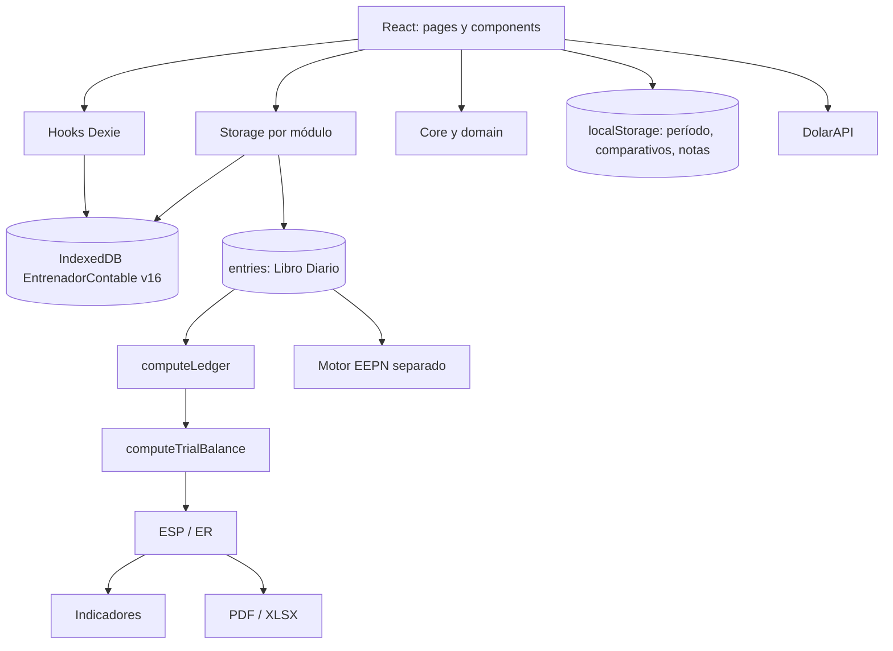
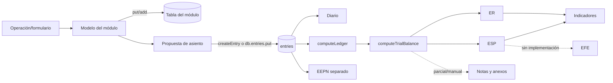
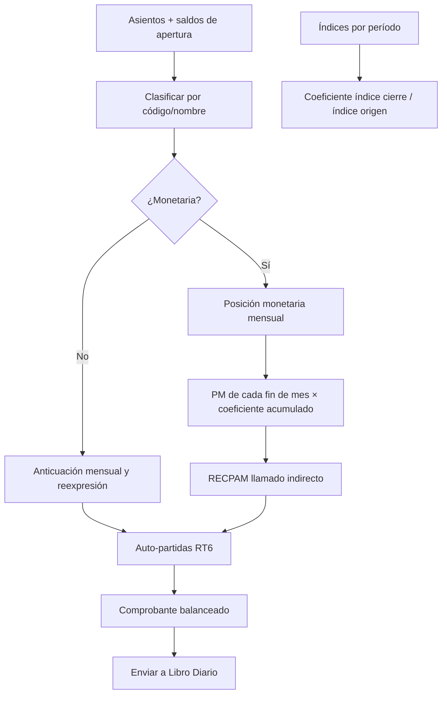
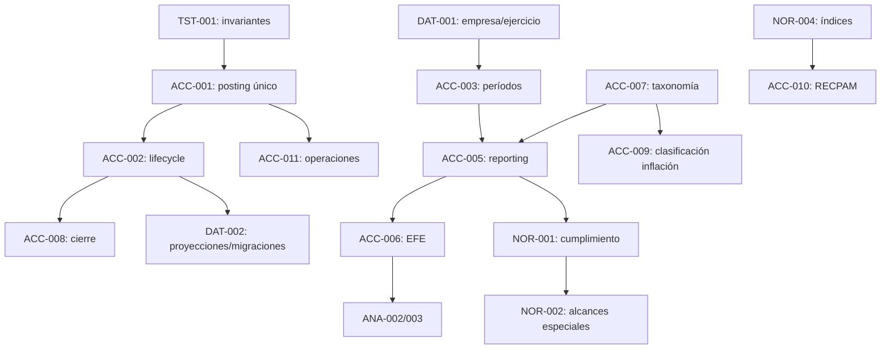
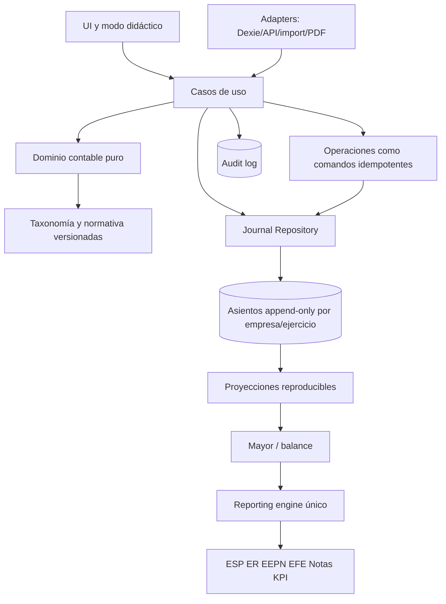

# Auditoría integral de ContaLivre — Fase 1

## 1. Portada

**Diagnóstico técnico, contable, normativo, funcional, didáctico y de experiencia de usuario**

| Dato | Valor |
|---|---|
| Proyecto | ContaLivre |
| Fecha de corte | 16 de julio de 2026 |
| Sitio observado | <https://contalivre.pages.dev/operaciones> |
| Repositorio | `D:\Git\ContaLivre` |
| Rama | `Sesion1` |
| Commit auditado | `d28523baad5d0d4e94c5edebb6e264ded0f8773a` (`d28523b`, 2026-02-16 21:40:29 -03:00) |
| Estado inicial | Árbol de trabajo limpio |
| Naturaleza | Auditoría de lectura; no se implementaron correcciones |

## 2. Fecha, versión y criterio de evidencia

La versión auditada es el `HEAD` indicado. Las referencias de líneas son aproximadas y corresponden a ese commit. Se distinguen:

- **Hecho comprobado:** observado en código, salida de comando o navegador.
- **Inferencia:** conclusión razonable que requiere una prueba funcional adicional para confirmación total.
- **Recomendación:** diseño futuro; no implementado.
- **No verificado:** no había infraestructura, datos o acceso suficiente.

El sitio se recorrió sin enviar formularios ni modificar datos. Las capturas fueron inspeccionadas en la sesión automatizada, pero no se guardaron como archivos para respetar la restricción de que este informe fuera la única modificación.

## 3. Rama, commit y estado inicial

`git status --short` no informó cambios al inicio. El administrador real es **npm** (`package-lock.json`). `package.json` declara React 18.3, TypeScript 5.6, Vite 6, Dexie 4, React Router 6, Vitest 2, PWA/Workbox, jsPDF, XLSX, mathjs y librerías de visualización/exportación.

No se detectaron `.env`, backend, API propia, Worker, D1, KV ni R2. Solo se verificó un servicio HTTP externo: `src/services/exchangeRates.ts:11,129`, que consulta `https://dolarapi.com/v1/dolares` y conserva una caché de 15 minutos en IndexedDB. No hay configuración de Cloudflare Pages, workflow de CI, `wrangler.toml` ni `_redirects` versionados; el mecanismo exacto de despliegue es **no verificado**.

`dist/` existe localmente pero está ignorado. Sí están versionados artefactos diagnósticos (`debug_output.txt`, `repro_log*.txt`, `test_output.txt`, `tsc_output.txt` y `test-results/.last-run.json`), lo que ensucia la frontera entre fuente y resultados.

## 4. Alcance

Se inspeccionaron estructura, rutas, dominio, persistencia, modelos, cálculos, operaciones, estados, inflación, indicadores, importadores, PDF/exportaciones, pruebas, dependencias, bundle y PWA. Se ejecutaron comandos no destructivos y se recorrieron todas las rutas declaradas del sitio publicado en escritorio y en una ventana móvil de 390 × 844.

La auditoría normativa se contrastó con fuentes oficiales de FACPCE/CENCyA y CPCE Corrientes disponibles al 16-07-2026. El benchmark usa documentación pública oficial de los proveedores; no constituye una prueba comparativa de calidad ni una certificación de sus afirmaciones comerciales.

## 5. Limitaciones

- No se modificaron ni sembraron datos para casos destructivos; la idempotencia de cada operación se evaluó principalmente por código.
- No existe suite E2E ni dependencia de cobertura instalada. No se añadió ninguna.
- No se contó con pipeline o cuenta de Cloudflare para vincular el deploy a un commit.
- La adopción jurisdiccional de RT 54 TO RT 59 en Corrientes se verificó mediante la publicación del CPCE, pero no se localizó en esta fase el número de resolución jurisdiccional: **requiere verificación documental adicional**.
- No se auditó exactitud visual de todos los PDF con juegos contables completos.
- La seguridad se evaluó como aplicación web local/PWA. Si el producto incorpora backend o multiusuario, el modelo de amenazas deberá rehacerse.

## 6. Resumen ejecutivo

ContaLivre tiene una superficie funcional notable y una interfaz cuidada, pero hoy es un **prototipo educativo avanzado**, no un sistema contable apto para confiar estados formales. La cadena nominal operación → asiento → mayor → balance → estados existe; sin embargo, no hay una única puerta de contabilización, los ejercicios no aíslan todos los consumidores, se permite borrado físico y no existe estado contabilizado ni rastro de auditoría.

Los riesgos más severos son:

1. Un asiento puede persistirse por rutas que eluden `validateEntry`; incluso la validación central no comprueba existencia o imputabilidad de cuentas. El mayor omite silenciosamente líneas con cuenta inexistente.
2. Balance, mayor, indicadores y parte del ESP leen asientos de todos los años, mientras el ER filtra el período. Esto puede producir reportes internamente incompatibles.
3. No existe EFE y, por tanto, no se pueden garantizar sus conciliaciones con efectivo.
4. En inflación, `1.1.04` (Bienes de cambio en el seed) se clasifica como monetaria; otros mapeos RT 6 usan una taxonomía de códigos distinta; faltantes de índice pueden convertirse en coeficiente 1; y el RECPAM “indirecto” suma posiciones monetarias de cierre mensuales reexpresadas, algoritmo que duplica exposiciones persistentes.
5. Los datos viven en una única base IndexedDB del navegador, sin empresa/usuario, permisos, cierre, auditoría ni recuperación integral verificada.
6. El build pasa y los 82 tests pasan, pero el lint tiene 117 errores, faltan pruebas de los invariantes de mayor riesgo y el bundle inicial es de 3,47 MB (889,70 kB gzip).
7. El sitio publicado usa hashes de assets diferentes del build local; sin metadata de deploy no puede demostrarse qué commit está publicado.

**Decisión recomendada:** congelar nuevas funcionalidades contables y ejecutar primero un programa P0 de integridad: libro diario inmutable y por período, puerta única de contabilización, catálogo contable tipado, motor único de reportes, corrección y validación independiente del ajuste por inflación, EFE e invariantes ejecutables.

## 7. Puntuación general: 38/100

| Dimensión | Máximo | Puntaje | Justificación |
|---|---:|---:|---|
| Corrección contable | 25 | 10 | Hay partida doble y motores de mayor/balance, pero la validación es eludible, no hay ciclo contable y la inflación presenta defectos críticos. |
| Integridad y trazabilidad | 15 | 4 | Enlaces de origen parciales, borrado físico, datos duplicados y sin auditoría/aislamiento. |
| Cumplimiento normativo | 15 | 5 | ESP/ER/EEPN parciales; sin EFE, comparativos estructurados ni notas completas; alcance especial no implementado. |
| Estados e indicadores | 10 | 4 | Estados básicos visibles, pero períodos inconsistentes, ratios incompletos e infinito posible. |
| Calidad didáctica | 10 | 6 | Buena explorabilidad y lenguaje visual; falta explicación causal y algunas promesas son simuladas. |
| UX y accesibilidad | 10 | 6 | Responsive y consistente en el smoke test; acciones inertes, CSS expuesto al árbol accesible y rutas incompletas. |
| Testing y mantenibilidad | 8 | 2 | 82 tests pasan, pero no cubren riesgos P0; 117 errores de lint y componentes gigantes. |
| Seguridad, persistencia y despliegue | 7 | 1 | Sin secretos expuestos detectados, pero hay vulnerabilidades de producción, sin identidad, backup ni deploy trazable. |
| **Total** | **100** | **38** | No se premió la mera existencia visual de módulos. |

## 8. Estado de comandos ejecutados

| Comando/inspección | Resultado | Clasificación |
|---|---|---|
| `git status --short`, rama y log | Limpio; `Sesion1`; commit indicado | Correcto |
| `npm test -- --reporter=verbose` | 16 archivos, 82 tests aprobados; 20,82 s | Correcto, cobertura funcional limitada |
| `npm run lint` | Exit 1; 170 problemas: 117 errores y 53 warnings | Falla de código/calidad |
| `npm run build` | Exit 0; 7.738 módulos; build Vite 24,43 s | Correcto con advertencias |
| `npm audit --omit=dev --json` | Exit 1; 6 vulnerabilidades: 1 crítica, 2 altas, 3 moderadas | Dependencias |
| `npm ls @vitest/coverage-v8 --depth=0` | Exit 1, paquete ausente | Entorno previsto; cobertura no ejecutable sin instalar |
| Inventario con `rg`, lectura de configs y conteos | 230 archivos TS/TSX/CSS, 122.310 líneas | Correcto |
| Smoke test web de rutas | Todas cargaron; sin errores de consola al cierre; `/clean/prototype` vacío | Parcial, no E2E transaccional |
| Prueba móvil 390 × 844 | Sin overflow horizontal; barra inferior visible | Parcial visual |

Detalles del build: CSS principal 305,26 kB (46,03 kB gzip); JS principal 3.467,94 kB (889,70 kB gzip); jsPDF 388,32 kB, html2canvas 202,38 kB y XLSX/`index.es` 159,39 kB. Workbox precachea 41 entradas, 6.676,76 KiB. Vite advirtió chunk mayor a 500 kB, import estático/dinámico simultáneo de `accounts.ts` y Browserslist desactualizado siete meses.

## 9. Arquitectura actual

### Árbol resumido

```text
ContaLivre/
├─ src/
│  ├─ core/          modelos, validación, ledger, balance, estados, inflación e impuestos
│  ├─ domain/        reportes, mapping y reglas parciales de dominio
│  ├─ storage/       Dexie, schema v16 y lógica transaccional por módulo
│  ├─ hooks/         consultas reactivas y métricas
│  ├─ pages/         pantallas y abundante lógica de negocio
│  ├─ components/    estados, importadores, PDF y UI compuesta
│  ├─ services/      cotizaciones externas
│  ├─ utils/         indicadores, expresiones y cálculos alternativos
│  └─ pdf/           documentos/exportación
├─ tests/            10 archivos de prueba
├─ public/           PWA, íconos y marca
├─ scripts/          generación de favicons
├─ docs/             documentación
├─ vite.config.ts    Vite + PWA/Workbox
└─ package.json
```

### Módulos y dependencias principales

| Módulo | Responsabilidad real | Dependencias y observaciones |
|---|---|---|
| `core/models.ts` | Cuenta, asiento, balance y estados básicos | Modelo insuficiente para período, estado y trazabilidad |
| `core/validation.ts` | Forma y partida doble del asiento | No conoce catálogo, período ni estado |
| `core/ledger.ts`, `balance.ts`, `statements.ts` | Derivación contable | En memoria; omite cuentas inexistentes; no EFE |
| `domain/reports` y `utils/resultsStatement.ts` | ER alternativos | Lógica duplicada y heurística |
| `storage/db.ts` | IndexedDB/Dexie v16, 35 tablas tipadas declaradas | Una base global `EntrenadorContable`; dos estados `any` |
| `storage/entries.ts` | CRUD central de asientos | Validación central, pero no exclusiva; borrado físico |
| `storage/bienes.ts`, `fx.ts`, `impuestos.ts`, etc. | Operaciones y sincronización | Mezclan dominio, persistencia y asientos |
| `cierre-valuacion` | RT 6/RT 17, índices y partidas | Reglas por código/nombre y datos de ejemplo |
| `components/Estados` | ESP, ER, EEPN, notas y comparativos | Varias fuentes; comparativos importados a localStorage |
| `hooks/useIndicatorsMetrics.ts` | Base de indicadores | Lee todos los asientos y usa heurísticas por nombre |
| `services/exchangeRates.ts` | DolarAPI + caché local | Fuente no oficial para todos los usos; fallback vencido señalizado |
| importadores | XLSX/CSV de cuentas, asientos, bancos, índices y comparativos | Sin límites de tamaño/filas detectados |

### Diagrama de arquitectura observada



La arquitectura es una **SPA modular por funcionalidades con dominio parcial y persistencia local activa**, no una arquitectura en capas estricta: componentes de miles de líneas contienen reglas, consultas y mutaciones; cada almacenamiento puede crear o modificar asientos.

## 10. Flujo completo de datos

### Flujo nominal y puntos de ruptura



### Trazabilidad de una operación real

Ejemplo: un movimiento de moneda extranjera.

| Etapa | Responsable | Entrada → transformación → salida | Persistencia/consumo | Control y riesgo |
|---|---|---|---|---|
| Formulario | `pages/Operaciones/MonedaExtranjeraPage.tsx` | Fecha, moneda, cantidad, cotización, cuentas → movimiento | Estado UI | Validación local; componente de 2.320 líneas |
| Regla | `storage/fx.ts` | Movimiento/deuda → líneas y metadata de origen | `fxMovements`, `fxDebts`, `fxLiabilities` | Reglas por tipo y cuenta; lógica extensa |
| Cotización | `services/exchangeRates.ts:getExchangeRates` | DolarAPI/caché → compra/venta | `fxRatesCache` | Puede usar caché expirada, lo informa |
| Contabilización | `storage/fx.ts` (varios `db.entries.put`, aprox. líneas 1009, 1136, 1217, 2062) | Propuesta → `JournalEntry` | `entries` | Elude `createEntry`; no hay estado posted |
| Diario | `pages/Asientos*` | Lee `entries` | Pantalla Diario | Edición directa observada en `AsientosDesktop.tsx:95-110` |
| Mayor | `core/ledger.ts:computeLedger` | Ordena asientos y acumula líneas | No persiste saldo | Omite cuenta ausente (`ledger.ts:57-60`) |
| Balance | `core/balance.ts` | Mayor → sumas y saldos | No persiste | Pantalla lee todos los ejercicios |
| Estados | `core/statements.ts` y motores paralelos | Balance → ESP/ER | No persiste; comparativos sí en localStorage | ER y ESP no comparten siempre período/motor |
| Indicadores | `hooks/useIndicatorsMetrics.ts` | Estados/cuentas heurísticas → métricas | No persiste | Todos los años; denominador cero puede ser infinito |

**Fuente primaria:** `entries` pretende ser el Libro Diario y mayores/saldos se recalculan. Sin embargo, tablas operativas también son fuentes primarias y existen escrituras directas, por lo que el Diario no es el único registro autoritativo. No se verificó almacenamiento de saldos contables generales, pero sí cierres/estados derivados específicos de módulos.

## 11. Inventario funcional y mapa de rutas

| Ruta | Función observada | Estado |
|---|---|---|
| `/` | Dashboard/Inicio | Parcial; métricas por período |
| `/operaciones` | Hub de operaciones | Completa como navegación; datos agregados no siempre conciliados |
| `/operaciones/inventario` | Bienes de cambio | Amplio, parcialmente duplicado con legado de planillas |
| `/operaciones/moneda-extranjera` | Activos/deudas y diferencias de cambio | Parcial |
| `/operaciones/prestamos` | Préstamos, cuotas e intereses | Parcial |
| `/operaciones/impuestos` | IVA/obligaciones/pagos | Parcial; no motor fiscal integral |
| `/operaciones/bienes-uso` | Altas, eventos y depreciación | Parcial |
| `/operaciones/inversiones` | Instrumentos y movimientos | Parcial |
| `/operaciones/proveedores`, `/clientes` | Saldos/vencimientos | Parcial; se observaron cifras divergentes con el hub |
| `/operaciones/deudas-sociales` | Nómina y obligaciones | Parcial |
| `/operaciones/gastos` | Gastos | Parcial |
| `/cuentas` | Plan de cuentas/importación | Funcional, metadatos insuficientes |
| `/asientos` | Diario/manual/importación | Funcional sin ciclo posted/reversión |
| `/mayor` | Libro Mayor | Funcional, sin aislamiento de ejercicio |
| `/balance` | Sumas y saldos | Funcional, sin aislamiento de ejercicio |
| `/estados` | ESP, ER, EEPN, notas | Parcial; EFE deshabilitado |
| `/planillas` | Hub de herramientas | Parcial/simulado en textos |
| `/planillas/conciliaciones` | Conciliación bancaria | Parcial |
| `/planillas/amortizaciones` | Planilla legado | Duplicada con bienes de uso |
| `/planillas/cierre-valuacion` | Inflación/cierre/valuación | Parcial con riesgos críticos |
| `/clean/prototype` | Prototipo | Accesible pero vacío |

Redirecciones: `/practica` → `/`; `/planillas/inventario` → `/operaciones/inventario`. No se halló ruta accesible para un EFE operativo. El sitio publicado cargó todos los paths directos inspeccionados, lo cual sugiere fallback SPA en la plataforma, aunque no está versionado.

### Estado transversal

| Categoría | Funcionalidades |
|---|---|
| Completas en alcance técnico acotado | Derivación mayor/balance desde líneas válidas; cotización con caché; PWA build |
| Parciales | Todas las operaciones, ESP, ER, EEPN, notas, conciliación, cierres, importadores |
| Simuladas/promocionales | “Match inteligente (AI)”, “Índices FACPCE actualizados”, fechas de último uso en `PlanillasHome.tsx:25-58` |
| Desconectadas | `computeKPIs` de `utils/indicators.ts`; EFE no conectado |
| Duplicadas | ER, inventario/amortizaciones, reglas/mapeos contables, saldos de módulos vs diario |
| Obsoletas | Identidad “Entrenador Contable MVP 0.2”, schema v2 y 29 tests en README |
| Ocultas/sin uso visible | `/clean/prototype`; utilidades KPI; estados/tablas legacy |

### Matriz de operaciones y automatización

La siguiente matriz resume el comportamiento comprobado en código. “Configurable” significa que el módulo depende del mapeo/cuenta elegida; no certifica que el usuario haya elegido una cuenta técnicamente correcta. En ninguna operación se observó un workflow general de aprobación, posted inmutable o reversión; por ello ACC-002 y ACC-011 aplican transversalmente.

| Operación/capacidad | Reconocimiento y asiento propuesto | Persistencia y trazabilidad | Edición, baja, duplicación e impacto |
|---|---|---|---|
| Asiento manual | Líneas D/H elegidas; control aritmético local/central | `entries`; `sourceModule` manual o ausente | Editable y borrable físicamente; impacto directo en todos los estados |
| Importación de asientos | CSV/XLSX → mapeo de fecha, concepto, cuentas e importes | `ImportAsientosUX.tsx` → diario | Lee archivo completo; preview limitada visualmente, no tamaño; necesita atomicidad y reporte por fila |
| Compra de inventario | Alta de existencias; costo/IVA/contrapartida según flujo y mapping | Tablas de productos/movimientos + asiento enlazado | Riesgo de doble fuente, recálculo y taxonomía legacy; afecta activo/IVA/efectivo o proveedores |
| Venta y costo de ventas | Ingreso/IVA/crédito o efectivo + segundo reconocimiento de CMV | Inventario/movimientos y diario | Deben ser atómicos; devoluciones tienen tests parciales; riesgo de regeneración o desfase de costo |
| Cobros/clientes | Disminución de crédito contra caja/banco, según cuenta | Módulo/metadata de origen + diario | No hay auxiliar único ni aging reconciliado global; impacto financiero sin resultado salvo diferencias |
| Pagos/proveedores | Disminución de deuda contra caja/banco | Módulo/metadata + diario | Se observaron regresiones cubiertas para pagos, pero no invariante transversal ni reversión |
| Gastos/devengamientos | Gasto contra efectivo/deuda según formulario | Operación + diario | Momento de reconocimiento depende de datos/UI; sin reversión automática de devengamientos por período |
| Préstamos e intereses | Alta/cancelación de principal; intereses por devengamiento/cuota | Pantalla de 1.800 líneas y asientos vinculados | Falta separación contractual universal CP/LP y costo efectivo; edición/baja no deja trail |
| Nómina/deudas sociales | Corrida, líneas, conceptos, pagos y obligaciones | Seis tablas de payroll + diario | Catálogo propio; riesgo de que editar corrida no reconstruya de forma uniforme; no sustituye liquidación legal |
| Impuestos | Cierres, obligaciones, vencimientos y pagos; IVA tiene funciones probadas | Cuatro tablas fiscales + diario | Módulo amplio (página 3.292/storage 1.910 líneas); alcance fiscal no certificado; conciliación parcial |
| Bienes de uso | Alta, eventos, depreciación y cuentas de activo/regularizadora | `fixedAssets/events`, tablas de bienes y diario | Solapa planilla de amortizaciones; método no amortizable existe, aunque el seed incluye amortización acumulada de terrenos |
| Inversiones | Compra/venta/rendimiento/valuación según instrumento y mapping | Instrumentos, movimientos, settings, notificaciones y diario | Delete directo detectado; medición/categoría normativa no centralizada |
| Moneda extranjera | Cantidad × cotización; activos usan regla compra/venta configurada; diferencias | Seis tablas FX, caché y diario | DolarAPI/caché puede quedar vencida (se informa); faltan política/versionado integral de tipo de cambio |
| Conciliación bancaria | Importa extracto y propone matching/ajustes | Estado de conciliación y asientos según acción | “Match inteligente (AI)” no se probó como IA; sin límites de importación ni auditoría de match/override |
| Inflación/cierre | Reexpresión y auto-partidas RT6; voucher balanceado | `cierreValuacionState` + diario por hash/origen | Previene algunos duplicados, pero puede contabilizar con datos normativamente inválidos; ACC-009/010 y NOR-004 |
| Cierre/apertura | No existe workflow contable general | Solo selector local y cierres específicos de módulos | No hay refundición, apertura, lock ni traslado formal de resultado; ACC-008 |

Impacto conceptual común: operaciones patrimoniales modifican activos/pasivos/PN; operaciones de resultado alimentan ER y luego PN; cobros/pagos/préstamos afectan efectivo y deberían clasificarse en EFE, hoy ausente. La metadata de origen facilita navegación parcial, pero no constituye idempotencia ni auditoría por sí sola.

### Importación, exportación y artefactos

Se localizaron importadores de cuentas, asientos, extractos bancarios, índices y comparativos ESP/ER; aceptan CSV/XLS/XLSX según pantalla. Se utilizan `papaparse` y `xlsx`. Existen generadores PDF con jsPDF/html2canvas/autotable y exportaciones XLSX en módulos. La consistencia de redondeo y layout entre todos ellos es **no verificada** por falta de un dataset formal y pruebas de artefacto. `scripts/generate-favicons.mjs` es el único script auxiliar destacado; no hay scripts de migración/despliegue fuera de la aplicación.

## 12. Auditoría del núcleo contable

### Invariantes

| Invariante | Garantía actual | Evidencia/resultado |
|---|---|---|
| Debe = Haber en cada asiento | Parcial | `validation.ts:49-87`; tolerancia redondeada. Escrituras directas la eluden. |
| Diario Debe = Diario Haber | Circunstancial | Se deriva de lo anterior si todas las entradas válidas; sin auditor global. |
| Mayor débitos/créditos = Diario | Puede romperse | Cuenta inexistente se omite en `ledger.ts:57-60`. |
| Balance equilibrado | Parcial | Tests pasan para casos acotados; mismo riesgo de omisión/período. |
| Activo = Pasivo + PN | Parcial | `statements.ts` inyecta resultado abierto; no hay check de publicación. |
| Resultado ER = EEPN | No garantizado | Motores separados y períodos/fuentes distintos. |
| Variación EFE = efectivo final − inicial | Ausente | EFE deshabilitado en `EstadosHeader.tsx:22-27`. |
| Efectivo EFE = efectivo ESP | Ausente | No calculable. |
| Anexos = rubros | Parcial/manual | `core/notas-anexos/compute.ts:116` contiene TODO; overrides manuales. |
| Apertura = cierre anterior | Ausente | No hay entidad ejercicio ni cierre/apertura formal. |
| Comparativos homogéneos | No garantizado | Se importan manualmente y guardan en localStorage. |

### Importes y redondeo

Los importes son `number`. `validation.ts` rechaza negativos y doble columna pero no prueba `Number.isFinite`, por lo que `NaN` puede atravesar comparaciones. La igualdad redondea a centavos y acepta una diferencia efectiva de hasta un centavo. No hay política central de redondeo para cálculo, pantalla, PDF y XLSX. Conceptualmente conviene un tipo monetario de enteros en centavos o decimal exacto, con moneda y regla de redondeo explícitas.

### Plan de cuentas

El seed contiene 197 cuentas, sin códigos o nombres duplicados detectados; 8 `statementGroup` nulos corresponden principalmente a agrupadoras. `Account` (`core/models.ts`) soporta código, nombre, tipo, sección, grupo, naturaleza, contra-cuenta, jerarquía e imputabilidad. No modela en primera clase: monetaria/no monetaria, EFE, nota/anexo, moneda, centro de costos, entidad, ejercicio, vigencia ni políticas. Las reglas compensan esa falta con prefijos y textos (`core/account-classification.ts`, `monetary-classification.ts`, `auto-partidas-rt6.ts`, indicadores).

### Ejercicios y períodos

`hooks/usePeriodYear.ts` usa `localStorage`, año por defecto 2026 y lista fija 2023–2027. `Balance.tsx:24-32`, `useLedger.ts:7-13` y `useIndicatorsMetrics.ts:26-57` leen todas las entradas. `Estados.tsx:303-322` calcula ESP con todas; el ER sí filtra en `buildEstadoResultados` (`Estados.tsx:348-373`). No hay lock, apertura, refundición, cierre de resultados, reversión de devengamientos ni protección contra fecha fuera de ejercicio.

## 13. Auditoría normativa

La base profesional vigente considerada es RT 54 en texto ordenado por RT 59. FACPCE aprobó RT 59 el 29-06-2024 como texto ordenado y aclaró que no pretendía cambios sustanciales. A la fecha de corte también se revisaron Interpretación 18, RT 62, resoluciones JG posteriores y modelos/informes CENCyA. La publicación del CPCE Corrientes informa aplicación obligatoria del TO RT 59 desde 01-07-2024 y anticipada desde 01-01-2023; el acto jurisdiccional exacto queda abierto.

ContaLivre no registra versión normativa, jurisdicción, categoría de ente, opciones de política ni fecha de vigencia aplicadas a cada cierre. La UI muestra “RT 6 + RT 17”, mientras el marco general contemporáneo debe articularse con RT 54 TO RT 59 y normas específicas vigentes. Tampoco implementa las presentaciones/modelos completos de Informes CENCyA 27–31.

| Alcance | Grado real | Evidencia |
|---|---|---|
| Ente con fines de lucro comercial/servicios | Parcial | Plan y estados básicos genéricos |
| Industrial | Muy parcial | Sin costos de producción integrados/formales |
| Sin fines de lucro | No soportado | No estados/reglas específicos; cambiar título no basta |
| Agropecuario | No soportado | Sin activos biológicos ni medición específica |
| Cooperativas (RT 62) | No soportado | Sin capítulo/modelo cooperativo |
| Consolidado | No soportado | Sin entidades, eliminaciones ni moneda funcional por componente |
| Negocio conjunto | No soportado | Sin modelo de participación |
| Moneda extranjera | Parcial | Operaciones y diferencias, sin cierre normativo integral |
| Discontinuadas | No soportado | Sin clasificación/presentación separada |

No se evaluó cumplimiento fiscal/legal: impuestos de la aplicación son ayudas operativas y no deben confundirse con determinación tributaria certificada.

## 14. Auditoría de estados contables

- **ESP:** clasifica por `kind`, `section` y `statementGroup`, pero el período puede mezclar años. No hay referencias estructuradas a notas ni control de compensaciones. `computeBalanceSheet` ignora su parámetro `_netIncome` y recalcula/inserta resultado, una segunda vía susceptible de divergencia.
- **ER:** existen al menos dos motores (`utils/resultsStatement.ts` y `domain/reports/estadoResultados.ts`) y heurísticas de nombre para devoluciones/descuentos. No cubre de forma robusta discontinuadas, ORI/resultados diferidos o impuesto a las ganancias.
- **EEPN:** existe como motor/componente separado, con elevada complejidad (`EvolucionPNTab.tsx`, 1.683 líneas). No hay invariante automática ER = resultado incorporado al PN.
- **EFE:** ausente; la pestaña está deshabilitada como “Próximamente”. Esto impide cumplir conciliaciones y analizar calidad de resultados.
- **Notas/anexos:** hay generación parcial y overrides manuales, con TODO explícito. Debe marcarse cada dato como derivado, manual o no disponible y tener referencias cruzadas verificables.
- **Comparativos:** ESP/ER aceptan archivos manuales y localStorage; no se derivan de un ejercicio cerrado ni acreditan moneda homogénea.

## 15. Auditoría de inflación

### Algoritmo observado



### Diferencias críticas con el procedimiento esperado

1. `seed.ts:90-93` define `1.1.04` como Bienes de cambio/Mercaderías; `monetary-classification.ts:169` la declara monetaria. Así se excluye inventario de reexpresión y se incluye indebidamente en exposición monetaria.
2. `auto-partidas-rt6.ts:622-624` rotula `1.2.01` Mercaderías, `1.2.02` Bienes de Uso y `1.2.03` Intangibles; el seed usa esos prefijos para Bienes de uso, Intangibles e Inversiones respectivamente.
3. `types.ts:339-354` trae índices de demostración 2024-12/2025-12; `PlanillasHome` afirma “Índices FACPCE actualizados”. La página publicada avisó “Falta índice 2026-07”. Debe existir fuente, período, valor, versión y fecha de consulta, sin afirmar actualización automática.
4. `calc.ts:54-56` devuelve coeficiente 1 si falta índice. Aunque se generan avisos, el comprobante puede quedar balanceado y `CierreValuacionPage.tsx:411-453` solo verifica validez aritmética antes de enviar.
5. Saldos de apertura sin origen se asignan al inicio del período (`auto-partidas-rt6.ts:269-278,397-408`), perdiendo anticuación histórica.
6. `recpam-indirecto.ts:80-172` reexpresa y suma la posición monetaria completa al cierre de cada mes. Un saldo que permanece varios meses se cuenta repetidamente. El método indirecto debe resultar de la conciliación/balanceo luego de reexpresar partidas no monetarias, PN y resultados, o usarse un método directo basado en exposiciones y cambios sin duplicación.

La prevención de doble ajuste de asientos RT6 y ciertas bases de inventario sí está contemplada y probada en casos acotados. Eso no compensa los defectos anteriores.

## 16. Auditoría de indicadores

| Indicador | Fórmula actual | Fórmula recomendada | Estado/error | Impacto | Prioridad |
|---|---|---|---|---|---|
| Capital de trabajo | AC − PC | Igual, con fecha/período visible | Correcta, fuente mezcla ejercicios | Alto | P0 |
| Liquidez corriente | AC / PC | Igual; no calculable si PC=0 | Puede mostrar ∞ | Alto | P0 |
| Prueba ácida | (AC − inventarios) / PC | Igual; inventarios por metadata | Heurística por nombre | Alto | P0 |
| Liquidez inmediata | Efectivo / PC | Efectivo y equivalentes / PC | Efectivo por nombre/código | Alto | P0 |
| Endeudamiento | PT / AT | Igual, explicando signo y sector | Umbral universal | Medio | P1 |
| Pasivo/PN | PT / PN | No calculable si PN≤0 o interpretación especial | Semáforo puede inducir error | Alto | P1 |
| Autonomía | PN / AT | Igual | Usa cierre y umbral fijo | Medio | P1 |
| Solvencia | AT / PT | Igual; tratar PT=0 | Puede ser ∞ y “bueno” | Alto | P0 |
| Inmovilización | ANC / AT | Igual | Período no aislado | Medio | P0 |
| Margen bruto | Resultado bruto / ventas netas | Igual | Depende de clasificación heurística | Alto | P1 |
| Margen neto | Resultado neto / ventas netas | Igual | Sin homogeneidad/actividad discontinuada | Alto | P1 |
| ROE | Resultado / PN de cierre | Resultado / PN promedio, o advertir aproximación | Conceptualmente incompleto | Alto | P1 |
| Días de cobranza | UI: N/D; motor no usado: 60 fijo | Créditos por ventas promedio / ventas a crédito × días | Motor muerto contiene dato inventado | Crítico si se conecta | P0 |
| Días de pago | UI: N/D; motor no usado: 45 fijo | Proveedores promedio / compras a crédito × días | Igual | Crítico si se conecta | P0 |
| Ciclo de caja | N/D | Días inventario + cobranza − pago | Ausente | Medio | P2 |
| ROA, EBITDA, ROIC, DuPont | Ausentes | Según definiciones y conciliación visible | Ausentes | Medio | P2 |
| Flujos/coberturas | Ausentes | CFO/PC, CFO/RN, FCF, deuda/interés | Requieren EFE | Alto | P1 tras EFE |
| Vertical/horizontal/tendencias | Ausentes | Base y moneda homogénea explícitas | Ausentes | Alto | P1 |

`utils/indicators.ts:safeDiv` devuelve `Infinity` cuando el denominador es cero y formatea `∞`. El dashboard genera además un “health score” promediando estados cualitativos (10/8/5/2) con umbrales universales. Esto crea una precisión aparente sin sector, tamaño, ciclo ni contexto. Cada KPI futuro debe abrir fórmula, sustitución, fuentes, período, limitaciones y estado “No calculable/Información insuficiente”.

## 17. Auditoría didáctica

Fortalezas: navegación por operaciones, vista de asientos propuestos, módulos argentinos (IVA, moneda extranjera, bienes de uso, inflación) y estética que reduce fricción inicial.

Debilidades: el estudiante no dispone de una explicación persistente de por qué debita/acredita, ni puede seguir visualmente una línea hasta mayor, balance, rubro, nota e indicador. Los resultados automáticos no muestran sustitución ni reglas; las pantallas avanzadas exponen complejidad antes de conceptos; y textos como “AI”, “actualizados” o fechas simuladas enseñan una confianza incorrecta.

Modalidad futura propuesta: escenario autocontenido → explicación de hecho económico → simulación sin contabilizar → asiento con naturaleza de cada cuenta → antes/después de ecuación patrimonial → propagación resaltada → controles e invariantes → pista gradual → corrección explicada → reset. Debe incluir casos comercial, servicios, ESFL, agro e inflación, pero solo habilitar los últimos cuando sus reglas específicas existan.

## 18. Auditoría UX y accesibilidad

En el smoke test, todas las rutas cargaron, no hubo overflow horizontal y no quedaron errores de consola. La navegación móvil mostró Inicio, Mayor, Nuevo, Estados y Planillas; la barra inferior puede cubrir parcialmente acciones cercanas al borde inferior. No se hizo auditoría WCAG automatizada completa.

Problemas observados:

- Menú superior muestra “Gonzalo M. / Admin / GM” sin identidad real; Perfil, Preferencias y Cerrar sesión apuntan a `#`.
- EFE está deshabilitado; `/clean/prototype` queda vacío.
- `<style>` embebidos hacen aparecer `@keyframes textShimmer` y CSS como texto en snapshots accesibles de algunas pantallas.
- Acciones/filtros aparecen deshabilitados sin siempre explicar prerrequisito.
- El hub de proveedores mostró 2 vencimientos/$320.000, mientras el módulo abierto mostró $0; es una observación de producción que requiere reproducción controlada.
- Identidad inconsistente: UI/PWA ContaLivre; README, package y base local “Entrenador Contable”. No se observó “ContaLibre” en las rutas recorridas.
- Tablas extensas y modales muy densos requieren revelación progresiva, foco probado y navegación de teclado. **No verificado** en profundidad.

## 19. Persistencia, seguridad y auditoría

Dexie `src/storage/db.ts` declara schema v16 y 35 tablas: cuentas/asientos/settings; inventarios legado y actual; cierre; FX; impuestos; activos; inversiones; empresa y nómina. `amortizationState` y `cierreValuacionState` son `any`. `generateId` usa tiempo + `Math.random`, suficiente para UI local pero no identidad distribuida.

No hay autenticación, autorización ni roles efectivos. No hay `companyId` en cuentas/asientos y `Estados.tsx:191-197` usa empresa `default`. Borrar datos del navegador puede perder todo; no se verificó backup/restauración integral ni exportación transaccional completa. LocalStorage guarda período y comparativos, separado del diario.

No se detectaron `dangerouslySetInnerHTML`, `eval` ni secretos versionados durante las búsquedas. CSRF no aplica sin backend propio. En cambio, los importadores XLSX/CSV leen archivos completos (`arrayBuffer`, `FileReader`) sin límites de tamaño o filas detectados; esto habilita agotamiento de memoria y amplifica el riesgo de la dependencia `xlsx` vulnerable.

`npm audit` reportó: jsPDF (directa) crítica, mathjs (directa) alta, xlsx (directa) alta sin fix disponible, y dompurify/react-router/react-router-dom moderadas. La explotabilidad exacta requiere análisis por advisory y flujo, pero PDF/importación son superficies activas, por lo que no debe diferirse la evaluación.

No existe rastro de quién/cuándo/antes/después/motivo. `createdAt` y metadata libre no equivalen a auditoría. `entries.ts:70-90` borra físicamente; otros módulos hacen deletes/puts directos.

## 20. Calidad del código y arquitectura

Se contaron 122.310 líneas en 230 archivos TS/TSX/CSS. Los mayores componentes son `MovementModalV3.tsx` (5.442), `InventarioBienesPage.tsx` (4.312), `ImpuestosPage.tsx` (3.292), `BienesUsoPage.tsx` (2.835) y `storage/bienes.ts` (2.810). Hay mezcla de render, cálculo, validación y persistencia.

El lint detecta `any`, variables sin uso, dependencias de hooks y violaciones de hooks condicionales, entre ellas `EstadoResultadosDocument.tsx:147` y `EvolucionPNTab.tsx:672,676,681`. Las reglas contables se repiten en componentes, storage y core; abundan prefijos/nombres mágicos. La coexistencia de implementaciones V2/V3 y módulos legacy muestra migraciones funcionales inconclusas.

## 21. Testing

Los 16 archivos y 82 tests cubren validación básica, ledger, balance, statements, costing, IVA/obligaciones/notificaciones, EEPN y regresiones puntuales. Son mayormente unitarios. No hay E2E, snapshots significativos, pruebas de migración, importación hostil, PDF visual, performance, aislamiento de ejercicios, EFE, seguridad, idempotencia transversal ni integridad Diario–Mayor–Estados sobre un caso completo.

Pirámide futura:

1. Propiedades del dominio: doble partida, finitud, moneda/redondeo, referencialidad, períodos.
2. Golden cases por motor con saldos exactos.
3. Integración Dexie por operación, rollback, idempotencia, migraciones y cierres.
4. Contratos de estados/PDF/XLSX y normativa versionada.
5. E2E de flujos críticos y smoke visual/accesible.
6. Performance con 10 k, 100 k y 1 M líneas según objetivo de producto.

Suite mínima de bloqueo: todos los invariantes de §12; casos A–F aplicables; importe no finito; cuenta inexistente/agrupadora; período cerrado; doble contabilización; edición/baja por reversión; migración desde cada versión soportada; índices faltantes; conciliación RECPAM; igualdad EFE–ESP.

## 22. Rendimiento

No hay lazy loading de rutas en `App.tsx`; el JS principal de 3,47 MB incluye librerías pesadas y el precache alcanza 6,68 MiB. Esto penaliza primera carga, actualización y memoria, especialmente móvil. Componentes de miles de líneas y lecturas `toArray()` de todos los asientos no escalan. PDF y XLSX se cargan en el grafo inicial y procesan en el hilo principal.

Recomendación conceptual: budgets, división por ruta/capacidad, importadores/PDF bajo demanda, consultas indexadas por empresa/ejercicio/fecha, cálculos incrementales verificables o workers para exportación, virtualización de tablas y pruebas con volúmenes definidos. No optimizar antes de fijar el modelo contable.

## 23. Despliegue

Vite PWA usa `registerType: autoUpdate`, precache y límite de 5 MiB por archivo (`vite.config.ts:11-48`). No hay provenance de build ni UI de versión/migración. El sitio publicado referenció `/assets/index-43ELTEzI.js` y `/assets/index-yo65zZoU.css`; el build local produjo `index-DhH39si6.js` y `index-DdlgjqWh.css`. **Hecho:** no son artefactos byte-idénticos. **No verificable:** qué commit originó producción. La diferencia puede incluir otro commit o condiciones de build; no debe atribuirse solo a caché.

El recorrido directo de rutas funcionó, pero el fallback Cloudflare no está en el repo. Deben versionarse pipeline, comando, Node/npm, variables públicas, headers, fallback, commit SHA, fecha y estrategia de rollback; y mostrar versión de app/schema para diagnosticar service workers antiguos.

## 24. Benchmark funcional

Estados: **P** presente, **Par** parcial, **A** ausente. Datos de competidores reflejan documentación oficial consultada, no pruebas independientes.

| Capacidad | ContaLivre | Xubio | Colppy | Contabilium | Tango | Bejerman | Lectura para ContaLivre |
|---|---|---|---|---|---|---|---|
| Registración/plan/diario/mayor | Par | P | P | P | P | P | Prioritaria: robustecer, no ampliar |
| Balance/ER | Par | P | P | P | P | P | Motor único y períodos |
| EEPN/EFE/notas | Par/A/Par | Reportes | Reportes | Reportes | Reportes | Reportes | EFE y trazabilidad P0/P1 |
| Inflación | Par crítica | P | P | No verificado | P | P | Validar normativamente antes de usar |
| Conciliación bancaria | Par | Automática | Sincronizada | Automática | P | P | Recomendable tras integridad |
| Importación/exportación | Par | P | P | P | P | P | Límites, esquema y auditoría |
| Multiempresa | A | P | P | P/multi-CUIT | P | P | Futura si evoluciona a producto |
| Usuarios/permisos/auditoría | A | P | P | P | P | P | Esencial para producto, no para sandbox local |
| Centros de costo | A | P | No verificado | P | P | P | P2, no codificar por nombre |
| Consolidación | A | No verificado | No verificado | No verificado | P | No verificado | P3 especializado |
| Indicadores/análisis | Par | Reportes | Reportes | >40 reportes | Configurables | Reportes/cashflow | Corregir trazabilidad antes de sumar KPIs |
| Integraciones/API | Una API de cambio | P | P | P | P | P | Contraria al foco inmediato |
| Herramientas educativas | Par/diferencial | A | A | A | A | A | Ventaja estratégica a profundizar |

No se recomienda copiar amplitud ERP. El diferencial sostenible es una cadena contable explicable y reproducible; primero debe ser correcta.

## 25. Hallazgos consolidados

> Para evitar duplicación, las secciones anteriores remiten a estos IDs. “Solución” significa solución conceptual futura.

### ACC-001 — La puerta de contabilización es eludible

| Campo | Contenido |
|---|---|
| ID / Área | ACC-001 / Diario, storage y módulos |
| Severidad / Prioridad | **Crítica / P0** |
| Evidencia | `storage/entries.ts:22-62`; `AsientosDesktop.tsx:95-110`; `storage/fx.ts` y `storage/bienes.ts` con `db.entries.put`; `ledger.ts:57-60` |
| Comportamiento actual | Solo parte de las escrituras usa `validateEntry`; una cuenta desconocida pasa validación y luego su línea desaparece del mayor. |
| Esperado | Comando transaccional único que valide importes finitos, cuentas existentes/imputables, período, estado y doble partida. |
| Riesgo | Diario balanceado que no reconcilia con mayor/balance/estados. |
| Norma/fundamento | Integridad y representación fiel; invariante de partida doble. |
| Causa probable | Evolución por módulos con acceso directo a Dexie. |
| Solución conceptual | Application service/repositorio exclusivo; constraint lógico y auditor global. |
| Esfuerzo / Dependencias | L / base de ACC-002, ACC-003, DAT-002 |
| Criterios de aceptación | Ninguna escritura directa; tests rechazan NaN, cuenta ausente/header, fecha cerrada y asiento desigual; totales diario=mayor. |

### ACC-002 — No existe ciclo borrador, contabilizado, reversión ni auditoría

| Campo | Contenido |
|---|---|
| ID / Área | ACC-002 / Asientos y operaciones |
| Severidad / Prioridad | **Crítica / P0** |
| Evidencia | `core/models.ts:108-119`; `storage/entries.ts:44-90`; deletes/updates directos |
| Comportamiento actual | Asiento sin estado/número/usuario/período; se edita y borra físicamente. |
| Esperado | Borrador editable; posted inmutable y numerado; baja/corrección por reversión enlazada; historial. |
| Riesgo | Pérdida de evidencia, estados retroactivamente mutables y fraude/error no detectable. |
| Norma/fundamento | Trazabilidad del sistema de información y libros confiables. |
| Causa probable | Modelo educativo CRUD. |
| Solución conceptual | Aggregate JournalEntry + eventos de auditoría append-only y roles futuros. |
| Esfuerzo / Dependencias | XL / ACC-001, ACC-003, DAT-001 |
| Criterios de aceptación | Posted no admite update/delete; reversión conserva original, actor, hora, motivo y hash/version. |

### ACC-003 — Mezcla de ejercicios entre reportes

| Campo | Contenido |
|---|---|
| ID / Área | ACC-003 / Mayor, balance, estados, indicadores |
| Severidad / Prioridad | **Crítica / P0** |
| Evidencia | `Balance.tsx:24-32`; `useLedger.ts:7-13`; `Estados.tsx:303-373`; `useIndicatorsMetrics.ts:26-57` |
| Comportamiento actual | ESP/mayor/balance/KPI usan todos los asientos; ER filtra el año seleccionado. |
| Esperado | Empresa + ejercicio + período explícitos y comunes a toda consulta. |
| Riesgo | Estados incompatibles y ratios materialmente falsos. |
| Norma/fundamento | Devengado, periodicidad y comparabilidad. |
| Causa probable | Selector visual agregado después del modelo global. |
| Solución conceptual | Contexto de reporting inmutable y queries indexadas. |
| Esfuerzo / Dependencias | L / ACC-001, DAT-001 |
| Criterios de aceptación | Golden multianual demuestra aislamiento; todos los reportes exhiben misma fecha/corte. |

### ACC-004 — Tipo monetario y tolerancia no son seguros

| Campo | Contenido |
|---|---|
| ID / Área | ACC-004 / Cálculos y exportación |
| Severidad / Prioridad | **Alta / P1** |
| Evidencia | `core/models.ts`; `validation.ts:8-87`; uso general de `number` |
| Comportamiento actual | Punto flotante, sin `isFinite`, tolerancia de centavo y redondeo distribuido. |
| Esperado | Decimal/centavos, moneda y rounding policy central; NaN/Infinity inválidos. |
| Riesgo | Diferencias entre cálculo, pantalla, PDF y exportación. |
| Norma/fundamento | Exactitud y consistencia de medición. |
| Causa probable | Conveniencia de JS. |
| Solución conceptual | Value object Money y políticas por moneda/impuesto. |
| Esfuerzo / Dependencias | L / ACC-001 |
| Criterios de aceptación | Tests de bordes y mismo importe serializado en todas las salidas. |

### ACC-005 — Motores de estados fragmentados y conciliaciones no garantizadas

| Campo | Contenido |
|---|---|
| ID / Área | ACC-005 / ESP, ER, EEPN, notas |
| Severidad / Prioridad | **Alta / P0** |
| Evidencia | `core/statements.ts:172-201`; `domain/reports/estadoResultados.ts`; `utils/resultsStatement.ts`; `EvolucionPNTab.tsx` |
| Comportamiento actual | ER duplicado, resultado recalculado/incrustado y EEPN separado; notas parciales. |
| Esperado | Un modelo de reporte desde trial balance ajustado, con reconciliaciones y mappings versionados. |
| Riesgo | Resultado o PN distintos según pantalla/exportación. |
| Norma/fundamento | Consistencia interna de estados. |
| Causa probable | Iteraciones UI paralelas. |
| Solución conceptual | Reporting engine puro + presentadores ESP/ER/EEPN/EFE/notas. |
| Esfuerzo / Dependencias | XL / ACC-003, ACC-007 |
| Criterios de aceptación | ER=EEPN; A=P+PN; anexos=rubros; un único cálculo invocado. |

### ACC-006 — EFE ausente

| Campo | Contenido |
|---|---|
| ID / Área | ACC-006 / Estados e indicadores |
| Severidad / Prioridad | **Alta / P0** |
| Evidencia | `EstadosHeader.tsx:22-27`, pestaña “Próximamente” |
| Comportamiento actual | No calcula efectivo/equivalentes, actividades ni conciliación. |
| Esperado | EFE normativo con política de efectivo, clasificación y transacciones no monetarias. |
| Riesgo | Juego de estados incompleto y KPIs de fondos imposibles. |
| Norma/fundamento | RT 54 TO RT 59 y modelos CENCyA aplicables. |
| Causa probable | Función pendiente. |
| Solución conceptual | Metadata EFE en cuenta/operación + motor directo/indirecto conciliado. |
| Esfuerzo / Dependencias | XL / ACC-005, ACC-007 |
| Criterios de aceptación | Variación=final−inicial; final=ESP; métodos coinciden; no monetarias reveladas. |

### ACC-007 — Catálogo insuficiente y reglas frágiles por texto/código

| Campo | Contenido |
|---|---|
| ID / Área | ACC-007 / Plan, estados, inflación, indicadores |
| Severidad / Prioridad | **Crítica / P0** |
| Evidencia | `core/models.ts`; `account-classification.ts`; `monetary-classification.ts`; `auto-partidas-rt6.ts` |
| Comportamiento actual | Faltan dimensiones contables y se infieren por nombre/prefijo. |
| Esperado | Metadata validada y versionada para naturaleza, rubros, EFE, inflación, notas, vigencia y entidad. |
| Riesgo | Reclasificación silenciosa al renombrar o importar cuentas. |
| Norma/fundamento | Presentación, medición y trazabilidad. |
| Causa probable | Seed usado como contrato implícito. |
| Solución conceptual | Taxonomía estable con IDs semánticos y reglas declarativas. |
| Esfuerzo / Dependencias | XL / ACC-005, NOR-001, ACC-009 |
| Criterios de aceptación | Ninguna regla crítica depende de texto; importación exige mapping; catálogo valida incompatibilidades. |

### ACC-008 — Sin cierre/apertura y protección temporal

| Campo | Contenido |
|---|---|
| ID / Área | ACC-008 / Ciclo contable |
| Severidad / Prioridad | **Crítica / P0** |
| Evidencia | `usePeriodYear.ts`; ausencia de entidad ejercicio/lock en modelos/schema |
| Comportamiento actual | Selector local; se puede mutar cualquier fecha; sin refundición, apertura o reversión. |
| Esperado | Ejercicios persistidos, estados de período y workflow de cierre/reapertura autorizado. |
| Riesgo | Modificación retroactiva y comparativos irreproducibles. |
| Norma/fundamento | Corte, comparabilidad y control interno. |
| Causa probable | Alcance MVP. |
| Solución conceptual | FiscalPeriod/AccountingExercise + comandos de cierre versionados. |
| Esfuerzo / Dependencias | XL / ACC-002, ACC-003 |
| Criterios de aceptación | Fecha fuera/closed rechazada; apertura concilia con cierre previo; reapertura auditada. |

### ACC-009 — Bienes de cambio clasificados como monetarios

| Campo | Contenido |
|---|---|
| ID / Área | ACC-009 / Ajuste por inflación |
| Severidad / Prioridad | **Crítica / P0** |
| Evidencia | `seed.ts:90-93` versus `monetary-classification.ts:169` |
| Comportamiento actual | Prefijo `1.1.04` Mercaderías retorna `MONETARY`. |
| Esperado | Inventarios como no monetarios, con base/fecha y medición aplicable. |
| Riesgo | Omisión de reexpresión y RECPAM falso. |
| Norma/fundamento | RT 54 TO RT 59; reexpresión en moneda de cierre. |
| Causa probable | Taxonomía vieja (“anticipos/créditos”). |
| Solución conceptual | Eliminar prefijos implícitos y migrar metadata. |
| Esfuerzo / Dependencias | M / ACC-007, NOR-004 |
| Criterios de aceptación | Golden E identifica mercaderías no monetarias y ajuste exacto. |

### ACC-010 — RECPAM indirecto y fechas de origen incorrectos

| Campo | Contenido |
|---|---|
| ID / Área | ACC-010 / Inflación |
| Severidad / Prioridad | **Crítica / P0** |
| Evidencia | `recpam-indirecto.ts:80-172`; `auto-partidas-rt6.ts:269-278,397-408` |
| Comportamiento actual | Suma PM finales mensuales reexpresadas y asigna origen de aperturas al inicio del ejercicio. |
| Esperado | Indirecto como partida de conciliación o directo por exposición sin doble conteo; preservar anticuación. |
| Riesgo | Resultado del período y PN materialmente incorrectos. |
| Norma/fundamento | Procedimiento de reexpresión RT 54 TO RT 59 / Informe CENCyA 30. |
| Causa probable | Confusión entre stock monetario y flujo de exposición. |
| Solución conceptual | Especificación matemática independiente, doble implementación de control y dataset oficial. |
| Esfuerzo / Dependencias | XL / ACC-009, NOR-004 |
| Criterios de aceptación | Casos constantes/altas/bajas concilian; RECPAM residual/directo coinciden dentro de rounding policy. |

### ACC-011 — Automatismos operativos no comparten idempotencia ni reversión

| Campo | Contenido |
|---|---|
| ID / Área | ACC-011 / Operaciones |
| Severidad / Prioridad | **Alta / P0** |
| Evidencia | puts/deletes en `storage/bienes.ts`, `fx.ts`, `inversiones.ts`, `ops.ts`; metadata libre |
| Comportamiento actual | Cada módulo sincroniza a su manera y puede borrar/recrear; hay conciliación parcial por hash/origen. |
| Esperado | Comando idempotente, clave única de origen, transacción atómica y reversión. |
| Riesgo | Duplicados, huérfanos o operación/asiento divergentes. |
| Norma/fundamento | Integridad del subsistema y no duplicación. |
| Causa probable | Desarrollo vertical independiente. |
| Solución conceptual | Outbox/evento de dominio local y journal posting service. |
| Esfuerzo / Dependencias | XL / ACC-001, ACC-002, DAT-002 |
| Criterios de aceptación | Reintento no duplica; edición revierte/reemplaza atómicamente; baja deja evidencia. |

### NOR-001 — Juego y presentación normativa incompletos

| Campo | Contenido |
|---|---|
| ID / Área | NOR-001 / Reporting |
| Severidad / Prioridad | **Alta / P0** |
| Evidencia | §§13–15; EFE ausente; comparativos importados; notas TODO |
| Comportamiento actual | Pantallas parciales sin versión normativa ni disclosure estructurado. |
| Esperado | Modelo aplicable por tipo de ente, período y jurisdicción, con estados e información complementaria reconciliados. |
| Riesgo | Presentar como estados formales información incompleta. |
| Norma/fundamento | RT 54 TO RT 59; Informes CENCyA 27–31. |
| Causa probable | Foco funcional/visual incremental. |
| Solución conceptual | Compliance matrix versionada y perfil de presentación. |
| Esfuerzo / Dependencias | XL / ACC-005–008 |
| Criterios de aceptación | Checklist normativo trazable a cada campo/salida; revisión profesional y golden outputs. |

### NOR-002 — Alcances especiales aparentes pero no implementados

| Campo | Contenido |
|---|---|
| ID / Área | NOR-002 / Tipos de ente |
| Severidad / Prioridad | **Alta / P1** |
| Evidencia | Sin modelos agro, cooperativa, ESFL o consolidación; perfil empresa no altera reglas suficientes |
| Comportamiento actual | Sistema genérico podría sugerir aplicabilidad amplia. |
| Esperado | Marcar “no soportado” hasta implementar medición/presentación específica. |
| Riesgo | Uso fuera de alcance y aprendizaje incorrecto. |
| Norma/fundamento | RT 62, Interpretación 18 y normas/modelos específicos. |
| Causa probable | Etiquetas/perfiles sin motor especializado. |
| Solución conceptual | Capability flags y módulos normativos separados. |
| Esfuerzo / Dependencias | XL / NOR-001 |
| Criterios de aceptación | UI/documentación declaran alcance; cada soporte exige caso de oro y matriz normativa. |

### NOR-003 — Línea normativa y jurisdiccional no versionada

| Campo | Contenido |
|---|---|
| ID / Área | NOR-003 / Configuración/documentación |
| Severidad / Prioridad | **Media / P1** |
| Evidencia | No hay catálogo de normas/vigencias; UI “RT6 + RT17”; fuentes §33 |
| Comportamiento actual | No se sabe qué norma, opción o adopción produjo un cierre. |
| Esperado | Baseline nacional, adopción jurisdiccional, norma legal/fiscal y decisión interna separadas. |
| Riesgo | Aplicación desactualizada o imposible de auditar. |
| Norma/fundamento | RT 59, RT 62, Interpretación 18 y JG vigentes. |
| Causa probable | Normas tratadas como texto de pantalla. |
| Solución conceptual | Registry inmutable de reglas y vigencias. |
| Esfuerzo / Dependencias | M / NOR-001 |
| Criterios de aceptación | Cada reporte exhibe versión, jurisdicción, fecha y opciones; fuentes oficiales enlazadas. |

### NOR-004 — Índices de demostración y faltantes no bloqueantes

| Campo | Contenido |
|---|---|
| ID / Área | NOR-004 / Inflación |
| Severidad / Prioridad | **Crítica / P0** |
| Evidencia | `types.ts:339-354`; `calc.ts:54-56`; `CierreValuacionPage.tsx:411-453`; texto de Planillas |
| Comportamiento actual | Muestra índices sample, faltante → coeficiente 1 y puede enviarse un comprobante aritméticamente válido. |
| Esperado | Índices oficiales con provenance; faltante requerido bloquea contabilización. |
| Riesgo | Estados nominales presentados como homogéneos. |
| Norma/fundamento | Serie FACPCE y procedimiento RT 54 TO RT 59. |
| Causa probable | Demo inicial convertida en flujo operativo. |
| Solución conceptual | Dataset versionado/importación validada + blocking reasons. |
| Esfuerzo / Dependencias | M / ACC-010 |
| Criterios de aceptación | Sin índice no hay posting; valor/fuente/version/hash quedan asociados al cierre. |

### ANA-001 — División por cero expone infinito

| Campo | Contenido |
|---|---|
| ID / Área | ANA-001 / KPIs |
| Severidad / Prioridad | **Alta / P0** |
| Evidencia | `utils/indicators.ts:25-51` |
| Comportamiento actual | `safeDiv` devuelve Infinity y el formatter muestra `∞`. |
| Esperado | Resultado tipado No calculable/No aplicable/Insuficiente. |
| Riesgo | Semáforo y usuario interpretan magnitud inexistente. |
| Norma/fundamento | Reglas obligatorias de análisis financiero. |
| Causa probable | Manejo matemático, no semántico. |
| Solución conceptual | `MetricResult` discriminado con razones. |
| Esfuerzo / Dependencias | S / ACC-003 |
| Criterios de aceptación | Ninguna UI/exportación contiene Infinity/NaN; pruebas de cero y negativos. |

### ANA-002 — Fórmulas, promedios, umbrales y score no son defendibles

| Campo | Contenido |
|---|---|
| ID / Área | ANA-002 / Dashboard de indicadores |
| Severidad / Prioridad | **Alta / P1** |
| Evidencia | `IndicatorsDashboard.tsx:269-481`; `utils/indicators.ts:115-192` |
| Comportamiento actual | ROE con PN final; umbrales fijos; score 10/8/5/2; motor no usado contiene 60/45 días fijos. |
| Esperado | Promedios cuando corresponda, contexto configurable y trazabilidad numérica. |
| Riesgo | Diagnóstico financiero con falsa autoridad. |
| Norma/fundamento | Técnica de análisis y reglas del encargo. |
| Causa probable | Diseño de demo. |
| Solución conceptual | Catálogo de métricas versionado y sin score global por defecto. |
| Esfuerzo / Dependencias | L / ANA-001, ACC-003, ACC-005 |
| Criterios de aceptación | Fórmula/sustitución/fuente/advertencia visibles; ningún valor inventado. |

### ANA-003 — Análisis estructural, actividad y fondos incompletos

| Campo | Contenido |
|---|---|
| ID / Área | ANA-003 / Análisis financiero |
| Severidad / Prioridad | **Media / P2** |
| Evidencia | Cinco KPI en N/D; ausencia de vertical/horizontal/ROA/flujo en código/UI |
| Comportamiento actual | Conjunto básico de liquidez, estructura y márgenes. |
| Esperado | Incorporar solo cuando datos homogéneos y EFE permitan fórmulas correctas. |
| Riesgo | Visión incompleta; no es P0 frente a integridad. |
| Norma/fundamento | Buenas prácticas de análisis. |
| Causa probable | Módulo en construcción. |
| Solución conceptual | Roadmap dependiente de estados confiables. |
| Esfuerzo / Dependencias | XL / ACC-006, ANA-002 |
| Criterios de aceptación | Cada métrica cumple contrato y golden cases con promedio/homogeneidad. |

### DAT-001 — Persistencia local sin aislamiento ni recuperación integral

| Campo | Contenido |
|---|---|
| ID / Área | DAT-001 / IndexedDB/localStorage |
| Severidad / Prioridad | **Crítica / P0** para producto; Alta para sandbox |
| Evidencia | `storage/db.ts`; sin `companyId` en accounts/entries; `empresaId='default'` |
| Comportamiento actual | Una base por origen/navegador, sin usuario, empresa, backup o concurrencia. |
| Esperado | Para sandbox: export/restore íntegro y advertencias; para producto: tenancy y backend transaccional. |
| Riesgo | Pérdida o mezcla de datos y ausencia de control. |
| Norma/fundamento | Integridad, disponibilidad y confidencialidad. |
| Causa probable | PWA offline educativa. |
| Solución conceptual | Definir explícitamente modo sandbox vs producto y arquitectura acorde. |
| Esfuerzo / Dependencias | L/XL / ACC-002, SEC-001 |
| Criterios de aceptación | Backup round-trip; tenant isolation tests; estrategia de recuperación documentada. |

### DAT-002 — Fuentes duplicadas y migraciones débiles

| Campo | Contenido |
|---|---|
| ID / Área | DAT-002 / Schema v16 y módulos |
| Severidad / Prioridad | **Alta / P0** |
| Evidencia | 35 tablas; estados `any`; tablas legacy/actual; entries + movimientos/cierres |
| Comportamiento actual | Datos operativos y asientos se sincronizan con lógica específica; derived state persistido. |
| Esperado | Fuente de verdad y proyección explícitas, versionadas y reconstruibles. |
| Riesgo | Drift, migración corrupta u orfandad. |
| Norma/fundamento | Consistencia de datos. |
| Causa probable | Expansión incremental de schema. |
| Solución conceptual | Data ownership matrix, foreign keys lógicas, migraciones ensayadas. |
| Esfuerzo / Dependencias | XL / ACC-011, ARQ-002 |
| Criterios de aceptación | Rebuild de proyecciones da mismo resultado; migraciones v1–actual testeadas. |

### SEC-001 — “Admin” decorativo, sin autenticación ni permisos

| Campo | Contenido |
|---|---|
| ID / Área | SEC-001 / Identidad y acceso |
| Severidad / Prioridad | **Alta / P0** antes de datos reales compartidos |
| Evidencia | UI “Gonzalo M. Admin”; enlaces `#`; ausencia de auth/backend |
| Comportamiento actual | Cualquier persona con el perfil del navegador puede operar todo. |
| Esperado | Sandbox debe declararlo; producto necesita identidad, RBAC y autorización server-side. |
| Riesgo | Acceso y cambios sin atribución. |
| Norma/fundamento | Control de acceso y auditoría. |
| Causa probable | Mock visual. |
| Solución conceptual | Quitar falsa señal o implementar identidad real en fase de producto. |
| Esfuerzo / Dependencias | XS/XL / DAT-001, ACC-002 |
| Criterios de aceptación | No se muestra rol ficticio; matriz de permisos y pruebas si hay backend. |

### SEC-002 — Dependencias vulnerables e importaciones sin límites

| Campo | Contenido |
|---|---|
| ID / Área | SEC-002 / Supply chain e imports |
| Severidad / Prioridad | **Crítica / P0** |
| Evidencia | `npm audit --omit=dev`: 1 crítica, 2 altas, 3 moderadas; importadores leen archivo completo |
| Comportamiento actual | jsPDF/mathjs/xlsx afectados; sin max size/rows detectado. |
| Esperado | Triage de advisories, versiones seguras/alternativas y límites/validación. |
| Riesgo | Denegación de servicio o explotación según flujo/advisory. |
| Norma/fundamento | Gestión de vulnerabilidades y entradas no confiables. |
| Causa probable | Dependencias viejas y UX de importación temprana. |
| Solución conceptual | Threat model, sandbox parse, budgets y actualización controlada en fase posterior. |
| Esfuerzo / Dependencias | M/L / TST-001 |
| Criterios de aceptación | Cero vulnerabilidades críticas/altas aceptadas sin excepción documentada; archivos fuera de límite rechazados. |

### ARQ-001 — Componentes y storages monolíticos

| Campo | Contenido |
|---|---|
| ID / Área | ARQ-001 / Frontend y aplicación |
| Severidad / Prioridad | **Alta / P1** |
| Evidencia | Archivos de 5.442, 4.312, 3.292, 2.835 y 2.810 líneas |
| Comportamiento actual | UI, negocio, persistencia y estilos comparten unidad. |
| Esperado | Casos de uso, dominio puro, adapters y presentadores pequeños. |
| Riesgo | Regresiones y reglas imposibles de probar aisladamente. |
| Norma/fundamento | Cohesión/separación de responsabilidades. |
| Causa probable | Entrega rápida por pantallas. |
| Solución conceptual | Extracción guiada por invariantes, no refactor cosmético. |
| Esfuerzo / Dependencias | XL / ACC-001, ARQ-002 |
| Criterios de aceptación | Reglas puras sin React/Dexie; límites de módulos y tests de contrato. |

### ARQ-002 — Implementaciones duplicadas y legado activo

| Campo | Contenido |
|---|---|
| ID / Área | ARQ-002 / Reportes, inventario, amortización |
| Severidad / Prioridad | **Alta / P1** |
| Evidencia | ER doble; V2/V3; inventario/closings legacy; planillas y operaciones solapadas |
| Comportamiento actual | Mismo concepto con modelos/reglas diferentes. |
| Esperado | Un dueño canónico y adapters temporales con fecha de retiro. |
| Riesgo | Resultados distintos y corrección aplicada solo a una vía. |
| Norma/fundamento | Mantenibilidad e integridad. |
| Causa probable | Migraciones sin decommission. |
| Solución conceptual | Inventario de decisiones/ADR y strangler plan. |
| Esfuerzo / Dependencias | L / ACC-005, DAT-002 |
| Criterios de aceptación | Una implementación por regla; pruebas demuestran equivalencia durante migración. |

### TST-001 — Suite verde sin cobertura de riesgos P0

| Campo | Contenido |
|---|---|
| ID / Área | TST-001 / Calidad |
| Severidad / Prioridad | **Alta / P0** |
| Evidencia | 82/82 tests; sin E2E/coverage; categorías faltantes §21 |
| Comportamiento actual | Confianza local en funciones, no en cadena completa. |
| Esperado | Invariantes/golden/integración como gates. |
| Riesgo | Build verde con estados incorrectos. |
| Norma/fundamento | Testing basado en riesgo. |
| Causa probable | Pruebas reactivas a bugs. |
| Solución conceptual | Suite mínima antes de refactor/feature. |
| Esfuerzo / Dependencias | L / todos los ACC/NOR P0 |
| Criterios de aceptación | CI bloquea ante ruptura de cualquier igualdad o golden case. |

### TST-002 — Lint falla con errores de hooks y tipos

| Campo | Contenido |
|---|---|
| ID / Área | TST-002 / React/TypeScript |
| Severidad / Prioridad | **Alta / P1** |
| Evidencia | 117 errores, 53 warnings; hooks condicionales en documentos/EEPN |
| Comportamiento actual | `npm run lint` exit 1. |
| Esperado | Cero errores y baseline controlado. |
| Riesgo | Orden de hooks inestable, estado incorrecto y ruido que oculta defectos. |
| Norma/fundamento | Calidad React. |
| Causa probable | Deuda acumulada. |
| Solución conceptual | Resolver por riesgo luego de tests de caracterización. |
| Esfuerzo / Dependencias | M / TST-001, ARQ-001 |
| Criterios de aceptación | Lint exit 0; hooks sin condicional; `any` crítico tipado. |

### PER-001 — Bundle monolítico y consultas no escalables

| Campo | Contenido |
|---|---|
| ID / Área | PER-001 / Carga y datos |
| Severidad / Prioridad | **Media / P1** |
| Evidencia | JS 3,47 MB/889,70 kB gzip; precache 6,68 MiB; `toArray()` global |
| Comportamiento actual | Todo se carga y muchos reportes recorren todos los asientos. |
| Esperado | Code splitting y queries por período con budgets. |
| Riesgo | Inicio/actualización lentos y memoria alta. |
| Norma/fundamento | Rendimiento web. |
| Causa probable | Imports eager y modelo local simple. |
| Solución conceptual | Lazy capabilities, workers y datos indexados. |
| Esfuerzo / Dependencias | M/L / ACC-003, ARQ-001 |
| Criterios de aceptación | Budgets y benchmarks de volumen acordados pasan. |

### DEP-001 — Producción no es trazable al commit auditado

| Campo | Contenido |
|---|---|
| ID / Área | DEP-001 / Cloudflare/PWA |
| Severidad / Prioridad | **Alta / P1** |
| Evidencia | Hashes publicados/locales distintos; sin pipeline/_redirects/metadata |
| Comportamiento actual | Sitio funciona, pero no se prueba su fuente ni rollback. |
| Esperado | Deploy reproducible con SHA, entorno, schema y artefacto. |
| Riesgo | Auditar/arreglar una versión distinta; caché incompatible. |
| Norma/fundamento | Provenance y gestión de cambios. |
| Causa probable | Configuración externa/manual. |
| Solución conceptual | Pipeline versionado y banner de versión. |
| Esfuerzo / Dependencias | M / DAT-002 |
| Criterios de aceptación | Asset manifest vincula SHA; direct routes y rollback probados. |

### UX-001 — Controles inertes, contenido simulado y accesibilidad textual

| Campo | Contenido |
|---|---|
| ID / Área | UX-001 / Navegación y Planillas |
| Severidad / Prioridad | **Media / P1** |
| Evidencia | Menú `#`; `/clean/prototype`; `PlanillasHome.tsx:25-58`; CSS en snapshots |
| Comportamiento actual | Señales de función/actualidad/rol que no corresponden a capacidad real. |
| Esperado | Etiquetar demo, ocultar/deshabilitar con motivo y árbol accesible limpio. |
| Riesgo | Confianza indebida y confusión. |
| Norma/fundamento | Honestidad de interfaz y accesibilidad. |
| Causa probable | Mock y estilos co-localizados. |
| Solución conceptual | Content inventory y estados de capacidad. |
| Esfuerzo / Dependencias | S/M / SEC-001, NOR-004 |
| Criterios de aceptación | Cero enlaces inertes o claims no demostrables; auditoría teclado/WCAG. |

### DID-001 — Falta trazabilidad explicativa de extremo a extremo

| Campo | Contenido |
|---|---|
| ID / Área | DID-001 / Aprendizaje |
| Severidad / Prioridad | **Media / P2** |
| Evidencia | No existe vista Operación→línea→mayor→rubro→KPI; KPIs sin sustitución |
| Comportamiento actual | Usuario observa resultados, no siempre la causalidad. |
| Esperado | Modo guiado, simulación, antes/después, pistas y explicación de errores. |
| Riesgo | Automatización sin aprendizaje y propagación de conceptos erróneos. |
| Norma/fundamento | Objetivo educativo declarado. |
| Causa probable | Prioridad en amplitud funcional. |
| Solución conceptual | Learning layer sobre un núcleo estabilizado. |
| Esfuerzo / Dependencias | XL / ACC-001–007 |
| Criterios de aceptación | Golden A navegable y cada importe tiene linaje y explicación. |

### DOC-001 — Documentación e identidad obsoletas

| Campo | Contenido |
|---|---|
| ID / Área | DOC-001 / README/metadatos |
| Severidad / Prioridad | **Baja / P2** |
| Evidencia | README “Entrenador Contable MVP 0.2”, schema v2, ~85 cuentas, 29 tests; realidad v16/197/82 |
| Comportamiento actual | Documentación no representa el producto. |
| Esperado | Alcance, riesgos, comandos, arquitectura y nombre actuales. |
| Riesgo | Onboarding y decisiones erróneas. |
| Norma/fundamento | Mantenibilidad. |
| Causa probable | README sin actualización. |
| Solución conceptual | Docs versionadas y checks automáticos de cifras evitables. |
| Esfuerzo / Dependencias | S / NOR-003, DEP-001 |
| Criterios de aceptación | README coincide con schema/scripts/alcance y declara sandbox. |

## 26. Matriz impacto/esfuerzo

| Cuadrante | Hallazgos |
|---|---|
| Alto impacto / menor esfuerzo | ANA-001, NOR-004 (bloqueo), UX-001, SEC-001 (retirar señal ficticia) |
| Alto impacto / esfuerzo medio | ACC-009, SEC-002, DEP-001, NOR-003 |
| Alto impacto / esfuerzo grande | ACC-001/002/003/005/006/007/008/010/011, NOR-001, DAT-001/002, TST-001 |
| Mejora posterior | ANA-003, DID-001, DOC-001, PER-001 tras modelo, NOR-002 por módulos |

## 27. Dependencias entre hallazgos



## 28. Riesgos de continuar agregando funciones sin estabilizar

Cada nuevo módulo hoy agrega otra ruta de escritura y otra interpretación de cuentas/períodos. Esto multiplica combinatoriamente sincronizaciones, hace más costosa la migración a posted/reversión, consolida datos imposibles de anticuación y da apariencia de cumplimiento a estados incompletos. Agregar KPIs sobre fuentes no homogéneas amplifica el error; agregar multiempresa sobre IDs globales lo convierte en riesgo de aislamiento; y optimizar caches antes de fijar la fuente de verdad puede preservar resultados incorrectos más rápido.

## 29. Arquitectura objetivo sugerida



Principios: dominio sin React/Dexie; Money/Period/AccountMapping como value objects; posted append-only; reglas normativas declarativas y versionadas; operaciones como propuestas explicables; una sola proyección de reporting; toda salida con lineage; modo local explícito y eventual backend detrás de ports.

## 30. Roadmap recomendado — sin implementación

| Etapa | Objetivo | Entregables/gate |
|---|---|---|
| 0. Contención | No acumular deuda contable | Etiquetar prototipo, bloquear inflación incompleta, registrar baseline y advisories |
| 1. Especificación | Convertir riesgos en contratos | Invariantes, golden A/B/E, matriz normativa, taxonomía, rounding policy |
| 2. Diario confiable | Fuente única | Posting service, referencialidad, lifecycle, reversión, audit log |
| 3. Tiempo y datos | Reproducibilidad | Empresa/ejercicio/período, locks, migraciones, backup/restore |
| 4. Reporting | Estados consistentes | Motor único ESP/ER/EEPN, comparativos homogéneos, notas/anexos |
| 5. Inflación | Corrección validada | Índices con provenance, anticuación, RECPAM conciliado, revisión profesional |
| 6. EFE y análisis | Juego completo | EFE, reconciliaciones, KPI tipados y análisis vertical/horizontal |
| 7. Operaciones | Automatización segura | Migrar módulos a comandos idempotentes y retirar legados |
| 8. Producto/educación | Evolución elegida | Modo didáctico; o auth/multiempresa/backend según decisión estratégica |
| 9. Calidad/entrega | Operación sostenible | CI, E2E, performance budgets, deploy SHA, seguridad continua |

## 31. Casos de prueba de oro

Todos los importes se expresan en ARS y deben registrar fecha, comprobante, empresa y ejercicio. “D/H” significa Debe/Haber. Cada caso debe verificar Diario=Mayor, balance, A=P+PN, ER=EEPN, EFE=variación de efectivo y lineage.

### Caso A — Empresa comercial

Transacciones: capital efectivo 1.000.000; compra contado mercaderías 200.000 + IVA 42.000; compra crédito 100.000 + IVA 21.000; venta contado 180.000 + IVA 37.800 y CMV 120.000; venta crédito 150.000 + IVA 31.500 y CMV 100.000; cobro 145.200; pago proveedor 121.000; sueldos devengados 80.000; servicio devengado 30.000; préstamo recibido 300.000; interés devengado 15.000; bien de uso a crédito 120.000 + IVA 25.200; depreciación 12.000; previsión incobrable 10.000.

Asientos esperados: cada hecho separa IVA y devengado; ventas tienen asiento de ingreso/IVA y asiento de CMV/inventario; cobro/pago cancelan auxiliares; PPE no afecta efectivo; depreciación acredita acumulada; incobrable acredita regularizadora. Saldos: efectivo 1.300.000; inventario 80.000; créditos 36.300; previsión −10.000; IVA neto a favor 18.900; PPE neto 108.000; pasivos 570.200; capital 1.000.000; pérdida 37.000. Total activo 1.533.200 = pasivo 570.200 + PN 963.000. ER: ventas 330.000 − CMV 220.000 − gastos 147.000 = −37.000. EFE: operación 0; inversión 0 en efectivo (PPE no monetaria informada); financiación +1.300.000; variación/final 1.300.000. KPI verificables: CT = AC 1.425.200 − PC 270.200 = 1.155.000 si préstamo se clasifica no corriente; liquidez 5,274; prueba ácida 4,978; márgenes bruto 33,33% y neto −11,21%; ROE no calculable con promedio no especificado hasta definir saldos temporales.

### Caso B — Empresa de servicios

Capital efectivo 300.000; servicios 500.000 (300.000 cobrados, 200.000 a cobrar); gastos pagados 180.000; gasto devengado 40.000; equipo contado 100.000; préstamo 200.000; depreciación 10.000. Asientos por devengado y cobro separados. Saldos: efectivo 520.000, créditos 200.000, PPE neto 90.000; préstamo 200.000, cuentas a pagar 40.000; capital 300.000, resultado 270.000; total 810.000. EFE: operación +120.000, inversión −100.000, financiación +500.000, final +520.000. Margen neto 54%; ROA/ROE solo con promedio o advertencia explícita.

### Caso C — Ente sin fines de lucro

Recursos sin restricción 400.000 cobrados; recurso específico 200.000 cobrado para becas; gastos generales 250.000 pagados; becas aplicadas 120.000; PPE donado valor razonable documentado 80.000; depreciación 8.000. Esperado: fondo específico remanente 80.000, variación sin restricción 142.000 si la depreciación se imputa allí, alta no monetaria del PPE y disclosure de donación. El formato no debe reutilizar títulos societarios. Conciliar recursos, gastos, fondos y EFE; caso queda **no soportado** hasta especificar norma/modelo aplicable.

### Caso D — Actividad agropecuaria

Compra/alta de activo biológico 300.000; costos 90.000; medición a cierre 450.000; cosecha transferida a producto 420.000; venta parcial 250.000 con costo 180.000. Se debe especificar base normativa vigente, mercado/precios/costos de venta y separar resultado de medición/producción del comercial. Activo final esperado según unidades no vendidas y medición; conciliación por cantidades y valores. Este caso debe fallar como “capacidad no soportada” hoy, no producir un estado genérico engañoso.

### Caso E — Inflación

Índices controlados: enero 100, julio 160, diciembre 200. Capital 1.000.000 y PPE 600.000 de enero; depreciación nominal 60.000 originada uniformemente/según política documentada; inventario 200.000 de julio; efectivo y deuda monetarios con movimientos mensuales explícitos. Coeficientes: enero 2,00; julio 1,25; diciembre 1,00. Capital reexpresado 2.000.000 (ajuste PN 1.000.000); PPE bruto 1.200.000 (ajuste 600.000); inventario 250.000 (ajuste 50.000); depreciación debe anticuarse coherentemente, no aplicarse un único coeficiente sin justificación. Efectivo/deuda no se reexpresan. RECPAM indirecto es la partida que hace conciliar el estado reexpresado; el directo basado en exposiciones debe coincidir. Comparativo se expresa en moneda de diciembre. Faltante de cualquier índice requerido invalida el posting.

### Caso F — Consolidación

Controladora posee 80% de subsidiaria; registrar inversión/PN de adquisición, saldos recíprocos 100.000 y venta intercompañía 100.000 con costo 80.000, quedando 50% del inventario sin vender. Esperado: eliminar crédito/deuda 100.000; eliminar venta/costo recíprocos y resultado no realizado 10.000 del inventario; eliminar inversión contra PN preadquisición; reconocer participación no controladora y diferencias de adquisición según política. Balance y resultado consolidados deben excluir dobles conteos. Hoy debe declararse **no soportado**.

## 32. Preguntas abiertas

1. ¿ContaLivre seguirá siendo sandbox educativo local o aspira a custodiar libros reales multiusuario?
2. ¿Cuál es el acto exacto de adopción vigente del CPCE Corrientes y qué categorías de ente son objetivo inicial?
3. ¿Qué método/modelo oficial será baseline para ESP/ER/EEPN/EFE y notas?
4. ¿Cuál es la política de redondeo, moneda funcional y tratamiento de centavos/impuestos?
5. ¿Qué datos existentes deben migrarse y cuál es el volumen máximo real?
6. ¿Qué commit/pipeline produce `contalivre.pages.dev` y quién autoriza releases?
7. ¿Los datos observados en producción son demo descartable o información del usuario que requiere backup previo?
8. ¿Qué operaciones deben ser reversibles y cuáles tendrán workflow de aprobación?
9. ¿Se pretende soportar ESFL, agro, cooperativas y consolidación o solo enseñar casos aislados?
10. ¿Qué profesional matriculado validará los golden cases y futuras matrices normativas?

## 33. Fuentes consultadas

Consultadas el **16-07-2026**, salvo indicación. Se priorizan fuentes oficiales.

### Normativa y modelos

- FACPCE, [RT 54 original](https://www.facpce.org.ar/wp-content/uploads/2022/07/RT54.pdf).
- FACPCE, [RT 59 — Texto Ordenado de RT 54](https://www.facpce.org.ar/wp-content/uploads/2024/07/Resolucion-Tecnica-N%C2%B0-59-TO-RT-54-NUA.pdf) y [noticia de aprobación](https://www.facpce.org.ar/facpce-aprobo-la-resolucion-tecnica-n59/).
- FACPCE, [portal de normas argentinas vigentes](https://normasweb.facpce.org.ar/normas-argentinas/?order=asc&orderby=title&term=607&view=list).
- FACPCE, [Interpretación 18](https://www.facpce.org.ar/wp-content/uploads/2025/12/Interpretacion_18_Clasificacion_parrafos_6_y_7_RT_54-1.pdf).
- FACPCE, [RT 62](https://www.facpce.org.ar/wp-content/uploads/2025/12/RT-62-Capiitulo_12_NUA_Cooperativas-1.pdf) y [normas aprobadas el 21-11-2025](https://www.facpce.org.ar/normas-contables-aprobadas-en-la-junta-de-gobierno/).
- FACPCE, [Resolución JG 660/26 y alcance de dispensa](https://www.facpce.org.ar/nueva-resolucion-de-junta-de-gobierno-660-26-precisiones-sobre-su-aplicacion-y-uso-de-la-dispensa-por-restricciones-operativas/).
- CPCE Corrientes, [aplicación de RT 54 TO RT 59](https://cpcecorrientes.org.ar/index.php/ultimas-noticias?catid=18&id=100&view=article).
- CENCyA, [Informe 27 — modelo con fines de lucro](https://www.facpce.org.ar/informe-del-cencya-n-27-modelo-de-estados-contables-rt-54/) e [Informe 28 — ESFL](https://www.facpce.org.ar/informe-del-cencya-n-28-modelo-de-estados-contables-rt-54-para-entidades-sin-fines-de-lucro/).
- CENCyA, [Informes 29–31 en portal](https://normasweb.facpce.org.ar/normas-argentinas/?order=asc&orderby=title&term=605&view=list) e [Informe 30 — ajuste por inflación](https://sfap.facpce.org.ar/normasweb/documentos/1945.pdf).
- FACPCE, [índices de reexpresión](https://www.facpce.org.ar/indices-facpce/) y [portal con actualización junio 2026](https://www.facpce.org.ar/).

La norma profesional nacional no equivale por sí sola a adopción jurisdiccional, ley o regla fiscal. Este informe no confunde esos planos.

### Benchmark

- Xubio: [precios/funciones para contadores](https://xubio.com/ar/precios-contadores), [Open Finance](https://xubio.com/ar/open-finance), [contadores](https://xubio.com/ar/contadores).
- Colppy: [sitio oficial](https://colppy.com/), [tesorería multimoneda](https://colppy.com/tesoreria-multimoneda-para-contadores), [ajuste por inflación](https://colppy.com/ajuste-por-inflacion-pymes), [cierre contable](https://colppy.com/cierre-contable-para-contadores-software-para-estudios).
- Contabilium: [funcionalidades](https://contabilium.com/ar/funcionalidades), [libros/reportes](https://ayuda.contabilium.com/hc/es/articles/360013055913--C%C3%B3mo-accedo-a-mis-libros-y-reportes-contables), [tesorería](https://contabilium.com/ar/gestion-de-tesoreria).
- Tango: [Contabilidad para estudios](https://www.axoft.com/tango/software-para-estudios-contables/soluciones/contabilidad.php).
- Bejerman: [ERP oficial](https://www.thomsonreuters.com.ar/es/soluciones-fiscales-contables-gestion/soluciones-de-gestion-para-pymes/bejerman-erp.html).

## 34. Conclusión

ContaLivre ya demuestra valor como laboratorio: hay amplitud, una cadena contable reconocible, muchos módulos argentinos y una experiencia visual prometedora. Su confiabilidad, sin embargo, está limitada por defectos estructurales previos a cualquier nueva función: el diario no es una frontera exclusiva ni inmutable, el tiempo contable no está modelado, la taxonomía es implícita, los estados no comparten siempre fuente/período y el ajuste por inflación no es aceptable sin rediseño y validación profesional.

La Fase 2 no debería comenzar implementando más pantallas. Debe convertir los hallazgos P0 en especificaciones y pruebas, preservar/migrar datos de manera explícita y recién después reconstruir el núcleo. Ninguna corrección fue aplicada durante esta auditoría.
