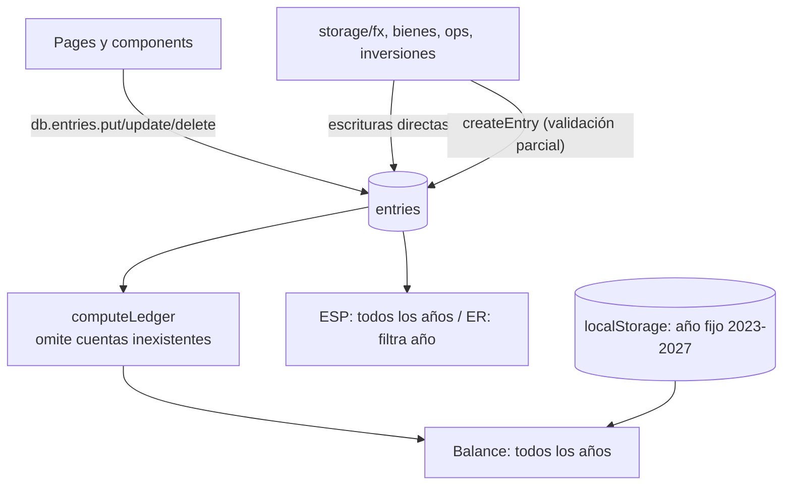
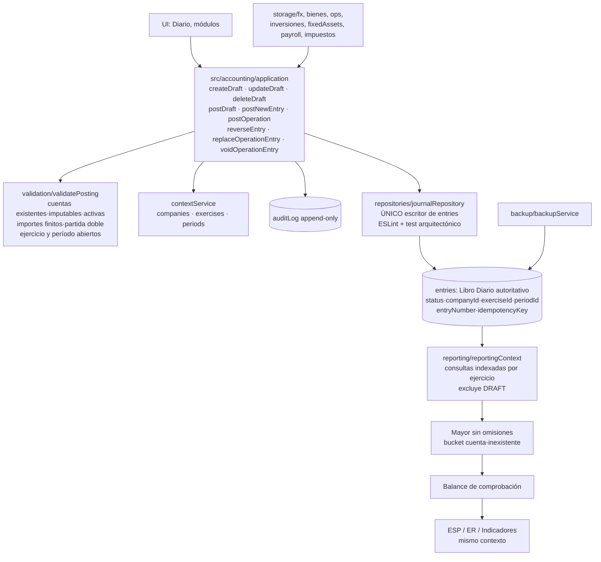

# Implementación Fase 2A — Núcleo Contable

**ContaLivre — Estabilización estructural del núcleo contable, preservación de datos, pruebas, contabilización única, ejercicios y taxonomía**

| Dato | Valor |
|---|---|
| Fecha | 16 de julio de 2026 |
| Rama de trabajo | `refactor/fase-2a-nucleo-contable` (creada desde `Sesion1`) |
| Commit base | `d28523b` |
| Fuente de diagnóstico | `docs/AUDITORIA_INTEGRAL_CONTALIVRE_FASE_1.md` |
| Node / npm | v25.9.0 / 11.12.1 |

---

## 14.1. Resumen ejecutivo

### Qué se modificó y por qué

Se implementó la cadena única y verificable exigida por la fase:

`Operación o asiento manual → propuesta → validación contable → borrador → contabilización → Libro Diario → Libro Mayor → Balance de comprobación`

1. **Servicio único de contabilización** (`src/accounting/`): ninguna función del sistema puede escribir en la tabla `entries` sin atravesarlo. La regla está garantizada por triple mecanismo: (a) migración de todos los llamadores, (b) regla ESLint `no-restricted-syntax` que prohíbe `db.entries.add/put/update/delete/bulk*/clear` fuera del repositorio, (c) test arquitectónico que escanea `src/` en cada corrida.
2. **Ciclo de vida de asientos**: `DRAFT` (editable, no impacta libros) → `POSTED` (inmutable, numerado secuencialmente por empresa/ejercicio) → `REVERSED` (reversión por asiento inverso enlazado, con motivo y actor; el original se conserva).
3. **Empresa, ejercicio y período persistidos** (tablas `companies`, `exercises`, `periods`): los ejercicios ya no son la lista fija 2023–2027; se cierran y reabren con auditoría; una fecha en período cerrado bloquea la contabilización con mensaje concreto.
4. **Aislamiento por contexto**: Mayor, Balance de comprobación, ESP/ER e indicadores dejan de leer todos los asientos globalmente. Cada consumidor filtra por el ejercicio seleccionado (consulta indexada por fecha) y excluye borradores.
5. **Idempotencia**: toda operación automática construye la clave `companyId|sourceModule|sourceType|sourceId|accountingEventType`; repetirla devuelve el asiento existente sin duplicar y deja registro del intento.
6. **Audit log append-only** (`auditLog`): borradores creados/modificados/eliminados, contabilizaciones, rechazos, reversiones, reemplazos y bajas de módulos, cierres/reaperturas, migraciones, respaldos y restauraciones.
7. **Preservación de datos**: respaldo integral JSON con versión, checksums y todas las tablas; restauración con validación previa, vista previa, copia automática del estado anterior y aplicación transaccional con rollback.
8. **Taxonomía**: `Account` ampliada con `accountClass`, `currentClassification`, `monetaryClassification`, `isPostable`, `active`, etc.; la migración v17 la materializa para todas las cuentas; **Bienes de Cambio quedó como NO monetaria** y la contradicción `1.1.04` (seed vs. prefijos) se eliminó: la metadata manda, los prefijos ambiguos ya no clasifican.
9. **Contención de inflación**: índice faltante ya no se sustituye por coeficiente 1 (bloquea informando el período); los asientos RT6 se envían al Diario **como borrador**; los índices precargados están rotulados como datos de ejemplo; el texto "Índices FACPCE actualizados" fue eliminado; advertencia visible "Módulo en revisión normativa".
10. **Importes**: servicio monetario central (`money.ts`) con rechazo de NaN/Infinity, redondeo half-up exacto (desplazamiento decimal, no multiplicación binaria), sumas en centavos e igualdad al centavo.

### Estado final

- **163/163 tests** (82 previos + 81 nuevos), **build OK**, **0 errores de hooks**, lint reducido de 117 a 98 errores (todos preexistentes, fuera del alcance; capa nueva 100 % limpia).
- Vulnerabilidades de producción: de 6 (1 crítica, 2 altas, 3 moderadas) a **1 alta (xlsx, sin fix disponible)**, mitigada con límites de importación.

### Riesgos eliminados

- Asientos persistidos sin validación (ACC-001), cuenta inexistente que desaparecía del Mayor, edición/borrado físico de contabilizados (ACC-002), mezcla de ejercicios entre reportes (ACC-003), duplicación por reintento (ACC-011), NaN/Infinity en libros (ACC-004), Mercaderías monetaria (ACC-009), coeficiente 1 silencioso (NOR-004), pérdida total de datos sin respaldo (DAT-001).

### Riesgos pendientes (ver 14.12)

- Importes siguen siendo `number` (el servicio central bloquea no-finitos y centraliza redondeo; la migración a centavos enteros queda documentada como deuda).
- Los asientos de módulos operativos se regeneran mediante comandos auditados (`replaceOperationEntry`/`voidOperationEntry`) en lugar de reversión estricta: decisión transitoria documentada (ver 14.5).
- RECPAM/motor de inflación siguen en revisión normativa (Fase 2B); contenidos, no corregidos.
- xlsx sin fix: mitigado, propuesta de reemplazo para Fase 2B.

---

## 14.2. Git y versiones

| Ítem | Antes | Después |
|---|---|---|
| Rama | `Sesion1` | `refactor/fase-2a-nucleo-contable` |
| Commit inicial | `d28523b` (árbol limpio salvo el informe de auditoría sin trackear) | HEAD de la rama (commit de esta fase) |
| Schema Dexie | v16 (35 tablas) | **v17 (40 tablas)** |
| Versión app | 0.1.0 ("Entrenador Contable MVP") | 0.2.0 (`APP_VERSION` en `migrateV17.ts`, visible en `/acerca`) |
| Tests | 16 archivos / 82 tests | 28 archivos / 163 tests |
| Lint | 117 errores / 53 warnings | 98 errores / 53 warnings (0 de hooks) |
| Vulnerabilidades (prod) | 6 (1 crítica, 2 altas, 3 moderadas) | 1 alta (xlsx, sin fix, mitigada) |

No se ejecutó `git reset --hard`, `git clean`, borrados masivos ni `npm audit fix --force`. No se hizo merge a la rama original. La única modificación previa del usuario (el informe de auditoría sin trackear) se preservó intacta.

---

## 14.3. Arquitectura antes y después

### Antes

### Después

---

## 14.4. Migraciones

### Tablas creadas (schema v17)

| Tabla | Contenido |
|---|---|
| `companies` | Empresa (por defecto `company-default`, tomada de `companyProfile`) |
| `exercises` | Ejercicios contables con estado OPEN/CLOSING/CLOSED |
| `periods` | Períodos con estado OPEN/SOFT_CLOSED/CLOSED, cierre/reapertura auditados |
| `auditLog` | Eventos append-only |
| `systemMeta` | appVersion, schemaVersion, installationId, migraciones, respaldos, excepciones |

### Campos agregados

- `entries`: `status`, `companyId`, `exerciseId`, `periodId`, `entryNumber`, `idempotencyKey`, `createdBy`, `updatedAt/updatedBy`, `postedAt/postedBy`, `reversedAt/reversedBy`, `reversalEntryId`, `reversedEntryId`, `reversalReason`, `schemaVersion` + índices `status`, `companyId`, `exerciseId`, `periodId`, `idempotencyKey`, `entryNumber`, `[companyId+exerciseId]`, `[exerciseId+status]`.
- `accounts`: `companyId`, `active`, `isPostable`, `normalBalance`, `accountClass`, `currentClassification`, `monetaryClassification`, `statementSection`, `resultFunction`, `cashFlowCategory`, `notesGroup`, `annexGroup`, `currency`, `validFrom/validTo`, `systemAccount`, `metadataVersion`.

### Estrategia legacy (`src/accounting/migration/migrateV17.ts`)

- **Idempotente**: cada paso verifica si el registro ya fue migrado (`entry.status`, `account.metadataVersion`) antes de tocarlo.
- Asientos existentes: empresa por defecto, ejercicio y período anuales derivados de su fecha, **estado POSTED**, numeración secuencial por ejercicio (orden fecha + createdAt), actor `legacy-migration`, `metadata.migratedFromLegacy: true`. **El contenido económico no se modifica.**
- Fechas inválidas: el asiento **no se descarta ni se le inventa fecha**; queda sin ejercicio, con `metadata.needsReview: true`, y se registra en `systemMeta.migrationExceptions`.
- Cuentas: materialización de taxonomía derivada de kind/section/statementGroup (sin tocar código ni nombre).
- Rollback: la migración corre dentro del upgrade transaccional de Dexie; si falla, la base queda en v16.
- Compatibilidad: todos los campos nuevos son opcionales en los tipos; el código lee con derivación de respaldo.

### Registros migrados (verificado por test)

`tests/accounting/migration.test.ts` reproduce una base v16 real (empresa, cuentas, asientos multi-año y un asiento con fecha corrupta) y verifica: IDs preservados, líneas idénticas, contexto asignado, ejercicios creados, excepción reportada, metadata y evento de auditoría.

---

## 14.5. Servicio de contabilización

**Flujo**: `createDraftEntry` (estructura mínima, importes finitos) → `postDraft`/`postNewEntry` → `validateAndResolveContext` → transacción atómica (número secuencial + POSTED + audit) → Diario.

**Validaciones previas a POSTED** (`validation/validatePosting.ts`): empresa/ejercicio existente y abierto; período existente y abierto; fecha válida (formato + calendario) y dentro de ejercicio y período; cuentas existentes, activas e imputables (agrupadoras rechazadas); importes finitos y no negativos; sin Debe y Haber simultáneos ni líneas vacías; mínimo 2 líneas; total Debe = total Haber **al centavo** (suma en centavos, sin tolerancia acumulativa); clave de idempotencia con unicidad lógica verificada dentro de la transacción.

**Numeración**: secuencial por empresa/ejercicio, asignada al contabilizar (`getMaxEntryNumber` dentro de la transacción). Los borradores no tienen número.

**Estados**: DRAFT editable/eliminable; POSTED inmutable (todo intento de edición/baja lanza `PostingError` con mensaje concreto); REVERSED conserva el original enlazado al reverso.

**Reversión** (`reverseEntry`): crea asiento nuevo con Debe/Haber invertidos y todas las líneas; exige motivo; usa período abierto; enlaza `reversalEntryId`/`reversedEntryId`; es idempotente (segunda reversión devuelve la existente); revalida el estado dentro de la transacción para impedir dobles reversiones concurrentes.

**Idempotencia** (`postOperation`): clave `companyId|sourceModule|sourceType|sourceId|accountingEventType`; el duplicado devuelve `{entry, idempotentHit: true}` y audita el intento.

**Audit log**: `DRAFT_CREATED/UPDATED/DELETED`, `ENTRY_POSTED`, `POSTING_REJECTED` (con los motivos), `ENTRY_REVERSED`, `ENTRY_REPLACED`, `ENTRY_VOIDED`, `PERIOD_CLOSED/REOPENED`, `EXERCISE_CREATED/CLOSED/REOPENED`, `MIGRATION_EXECUTED`, `BACKUP_CREATED`, `RESTORE_EXECUTED`, `JOURNAL_RESET`. Actor local explícito (`local-user` / `legacy-migration`); no se simula autenticación.

**Transacciones**: el servicio es consciente de transacciones (`inWriteTx`): si un módulo envuelve operación + asiento en una transacción Dexie (incluyendo las tablas de `JOURNAL_TX_TABLES`), el servicio la reutiliza; si falla el asiento no queda la operación, y viceversa. Las transacciones de `fx.ts` y `bienes.ts` fueron expandidas en consecuencia.

**Política de dos niveles (decisión documentada)**: los asientos **manuales** siguen el ciclo estricto (POSTED solo se corrige por reversión). Los asientos **generados por módulos operativos** se regeneran o retiran mediante comandos auditados del propio servicio (`replaceOperationEntry`, `voidOperationEntry`, `updateEntrySourceLink`) cuando el usuario edita/elimina la operación de origen: con validación completa, before/after en el audit log y **bloqueo en períodos cerrados**. Esto preserva los flujos operativos existentes sin escrituras directas; la unificación total por reversión es deuda explícita para Fase 2B.

**Aprovisionamiento de ejercicios (decisión documentada)**: en modo laboratorio educativo, si se contabiliza en una fecha sin ejercicio, se crea automáticamente el ejercicio anual + período (OPEN) y queda auditado como `EXERCISE_CREATED`. La protección temporal se activa al cerrar el período o el ejercicio: desde ese momento toda contabilización o modificación en ese rango se rechaza.

---

## 14.6. Empresa, ejercicio y período

- **Modelo**: `Company`, `AccountingExercise` (OPEN/CLOSING/CLOSED, `closedAt/closedBy`), `AccountingPeriod` (OPEN/SOFT_CLOSED/CLOSED, `reopenedAt/reopenedBy/reopenReason`). Períodos anuales por defecto (un período por ejercicio); el modelo admite subdividir en el futuro.
- **Selector**: `usePeriodYear` dejó la lista fija 2023–2027; `availableYears` ahora proviene de la tabla `exercises` (más el año seleccionado y el actual como mínimos). El encabezado (`PeriodPicker`) muestra **empresa, ejercicio, fechas y estado** (Abierto/En cierre/Cerrado).
- **Filtros**: `useLedger` (Mayor y Conciliaciones), `Balance.tsx`, `Estados.tsx`, `useIndicatorsMetrics` y el Diario (`AsientosDesktop`) consultan por rango de fechas indexado del ejercicio seleccionado y excluyen borradores. Al cambiar el ejercicio, todos los consumidores cambian con el mismo contexto (single source: `usePeriodYear`).
- **ESP** (decisión documentada): al no existir refundición/apertura formal (fuera de alcance), el ESP es un stock acumulado **hasta la fecha de corte** (nunca incluye fechas posteriores ni borradores); los saldos de ejercicios anteriores ingresan solo por ese mecanismo explícito, también disponible como `getOpeningBalances(ctx)`. El ER filtra estrictamente su ejercicio.
- **Cierre/reapertura**: `closeExercise`/`reopenExercise`, `closePeriod`/`reopenPeriod` con auditoría y motivo. La reapertura exige razón.
- **Aislamiento**: verificado por `tests/accounting/isolation.test.ts` (ejercicios 2025/2026: mayor, balance y contexto no se mezclan).

---

## 14.7. Taxonomía

- **Campos**: ver 14.4. `isPostable` (agrupadoras `false`), `active`, `normalBalance`, `accountClass` (ASSET/LIABILITY/EQUITY/REVENUE/EXPENSE/OTHER), `currentClassification`, `monetaryClassification` (MONETARY/NON_MONETARY/MIXED/NOT_APPLICABLE).
- **Cuentas migradas**: las 197 cuentas del seed (y cualquier cuenta importada) reciben metadata materializada en la migración v17 vía `materializeTaxonomy` (idempotente, no pisa metadata existente).
- **Clasificaciones corregidas** (mapa único en `src/accounting/taxonomy/taxonomy.ts`): Caja/Bancos, créditos y deudas en moneda → MONETARY; **Bienes de Cambio (INVENTORIES) → NON_MONETARY** (ACC-009); Bienes de Uso, Intangibles, PN y resultados → NON_MONETARY; INVESTMENTS → MIXED (requiere revisión por cuenta); agrupadoras → `isPostable: false`.
- **Reglas por texto eliminadas**:
  - `monetary-classification.ts`: la metadata persistida es la Regla 0 y manda siempre; el prefijo `1.1.04` **ya no clasifica** (era contradictorio: Bienes de cambio en el seed vs. "anticipos" en la tabla de prefijos); sin metadata la cuenta queda INDEFINIDA y exige decisión del usuario.
  - `auto-partidas-rt6.ts` (`deriveRubroLabel`): la fuente del rubro es `account.group` (metadata); se eliminaron los prefijos de activo contradictorios (1.2.01/1.2.02/1.2.03 rotulaban Mercaderías/Bienes de Uso/Intangibles cuando el seed los usa para Bienes de Uso/Intangibles/Inversiones).
- **Validación del plan** (`validateChartOfAccounts`): códigos e IDs duplicados por empresa, padre inexistente, ciclos jerárquicos, imputable con hijos (warning), ASSET acreedor / LIABILITY deudor sin marca de regularizadora. Probado en `tests/accounting/taxonomy.test.ts`.
- **Excepciones**: las heurísticas por nombre/prefijo se conservan únicamente como **respaldo documentado** para cuentas importadas sin metadata (nunca por encima de la metadata); la importación de planes con preview/mapping obligatorio por fila queda como deuda recomendable (14.12).

---

## 14.8. Datos

- **Backup** (`src/accounting/backup/backupService.ts` + UI en `/acerca`): JSON con `format`, `formatVersion`, `appVersion`, `schemaVersion`, `installationId`, fecha, **todas las tablas de IndexedDB** (asientos, cuentas, operaciones de todos los módulos, ejercicios, períodos, audit log, systemMeta), claves relevantes de localStorage (período seleccionado, comparativos, notas) y checksums de conteo por tabla + total. Sin secretos ni objetos no serializables.
- **Restore**: validación completa del archivo **antes de tocar la base** (formato, versión de schema no futura, consistencia de checksums); vista previa (tablas, registros, empresa, ejercicios, fecha) con opción de cancelar; **copia de seguridad automática previa** (se descarga); aplicación en **una transacción Dexie** (rollback ante fallo); validación de conteos posterior; evento `RESTORE_EXECUTED`.
- **Round-trip probado**: `tests/accounting/backup.roundtrip.test.ts` exporta, destruye la base, restaura y compara registro por registro; verifica además que un archivo inválido o con checksums adulterados se rechaza sin tocar nada.
- **Identificación de versión** (`/acerca`): nombre, versión, commit (`VITE_COMMIT_SHA` si el build lo provee), schema Dexie, fecha de compilación, installationId, última migración, último respaldo, modo "Laboratorio educativo local". Sin roles ficticios.

---

## 14.9. Tests

| Suite | Antes | Después | Resultado |
|---|---:|---:|---|
| Suite existente (16 archivos) | 82 | 82 | ✅ sin regresiones |
| `accounting/posting.invalid.test.ts` | — | 15 | ✅ |
| `accounting/lifecycle.test.ts` | — | 8 | ✅ |
| `accounting/idempotency.test.ts` | — | 4 | ✅ |
| `accounting/isolation.test.ts` | — | 5 | ✅ |
| `accounting/integrity.test.ts` | — | 4 | ✅ |
| `accounting/taxonomy.test.ts` | — | 15 | ✅ |
| `accounting/golden.comercial.test.ts` | — | 9 | ✅ |
| `accounting/migration.test.ts` | — | 5 | ✅ |
| `accounting/backup.roundtrip.test.ts` | — | 4 | ✅ |
| `accounting/inflacion.contencion.test.ts` | — | 4 | ✅ |
| `accounting/money.test.ts` | — | 7 | ✅ |
| `accounting/architecture.test.ts` | — | 1 | ✅ |
| **Total** | **82** | **163** | **✅ 163/163** |

Casos nuevos destacados: NaN/Infinity/-Infinity/negativos rechazados; Debe≠Haber; línea con ambas columnas o ninguna; cuenta inexistente/agrupadora/inactiva **impiden** la contabilización (no se omiten); fecha inválida/fuera de ejercicio/período cerrado; Diario=Mayor=Balance con conteo de líneas; línea legacy con cuenta inexistente visible en bucket `⚠ Cuenta inexistente` (totales preservados); borrador editable/eliminable y fuera de libros; POSTED inmutable por todas las vías; reversión enlazada con motivo/actor y neto cero; doble reversión bloqueada; operación repetida no duplica y queda auditada; aislamiento 2025/2026; apertura 2026 solo por mecanismo explícito; golden case comercial con saldos exactos y ecuación patrimonial; migración v16→v17 con excepciones; backup round-trip; escaneo arquitectónico.

Calidad: deterministas (fechas fijas), base Dexie aislada por test (`fake-indexeddb` + `resetDb`), resultados exactos (sin snapshots), mensajes claros. Única dependencia agregada: `fake-indexeddb` (dev), justificada para tests de integración/migración Dexie.

---

## 14.10. Comandos

| Comando | Antes | Después |
|---|---|---|
| `npm test` | 16 archivos, 82 tests ✅ | **28 archivos, 163 tests ✅** (12 s) |
| `npm run lint` | exit 1 — 117 errores / 53 warnings (4 de hooks) | exit 1 — **98 errores / 53 warnings, 0 de hooks, 0 escrituras directas**; `src/accounting` y `tests/accounting` con **0 problemas** |
| `npm run build` | exit 0 (chunk >500 kB, advertencia preexistente) | **exit 0** (misma advertencia preexistente) |
| `npm audit --omit=dev` | 6 vulnerabilidades (1 crítica jsPDF, 2 altas mathjs/xlsx, 3 moderadas) | **1 alta (xlsx, sin fix disponible)** — jsPDF, mathjs, dompurify y react-router actualizados con `npm audit fix` sin `--force`; tests y build verificados después |
| `git status` | limpio en `d28523b` | 41 archivos modificados + `src/accounting/` + `tests/accounting/` + `/acerca` + este informe |
| `git diff --stat` | — | ~41 archivos, ~900 inserciones / ~226 eliminaciones (sin contar archivos nuevos ni lockfile) |

---

## 14.11. Hallazgos

| Hallazgo | Estado | Evidencia | Observación |
|---|---|---|---|
| ACC-001 puerta eludible | **Resuelto** | `journalRepository.ts` único escritor; regla ESLint; `architecture.test.ts`; `posting.invalid.test.ts` | Validación completa obligatoria en toda escritura |
| ACC-002 sin ciclo de vida/auditoría | **Resuelto (manual) / Parcial (módulos)** | `journalService.ts`; `lifecycle.test.ts`; `auditLog` | POSTED manual inmutable + reversión enlazada. Módulos: regeneración auditada con bloqueo en período cerrado (decisión transitoria documentada en 14.5) |
| ACC-003 mezcla de ejercicios | **Resuelto** | `reportingContext.ts`; `useLedger`; `Balance.tsx`; `Estados.tsx`; `useIndicatorsMetrics`; `isolation.test.ts` | ESP = stock a la fecha de corte (mecanismo de apertura explícito); ER estricto al ejercicio |
| ACC-004 importes inseguros | **Parcial** | `money.ts`; `money.test.ts`; validación en todo posting | NaN/Infinity bloqueados, redondeo central, igualdad al centavo. Migración a centavos enteros: deuda 2B |
| ACC-007 catálogo por textos | **Parcial (mayor parte)** | `taxonomy.ts`; migración v17; `monetary-classification.ts` Regla 0; `taxonomy.test.ts` | Metadata manda; prefijos contradictorios eliminados; quedan heurísticas de respaldo documentadas e importación de planes con mapping para 2B |
| ACC-008 sin ejercicios/protección temporal | **Resuelto (núcleo)** | `contextService.ts`; `periods`; `posting.invalid.test.ts` (período cerrado) | Cierre/reapertura auditados. Refundición/apertura formal: fuera de alcance declarado |
| ACC-009 Bienes de Cambio monetarios | **Resuelto** | `taxonomy.ts` (INVENTORIES→NON_MONETARY); fix `monetary-classification.ts:170`; `taxonomy.test.ts`; `migration.test.ts` | Verificado también sobre cuentas migradas |
| ACC-011 automatismos sin idempotencia | **Resuelto (mecanismo) / Parcial (adopción)** | `postOperation`; `idempotency.test.ts`; comandos auditados en fx/bienes/ops/inversiones/fixedAssets | El mecanismo existe y está probado; migrar cada generador de asientos de módulo a `postOperation` con clave propia es tarea incremental 2B (hoy todos pasan igual por la puerta única validada) |
| DAT-001 sin recuperación integral | **Resuelto** | `backupService.ts`; `/acerca`; `backup.roundtrip.test.ts` | Export/restore transaccional con validación y copia previa |
| DAT-002 migraciones débiles | **Resuelto (v17)** | `migrateV17.ts`; `systemMeta`; `migration.test.ts` | Idempotente, con excepciones reportadas y metadata de sistema |
| NOR-004 índices no bloqueantes | **Resuelto** | `calc.ts` (`calculateCoef` → null); `CierreValuacionPage` bloquea y lista períodos; rotulado de `INITIAL_INDICES`; `inflacion.contencion.test.ts` | "Índices FACPCE actualizados" eliminado de PlanillasHome |
| ACC-010 RECPAM incorrecto | **Contenido (no corregido)** | Asientos RT6 → borrador; advertencia "Módulo en revisión normativa"; metadata `rt6EngineLegacy` | Rediseño integral: Fase 2B (alcance excluido) |
| TST-001 sin invariantes | **Resuelto** | 81 tests nuevos (14.9) | Invariantes P0 cubiertos |
| TST-002 lint con hooks | **Resuelto (hooks) / Parcial (total)** | `EstadoResultadosDocument.tsx`, `EvolucionPNTab.tsx` corregidos; 117→98 errores | Restantes: `any`/unused-vars preexistentes en módulos no intervenidos; ninguno nuevo |
| SEC-002 dependencias/imports | **Parcial (mayor parte)** | `npm audit fix` sin force (crítica y 1 alta eliminadas); `importLimits.ts` aplicado al importador de asientos | xlsx sin fix: límites de tamaño/filas/columnas/extensión; propuesta 2B: migrar a exceljs o parse en worker |

---

## 14.12. Deuda pendiente

**Bloqueante para Fase 2B**
1. Rediseño del motor de inflación/RECPAM (ACC-010) con especificación matemática, anticuación de aperturas y dataset oficial: los asientos RT6 quedan en borrador hasta entonces.
2. Decisión final de estrategia monetaria (centavos enteros vs. decimal) y migración completa de importes (ACC-004).
3. Unificación del tratamiento de asientos de módulos: reemplazar `replaceOperationEntry`/`voidOperationEntry` por reversión + re-posteo uniforme (ACC-002/ACC-011).

**Recomendable**
4. Adoptar `postOperation` (clave de idempotencia explícita) en cada generador de asientos de módulo, reemplazando `createEntry`.
5. Importación del plan de cuentas con preview, errores por fila, mapping obligatorio y rollback (ACC-007).
6. Extender `importLimits` a los demás importadores (bancos, índices, comparativos) y evaluar reemplazo de xlsx.
7. Reducir los 98 errores de lint preexistentes (`any`, unused-vars) por módulo.
8. Períodos mensuales opcionales dentro del ejercicio.

**Futura**
9. Refundición/cierre formal de ejercicio con traslado de resultados y asiento de apertura (elimina el mecanismo de apertura acumulada del ESP).
10. EFE, motor único de estados, indicadores tipados (fases siguientes del roadmap de la auditoría).

---

## 14.13. Archivos modificados

### Nuevos — núcleo contable (`src/accounting/`)

| Archivo | Propósito |
|---|---|
| `domain/types.ts` | Company, AccountingExercise, AccountingPeriod, AuditEvent, SystemMeta, contratos y PostingError |
| `domain/money.ts` | Servicio monetario único (finitud, redondeo, suma en centavos, igualdad) |
| `domain/idempotency.ts` | Clave canónica de idempotencia |
| `validation/validatePosting.ts` | Validación estructural de borradores y validación completa de contabilización |
| `repositories/journalRepository.ts` | Único escritor autorizado de `entries` |
| `application/journalService.ts` | Servicio único: draft/post/reverse/postOperation/replace/void/reset |
| `application/contextService.ts` | Empresa, ejercicios, períodos, cierre/reapertura, systemMeta |
| `application/txUtils.ts` | Reutilización de transacciones del llamador |
| `audit/auditLog.ts` | Registro append-only |
| `reporting/reportingContext.ts` | ReportingContext, consultas aisladas, saldos de apertura explícitos |
| `backup/backupService.ts` | Respaldo/restauración integral |
| `migration/migrateV17.ts` | Migración legacy v16→v17 |
| `taxonomy/taxonomy.ts` | Clasificación estructurada y validación del plan |
| `importLimits.ts` | Límites configurables de importación |
| `index.ts` | API pública |

### Nuevos — UI y tests

`src/pages/AcercaDe.tsx` (versión + backup/restore); `tests/accounting/*` (12 archivos, ver 14.9); `tests/setup.ts` (fake-indexeddb).

### Modificados (selección)

| Archivo | Propósito |
|---|---|
| `src/storage/db.ts` | Schema v17 + upgrade |
| `src/core/models.ts` | Account y JournalEntry ampliados, EntryStatus |
| `src/storage/entries.ts` | Capa de compatibilidad: delega todo en el servicio |
| `src/storage/fx.ts`, `bienes.ts`, `ops.ts`, `inversiones.ts`, `fixedAssets.ts`, `seed.ts` | Escrituras directas → comandos del servicio; transacciones expandidas |
| `src/core/ledger.ts` | Excluye DRAFT; bucket de cuenta inexistente (nunca omite líneas) |
| `src/hooks/useLedger.ts`, `usePeriodYear.ts`, `useIndicatorsMetrics.ts` | Aislamiento por ejercicio; ejercicios persistidos |
| `src/pages/Balance.tsx`, `Estados.tsx`, `AsientosDesktop.tsx`, `AsientosMobile.tsx` | Contexto + ciclo de vida (borrador/contabilizar/revertir) |
| `src/components/journal/EntryCard.tsx`, `NewEntryModal.tsx` | Estados visibles, acciones por estado, notas educativas |
| `src/ui/Layout/TopHeader/PeriodPicker.tsx` | Empresa/ejercicio/fechas/estado |
| `src/core/cierre-valuacion/*` | Contención: índice faltante bloquea, metadata manda, rubros por metadata |
| `src/pages/Planillas/CierreValuacionPage.tsx`, `PlanillasHome.tsx` | RT6 a borrador, bloqueo por índices, advertencia normativa, texto honesto |
| `src/components/ImportAsientosUX.tsx` | Límites de importación |
| `src/components/Estados/EstadoResultadosDocument.tsx`, `EvolucionPNTab.tsx` | Hooks incondicionales (errores de hooks eliminados) |
| `eslint.config.js` | Regla anti-escrituras directas |

---

## 14.14. Instrucciones de prueba manual

1. **Migración**: abrir la app con datos previos → en `/acerca` verificar "Schema Dexie v17" y "Última migración v17-fase2a-nucleo-contable". Los asientos históricos aparecen como **Contabilizado** con su número.
2. **Ejercicios**: en el selector del encabezado ver empresa + ejercicio + fechas + estado. Cambiar de año y verificar que Diario, Mayor, Balance y Estados cambian juntos.
3. **Borrador**: Asientos → Nuevo asiento → "Guardar borrador". Verificar chip **Borrador**, que NO aparece en Mayor/Balance, y que se puede editar y eliminar.
4. **Contabilizar**: botón ✓ del borrador → chip **Contabilizado** con número → aparece en Mayor y Balance. Verificar que Editar/Eliminar ya no están disponibles y que intentarlo muestra el mensaje de reversión.
5. **Revertir**: botón ↩ → ingresar motivo → se crea el asiento inverso, el original queda **Revertido** y el saldo neto de las cuentas vuelve a cero.
6. **Validaciones**: intentar contabilizar un borrador desbalanceado, o con una cuenta agrupadora: el mensaje indica exactamente la cuenta/el problema.
7. **Período cerrado**: (consola o herramienta) cerrar el período del ejercicio → cualquier alta de operación en ese rango se rechaza con "pertenece al período ... que está cerrado".
8. **Idempotencia**: crear una operación en un módulo (p. ej. compra de inventario), verificar que reintentos no duplican el asiento (contador del Diario).
9. **Inflación**: Planillas → Cierre AxI: ver la advertencia "Módulo en revisión normativa"; borrar un índice y verificar que "Enviar al Diario" se bloquea listando el período faltante; con índices completos, los asientos llegan como **Borrador**.
10. **Backup/restore**: `/acerca` → "Descargar respaldo" → borrar un asiento → "Seleccionar archivo" → revisar la vista previa → "Restaurar ahora" → verificar conteos y que se descargó la copia previa.

---

## 14.15. Conclusión

Los criterios de terminación de la fase se cumplen en su núcleo: respaldo y restauración probados, migración que preserva datos, empresa/ejercicio/período persistidos con protección temporal, puerta única de contabilización sin escrituras directas (verificado por lint + test), borradores fuera de los libros, contabilizados inmutables, reversión e idempotencia funcionales, audit log, importes finitos, taxonomía estructurada con Bienes de Cambio no monetarios, índice faltante que bloquea, Diario = Mayor = Balance probados, 163/163 tests, build sin errores y cero errores de hooks.

Quedan documentados como **parciales** (no ocultos): la estrategia monetaria definitiva, la unificación por reversión de los flujos de módulos, la adopción explícita de claves de idempotencia en cada módulo y el lint preexistente fuera del alcance.

**ContaLivre queda en condiciones de iniciar la Fase 2B** (motor de inflación/RECPAM, estados unificados, EFE) sobre una base contable trazable: la fase siguiente puede construirse sin volver a tocar la frontera de escritura del Diario.
