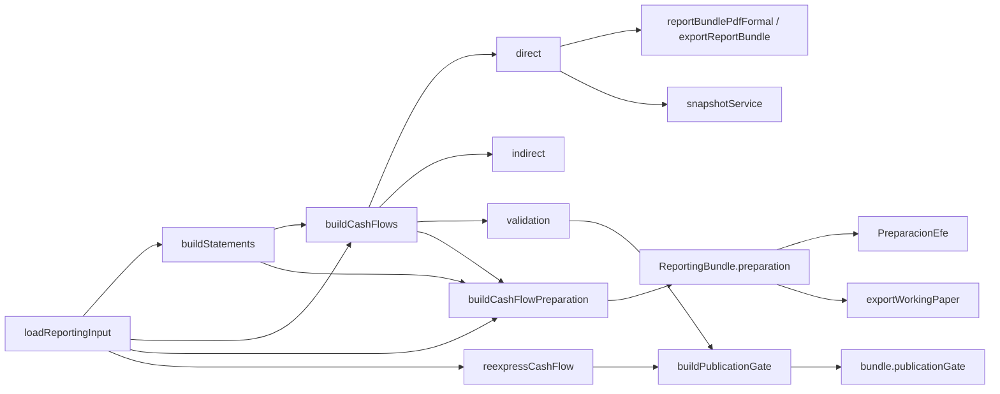

# Implementación — Fase 2G: Estado de Flujo de Efectivo auditable, matricial y formal

## 1. Resumen

Se corrigió el motor del EFE (los cuatro P0 de la auditoría), se incorporó una política EFE
versionada con migración de esquema, un modelo de preparación matricial auditable, comparativo
real, apertura modificada, REI en exportaciones, snapshots robustos y una experiencia de UI de
preparación (escritorio + móvil) con configuración y accesibilidad. Todo el cálculo vive en el
motor; la UI y los exportadores consumen `ReportingBundle`.

- **Rama:** `refactor/fase-2g-efe-matricial-auditable` (base `8984545`, sin merge, `main` intacto).
- **Motor:** `2G.0` · **Esquema:** `22` · **Versión:** `0.5.0-rc.1`.
- **Validación (Node 22.23.1):** 74 archivos / **466 tests**, tsc limpio, lint 0 errores / 53
  warnings (preexistentes), build OK, E2E chromium-desktop + chromium-mobile en verde.

## 2. Commits (uno por hito)

| Hito | Commit | Título |
|---|---|---|
| 0 | `2d29149` | docs: incorporar auditoría y especificación de la fase 2G |
| 1 | `d03bc72` | test: fijar Purmamarca y casos adversos del EFE |
| 2 | `acc8e50` | fix: corregir disposiciones de activos y flujo bruto |
| 3 | `2c45d7c` | fix: cerrar reexpresión y puerta de publicación EFE |
| 4 | `788d92b` | feat: versionar políticas EFE y migración v22 |
| 5 | `4ed29e3` | feat: incorporar modelo de preparación y lineage exacto |
| 6 | `a690768` | feat: completar apertura y comparativo del EFE |
| 7 | `4f13e41` | fix: completar exposición y exportaciones formales EFE |
| 8 | `1847460` | feat: robustecer snapshots e identidad de contenido |
| 9 | `5afc529` | feat: implementar experiencia matricial de preparación |
| 10 | `36733d1` | fix: completar configuración accesibilidad y responsive EFE |
| 11 | `0c14e4b` | test: cerrar contratos exports y aceptación E2E |
| 12 | (este) | docs: cerrar implementación de la fase 2G |

## 3. Baseline registrada

En `8984545` con Node 22.23.1 / npm 10.9.8: EFE focalizadas 7 archivos/51 tests; suite completa
64 archivos/423 tests; build exit 0 (sólo warning de tamaño de chunks); lint 0 errores/53 warnings.

## 4. Arquitectura

**Antes:** `buildCashFlows` producía `{direct, indirect, validation}`; la evidencia (contribución
por línea, bucket, coeficiente) se descartaba; el estado no distinguía preparación de exposición.

**Ahora:** tres contratos separados (ver [ADR](ADR_EFE_PREPARATION_MODEL.md)).

## 5. Migración

Esquema Dexie **21 → 22**: tabla `cashFlowPolicies`. `migrateToV22` crea una política heredada
determinista por empresa (`requiresReview`), es idempotente y no destructiva (no toca cuentas,
asientos ni ejercicios). `backup`/`reset` iteran `db.tables` ⇒ la tabla entra automáticamente.
Instalación fresca (base creada en v22, sin upgrade) usa `ensureDefaultPolicy`. Cadena v16→v22 y
roundtrip de backup probados.

## 6. Política EFE

`CashFlowPolicy` por entidad, versionada, con clasificación de efectivo/equivalentes (rol +
atributos de liquidez/riesgo/plazo/restricción), intereses/dividendos/IG, sobregiros y overrides
auditables con vigencia. Panel de Configuración pedagógico ("Políticas del Estado de Flujo de
Efectivo"). `NOT_APPLICABLE` honrado en `flowBucket`.

## 7. Motor (P0)

- **EFE-001** disposición de activos: `detectDisposalFold` lleva el cobro/pago BRUTO a la
  actividad y elimina el resultado del operativo (directo, indirecto y reexpresado).
- **EFE-004** reexpresión: se elimina el doble conteo de partidas sin clasificar.
- **EFE-003** puerta de publicación única (`publicationGate`) que gobierna `status`, snapshots y
  exports; considera controles nominales, reexpresados y cobertura de índices.
- **EFE-002** REI/RFyT y revelaciones en PDF/XLSX, con suma que reconcilia.

## 8. Preparación

`CashFlowPreparationModel`: identidad + hash, puente del efectivo, filas matriciales (control por
fila = 0 por construcción), imputaciones con fórmula/operandos/lineage, puentes devengado→percibido
y controles exactos en centavos.

## 9. UI

Selector `[Exposición][Preparación]`. Preparación: cuatro pasos, puente del efectivo, panel de
controles (verde sólo si el cálculo real lo aprueba), matriz con columnas por actividad, filtros,
celda interactiva con fórmula/lineage y modal accesible; móvil con tarjetas.

## 10. Exportaciones

PDF/XLSX formal (con REI, comparativo, apertura modificada y revelaciones separadas) + export
AUXILIAR de papel de trabajo (`exportWorkingPaper`) que consume la preparación. El formal nunca
consume la matriz (test de contrato).

## 11. Snapshots

Congelan ambos métodos + reexpresión + preparación + gate; hash de contenido determinista;
`snapshotDivergesFromCurrent`. VALIDATED gobernado por el gate.

## 12. Pruebas y performance

Unitarias/integración/contrato: Purmamarca (controles 0, puentes exactos), disposiciones
ganancia/pérdida/valor contable, reexpresión, gate, política, NOT_APPLICABLE, AREA, comparativo,
REI export, papel de trabajo, snapshots, migración v16→v22. E2E: preparación escritorio (matriz,
controles, celda, foco de modal), móvil 390×844 (tarjetas + aserción `scrollWidth<=clientWidth`),
config. Performance: el DTO agrega por cuenta (no por contribución) evitando miles de nodos DOM;
no degrada los límites 10k/100k del motor.

## 13. Evidencia

[`docs/evidence/phase2g/`](evidence/phase2g/): capturas de exposición, preparación (matriz y
controles), fórmula de celda, configuración y móvil; manifiesto con hashes y resultados de gates.

## 14. Limitaciones y deuda restante

- **Disposiciones a crédito / cobro parcial / operación mixta:** no se pliegan automáticamente;
  requieren override transaccional o lineage (previsto en la política). Se documentan, no se
  clasifican en silencio.
- **Preparación en moneda de cierre:** el DTO se emite nominal; la reexpresión de la matriz
  (coeficiente por contribución) es evolución futura. La exposición y los controles reexpresados
  ya existen en el estado formal.
- **Config de política:** el panel es de revisión (marca `requiresReview` como resuelto); la
  edición fina por cuenta/override es evolución futura.
- **E2E Firefox/exports** sobre la preparación: cubiertos por chromium; ampliables.

## 15. Pasos de prueba manual

1. Configuración → Datos → cargar dataset RC. 2. Estados → Flujo de Efectivo. 3. Alternar
Exposición/Preparación, Directo/Indirecto, Nominal/Cierre, Resumen/Detalle. 4. En Preparación:
revisar controles, filtrar por actividad, ocultar sin movimiento, abrir una celda (fórmula +
lineage), cerrar con Escape. 5. Exportar estados (PDF/XLSX) y verificar REI en cierre. 6.
Configuración → Plan de cuentas y mapeos → Políticas del EFE. 7. Viewport 390×844: tarjetas sin
recorte. 8. Cargar el caso Purmamarca vía el fixture de tests para QA numérico.
