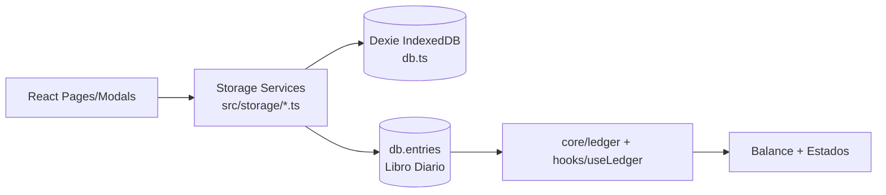

# SYSTEM AUDIT — ContaLivre

Fecha de auditoría: 2026-02-15  
Alcance: inspección estática del repo (`UI → dominio → DB → asientos → reportes`) sin cambios funcionales.

## 1. Resumen ejecutivo (1 página)

ContaLivre es una SPA React+Vite con persistencia local en IndexedDB (Dexie), sin backend/API HTTP en el flujo core.  
El circuito principal está centrado en `db.entries` (Libro Diario) y `db.accounts` (Plan de Cuentas), y el resto de módulos (Inventario, Impuestos, Sueldos, etc.) generan/vinculan asientos mediante `sourceModule/sourceId/sourceType` y `metadata`.

Hallazgos clave:
- El cableado end-to-end está bien definido para inventario comercial: alta de movimiento -> generación automática de asiento -> impacto en Mayor/Balance/Estados.
- Hay soporte explícito para pagos/cobros parciales (vía `PAYMENT` + `sourceMovementId`) en compras/ventas e integración con cuentas corrientes de terceros.
- IVA/retenciones/percepciones se registran en dos planos:
  - operativo (al contabilizar compras/ventas/pagos en inventario),
  - fiscal (determinación/cierre en módulo Impuestos).
- Edición/borrado tiene mecanismos de consistencia en inventario y payroll, pero no existe una política homogénea global para todos los módulos (riesgo de desalineación por módulo).
- `npm run build` falla por errores preexistentes de tipado en tests (`tests/repro_eepn.test.ts` con campo `isActive` no perteneciente a `JournalEntry`).

Conclusión operativa:
- El sistema ya tiene una base sólida para circuito contable general y fiscal mensual.
- El gap más relevante de negocio hoy no está en “asientos”, sino en modelado funcional para gastos no-stock (acreedores/gastos administrativos) y en formalizar extensiones para aportes/retiros de socios como flujo operativo guiado.

## 2. Arquitectura (diagrama Mermaid simple)



Evidencia:
- Router principal: `src/App.tsx:47`, `src/App.tsx:49`, `src/App.tsx:59`, `src/App.tsx:60`, `src/App.tsx:61`, `src/App.tsx:62`.
- DB Dexie y tablas: `src/storage/db.ts:59`, `src/storage/db.ts:453`.

Snippet clave (rutas principales):
```tsx
<Route path="/operaciones/inventario" element={<InventarioBienesPage />} />
<Route path="/operaciones/proveedores" element={<ProveedoresAcreedoresPage />} />
<Route path="/asientos" element={<Asientos />} />
<Route path="/mayor" element={<Mayor />} />
<Route path="/balance" element={<Balance />} />
<Route path="/estados" element={<Estados />} />
```
Fuente: `src/App.tsx:49-62`.

## 3. Mapa de rutas/páginas (tabla)

| Ruta | Página | Operaciones principales | Servicio/capa llamada | Persistencia |
|---|---|---|---|---|
| `/operaciones` | `OperacionesPage` | Hub KPI y navegación | LiveQuery directo + métricas (`getPayrollMetrics`, etc.) | `db.*` |
| `/operaciones/inventario` | `InventarioBienesPage` | Productos, movimientos, conciliación, cierre periódico | `src/storage/bienes.ts` (`createBienesMovement`, `updateBienesMovementWithJournal`, `deleteBienesMovementWithJournal`, `generatePeriodicClosingJournalEntries`) | `bienesProducts`, `bienesMovements`, `bienesSettings`, `entries` |
| `/operaciones/proveedores` | `ProveedoresAcreedoresPage` | Dashboard terceros, vencimientos, pagar/perfeccionar | Lee `db.entries/db.bienesMovements`; crea `RECLASS` vía `createBienesMovement` | `bienesMovements` + `entries` |
| `/asientos` | `AsientosDesktop` / `AsientosMobile` | Alta/edición/borrado Libro Diario | `createEntry`, `deleteJournalEntryWithSync` | `entries` |
| `/mayor` | `Mayor` | Libro mayor, saldos por cuenta y consolidado por jerarquía | `useLedger` + `computeRollupTotals` | deriva de `entries` + `accounts` |
| `/balance` | `Balance` | Balance de sumas y saldos | `computeLedger` + `computeTrialBalance` | deriva de `entries` + `accounts` |
| `/estados` | `Estados` | ESP/ER/EPN/Notas | `computeLedger`, `computeRollupTrialBalance`, `computeStatements` | deriva de `entries` + `accounts` |
| `/operaciones/impuestos` | `ImpuestosPage` | Cierre IVA/IIBB/MT/AUT, vencimientos, pagos fiscales | `storage/impuestos.ts` (`calculateIVAFromEntries`, `generateIVAEntry`, `registerTaxPayment`) | `taxClosures`, `taxObligations`, `taxPayments`, `entries` |

Módulo inventario (submódulos UI dentro de la ruta):
- Tabs internas en `InventarioBienesPage`: dashboard, productos, movimientos, conciliación, cierre (`src/pages/Planillas/InventarioBienesPage.tsx`).

## 4. Modelo de datos (tablas/entidades)

### 4.1 Tablas relevantes (Dexie)

Definición: `src/storage/db.ts:453` (schema v16).

Núcleo:
- `accounts`: plan de cuentas jerárquico (`code`, `parentId`, `statementGroup`, `isHeader`).
- `entries`: asientos (`date`, `memo`, `sourceModule`, `sourceId`).

Inventario comercial:
- `bienesProducts`
- `bienesMovements`
- `bienesSettings`

Fiscal:
- `taxClosures`
- `taxDueNotifications`
- `taxObligations`
- `taxPayments`

Sueldos:
- `payrollEmployees`
- `payrollSettings`
- `payrollRuns`
- `payrollLines`
- `payrollPayments`
- `payrollConcepts`

Otros módulos con asientos:
- `fixedAssets`, `fixedAssetEvents`
- `fxAccounts`, `fxMovements`, `fxDebts`, `fxLiabilities`
- `invInstruments`, `invMovements`, `invSettings`

### 4.2 Entidades clave y relaciones

- `Account` (`src/core/models.ts`): jerarquía por `parentId`; clasificación para estados por `statementGroup`.
- `JournalEntry` (`src/core/models.ts`): vínculo a origen por `sourceModule/sourceId/sourceType`.
- `BienesMovement` (`src/core/inventario/types.ts`): operación comercial con datos de IVA, impuestos adicionales, costeo, `sourceMovementId`, `linkedJournalEntryIds`.
- `TaxClosePeriod` / `TaxObligationRecord` / `TaxPaymentLink` (`src/core/impuestos/types.ts`): determinación y cancelación fiscal.
- `PayrollRun` / `PayrollPayment` (`src/core/payroll/types.ts` + `src/storage/payroll.ts`): devengado y pagos con vínculo a diario.

Snippet clave (trazabilidad en asiento):
```ts
export interface JournalEntry {
  id: string
  date: string
  memo: string
  lines: EntryLine[]
  sourceModule?: string
  sourceId?: string
  sourceType?: string
  metadata?: Record<string, any>
}
```
Fuente: `src/core/models.ts`.

## 5. Flujos end-to-end (compra, venta, pago, cobro, devolución)

### 5.1 Compra

UI:
- Modal `MovementModalV3` en modo compra (`src/pages/Planillas/components/MovementModalV3.tsx`).
- Captura: producto, cantidad/costo, IVA, tercero, condición de pago, splits, percepciones/retenciones, referencia, vencimiento.

Dominio/servicio:
- `handleSaveMovement` -> `createBienesMovement` (`src/pages/Planillas/InventarioBienesPage.tsx:837`, `src/storage/bienes.ts:1487`).
- Si `autoJournal=true`, `createBienesMovement` invoca `buildJournalEntriesForMovement` y persiste asiento(s).

DB/asiento:
- Guarda en `bienesMovements`.
- Genera `entries` con `sourceModule: 'inventory'`, `sourceId: movement.id`.
- Para tercero bajo cuenta control, crea subcuenta automática (`findOrCreateChildAccountByName`) en proveedores/deudores.

Impacto reportes:
- Mayor/Balance/Estados lo absorben vía `db.entries`.

### 5.2 Venta

UI:
- Mismo modal en tab venta.

Servicio:
- `createBienesMovement` calcula costo (FIFO/LIFO/PPP) para salidas y arma asiento de venta.
- En inventario permanente, también genera asiento CMV.

DB/asiento:
- `bienesMovements` + `entries` (role `sale` y `cogs` según caso).

### 5.3 Pago (a proveedor) y Cobro (de cliente)

UI:
- Tab pagos/cobros en `MovementModalV3` con selección de pendiente (`sourceMovementId`).

Servicio:
- `onSave` crea movimiento `type: 'PAYMENT'` y `paymentDirection: 'PAGO'|'COBRO'` (`src/pages/Planillas/components/MovementModalV3.tsx:1360-1362`).
- `buildJournalEntriesForMovement` genera:
  - Cobro: Debe caja/bancos/ret; Haber deudores.
  - Pago: Debe proveedores; Haber caja/bancos/ret.

DB:
- `bienesMovements` registra imputación parcial por `sourceMovementId`.
- `entries` refleja cancelación parcial.

### 5.4 Devolución (compra/venta)

UI:
- Ajuste -> devoluciones en `MovementModalV3`.

Servicio:
- Se guarda movimiento de devolución con `isDevolucion=true` y `sourceMovementId`.
- Asiento revierte operación base + IVA + percepciones según tipo.

### 5.5 Cierre inventario (periódico)

UI:
- Tab cierre en `InventarioBienesPage`.

Servicio:
- `generatePeriodicClosingJournalEntries` (`src/storage/bienes.ts:2378`) genera asientos de refundición/CMV/ventas netas para período.

## 6. Asientos: dónde se generan y cómo se vinculan

Generadores principales:
- Inventario: `buildJournalEntriesForMovement` (`src/storage/bienes.ts`) llamado por `createBienesMovement`, `updateBienesMovementWithJournal`, `generateJournalForMovement`.
- Impuestos: `buildIVAEntryData` / `buildIIBBEntryData` / `buildMonotributoEntryData` / `buildAutonomosEntryData` (`src/storage/impuestos.ts`).
- Sueldos: `postPayrollRun`, `registerPayrollPayment` (`src/storage/payroll.ts`).

Vinculación operación ↔ asiento:
- Por diseño en `JournalEntry.sourceModule/sourceId/sourceType` + `metadata`.
- En inventario además se mantiene espejo en `BienesMovement.linkedJournalEntryIds`.

Snippet clave (asiento payroll devengado):
```ts
const entry = await createEntry({
  date: run.accrualDate,
  memo: `Devengamiento sueldos ${run.period}`,
  lines,
  sourceModule: 'payroll',
  sourceId: run.id,
  sourceType: 'accrual',
})
```
Fuente: `src/storage/payroll.ts:870+`.

## 7. Impuestos (IVA/ret/per) y estado actual

### 7.1 Dónde se registra IVA CF / IVA DF

Operativo (movimientos):
- Compra -> IVA CF (si discrimina) en generador de inventario (`src/storage/bienes.ts:609`, `src/storage/bienes.ts:713`).
- Venta -> IVA DF (`src/storage/bienes.ts:610`, `src/storage/bienes.ts:835`).

Fiscal (cierre):
- Cálculo por cuentas desde diario: `calculateIVAFromEntries` (`src/storage/impuestos.ts:564`).
- Determinación y asiento IVA: `generateIVAEntry` (`src/storage/impuestos.ts:1647`).

### 7.2 IVA a pagar / IVA a favor

- Mapeo fallback explícito:
  - `ivaAPagar` -> `2.1.03.04`
  - `ivaAFavor` -> `1.1.03.06`
  (`src/storage/impuestos.ts`).
- Lógica de arrastre y saldo final: `applyIVACarry` (`src/core/impuestos/iva.ts`).

### 7.3 Retenciones / percepciones

- En inventario se modelan como `taxes: TaxLine[]` (`src/core/inventario/types.ts`).
- Asientos:
  - percepciones sufridas (compras) -> activo,
  - percepciones practicadas (ventas) -> pasivo,
  - reversión en devoluciones.
  Evidencia: `src/storage/bienes.ts:724-732`, `src/storage/bienes.ts:840-847`, `src/storage/bienes.ts:679-687`, `src/storage/bienes.ts:778-786`.
- En módulo Impuestos:
  - sincroniza obligaciones de depósito de agentes con `syncAgentDepositObligations` (`src/storage/impuestos.ts:1379`).

### 7.4 ¿Existe posición IVA/reporte fiscal?

Sí:
- Posición IVA y detalle por alícuotas en `ImpuestosPage` vía `useTaxClosure`.
- Persistencia fiscal mensual en `taxClosures`, `taxObligations`, `taxPayments`.

### 7.5 Dónde “enchufar” cierre de IVA (sin implementar)

Punto natural ya existente:
- `src/storage/impuestos.ts` (`calculateIVAFromEntries` + `generateIVAEntry` + `saveTaxEntryFromPreview`).
- UI de control ya montada en `src/pages/Operaciones/ImpuestosPage.tsx`.

## 8. Borrado/edición y consistencia

### 8.1 Inventario (movimientos)

Edición:
- `updateBienesMovementWithJournal` soporta:
  - regenerar asientos,
  - conservar asiento manual marcando `journalStatus: 'desync'`.
  Evidencia: `src/storage/bienes.ts:1777+`.

Borrado:
- `deleteBienesMovementWithJournal`:
  - borra auto-generados,
  - si hay manuales exige confirmación para conservar y des-vincular.
  Evidencia: `src/storage/bienes.ts:2110+`.

Producto:
- `deleteBienesProductWithMovements` hace cascada lógica sobre movimientos + asientos auto.

### 8.2 Libro Diario

- Borrado centralizado por `deleteJournalEntryWithSync` (`src/storage/journalSync.ts`):
  - si asiento payroll devengado -> despostea liquidación a draft,
  - si pago payroll -> desvincula pago.
- Desktop/mobile usan este flujo (`src/pages/AsientosDesktop.tsx`, `src/ui/MobileAsientosRegistrados.tsx`).

Snippet clave (sync de borrado):
```ts
if (entry.sourceModule === 'payroll' && entry.sourceType === 'accrual') {
  await unlinkJournalFromRun(entry.sourceId, entry.id, 'journal_delete')
  await deleteEntry(entry.id)
  return { mode: 'payroll_unposted', message: '...' }
}
```
Fuente: `src/storage/journalSync.ts`.

### 8.3 Soft delete / hard delete

- Predomina hard delete (Dexie `delete`/`bulkDelete`).
- “Soft” se usa de hecho como estado funcional (`journalStatus`, `missing`, `desync`) pero no como borrado lógico universal.

### 8.4 Riesgos de inconsistencia

- La estrategia de sync está fuerte en inventario/payroll, pero no está unificada para todos los módulos generadores.
- Si se manipulan asientos fuera de los servicios de módulo, pueden quedar links huérfanos (mitigado parcialmente por reconciliadores como `reconcileMovementJournalLinks`).

## 9. GAPS DETECTADOS + recomendaciones (sin codear)

### Gap 1 — Gastos sin stock a cuentas de gasto (mantenimiento/limpieza/admin)

Estado actual (evidencia):
- Existe `isSoloGasto` en modal de inventario, pero su salida contable está orientada a lógica de compras/inventario (`VALUE_ADJUSTMENT`/capitalización y cuentas de compras), no a un subproceso dedicado de gasto administrativo general.
- Referencias: `src/pages/Planillas/components/MovementModalV3.tsx:1652-1657`, `src/storage/bienes.ts` (circuito centrado en compras/mercaderías).

Recomendación:
- Definir flujo separado “Gasto no inventariable” con mapeo explícito a `ADMIN_EXPENSES`/`SELLING_EXPENSES`/`OTHER_EXPENSES` y opcional cuenta corriente de acreedor.

### Gap 2 — Cuenta corriente de “Acreedores varios” para esos gastos

Estado actual (evidencia):
- Existe cuenta y módulo de acreedores (`2.1.06.01`) y uso en RECLASS (`src/storage/bienes.ts:1005-1018`).
- En compra estándar, la resolución automática de contrapartida tiende a proveedores salvo configuración/split manual (`resolveCounterpartyAccountId` prioriza proveedores en compras).

Recomendación:
- En modo “Acreedores” del módulo proveedores, forzar default de contrapartida a `2.1.06.01` y separar UX de “compra mercadería” vs “gasto a acreedor”.

### Gap 3 — Pagos parciales, cobros parciales e imputación

Estado actual:
- Soportado.
- Evidencia: `PAYMENT` + `sourceMovementId` + cálculo de `saldoPendiente` (`src/pages/Operaciones/ProveedoresAcreedoresPage.tsx:213-248`, `src/pages/Planillas/components/MovementModalV3.tsx:1360-1378`).

Recomendación:
- Agregar controles de conciliación automática y reporte de antigüedad multi-módulo (hoy está fuerte en proveedores).

### Gap 4 — Aportes/retiros de socios

Estado actual:
- Hay cuentas en seed para retiros y deudas/créditos con socios (`src/storage/seed.ts:186`, `src/storage/seed.ts:227-228`), pero no se detectó módulo operativo dedicado para registrar aportes/retiros guiados desde UI de operaciones.

Recomendación:
- Crear submódulo en `/operaciones` (patrimonio/socios) o wizard en `/operaciones/proveedores` para movimientos de capital y retiros con asientos plantilla y validación de naturaleza patrimonial.

## 10. Checklist de QA manual (UI)

1. Inventario compra con IVA + percepciones:
   - Ir a `/operaciones/inventario`.
   - Crear compra con `autoJournal=true`, tercero y split.
   - Verificar asiento en `/asientos` con IVA CF y contrapartida correcta.
2. Inventario venta:
   - Registrar venta y validar asiento de ventas + IVA DF.
   - En modo permanente, validar asiento CMV asociado.
3. Pago parcial proveedor:
   - En `/operaciones/proveedores`, elegir comprobante pendiente y pagar parcialmente.
   - Validar que `saldoPendiente` baje y que el asiento impute contra proveedor.
4. Cobro parcial cliente:
   - En inventario (tab pagos/cobros), registrar cobro parcial con `sourceMovementId`.
   - Validar asiento y saldo remanente.
5. Devolución compra/venta:
   - Registrar devolución y validar reversión de IVA/percepciones.
6. Edición de movimiento con asiento manual:
   - Editar movimiento vinculado a manual y elegir “conservar”/“regenerar”.
   - Verificar `journalStatus` esperado.
7. Borrado movimiento:
   - Borrar movimiento con asiento auto y validar cascada.
   - Probar caso con manual y conservar asiento.
8. Borrado asiento payroll:
   - En `/asientos`, eliminar devengado de sueldos.
   - Verificar que liquidación vuelva a borrador.
9. Mayor:
   - Ir a `/mayor`, abrir cuenta con movimientos y validar saldo consolidado.
10. Balance/Estados:
   - Ir a `/balance` y `/estados`.
   - Confirmar que totales reflejen operaciones cargadas.

---

## Fase 0 — Inventario del repo

### Estructura relevante

- `src/pages/` (rutas y pantallas)
- `src/storage/` (persistencia + servicios de negocio)
- `src/core/` (modelos y cálculos contables)
- `src/components/` y `src/ui/` (UI reusable)
- `tests/` (vitest)
- `docs/` (handoff/auditorías)

### Stack, router y capa de datos

- Frontend: React 18 + Vite 6 + TypeScript (`package.json`).
- Router: `react-router-dom` (`src/main.tsx`, `src/App.tsx`).
- Data layer: Dexie sobre IndexedDB local (`src/storage/db.ts`).
- Estado “serverless local”: no endpoints HTTP en flujo core auditado.

### Comandos disponibles

De `package.json`:
- `npm run dev`
- `npm run build`
- `npm run lint`
- `npm run test`
- `npm run test:watch`
- `npm run preview`

## Validación solicitada

### `npm run build`

Resultado: **FAIL** por errores preexistentes en tests:
- `tests/repro_eepn.test.ts` usa `isActive` en objetos casteados a `JournalEntry[]`, pero `JournalEntry` no define `isActive`.

### `git status`

Antes de esta auditoría: limpio en branch `NO-SE...origin/NO-SE` (`git status --short --branch`).

---

## Archivos inspeccionados (top 15)

1. `src/App.tsx`
2. `src/storage/db.ts`
3. `src/core/models.ts`
4. `src/storage/bienes.ts`
5. `src/pages/Planillas/InventarioBienesPage.tsx`
6. `src/pages/Planillas/components/MovementModalV3.tsx`
7. `src/pages/Operaciones/ProveedoresAcreedoresPage.tsx`
8. `src/pages/AsientosDesktop.tsx`
9. `src/ui/MobileAsientosRegistrados.tsx`
10. `src/storage/journalSync.ts`
11. `src/storage/impuestos.ts`
12. `src/core/impuestos/iva.ts`
13. `src/storage/payroll.ts`
14. `src/pages/Balance.tsx`
15. `src/pages/Estados.tsx`

## Riesgos principales

- Inconsistencia inter-módulo si un asiento generado se elimina fuera del servicio de sync del módulo origen.
- Ambigüedad funcional entre “compra mercadería” y “gasto no stock” en flujo de acreedores.
- Dependencia fuerte de mapeo de cuentas: si falta cuenta/mapeo, la operación falla en runtime (correcto contablemente, pero sensible en UX).
- Build bloqueado por tests de tipado desalineados con modelo `JournalEntry`.

## Puntos de extensión sugeridos

- Módulo operativo de gastos no inventariables con imputación directa a rubros de resultado.
- Wizard de aportes/retiros socios con asientos plantilla y validación patrimonial.
- “Policy layer” única para borrado/anulación de asientos de todos los módulos (`inventory`, `fixed-assets`, `fx`, `impuestos`, `payroll`).
- Reconciliador transversal de vínculos `sourceModule/sourceId` para detectar y reparar huérfanos automáticamente.
