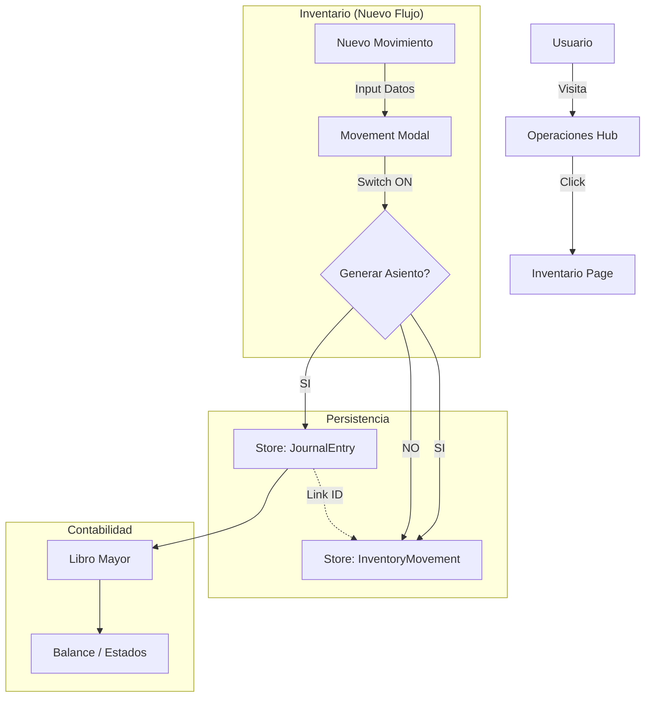

# Auditoría y Diagnóstico: Hub de Operaciones e Inventario

**Fecha:** 28 Enero 2026  
**Autor:** Antigravity Agent (Staff Engineer Role)  
**Objetivo:** Diagnóstico de brecha entre implementación actual y prototipos `Operaciones.html` / `Inventario.html`.

## 1. Resumen Ejecutivo
El repositorio cuenta con una implementación parcial del módulo de Inventario (`InventarioPage.tsx`) que soporta la carga de productos y movimientos físicos (unidades), así como un cálculo de Cierre por diferencia (CMV). Sin embargo, **existen brechas críticas** para alcanzar la funcionalidad de los prototipos:
1.  **Falta el Hub de Operaciones:** No existe la página principal ("Hub") ni su routing.
2.  **Inventario sin importes:** El modelo de datos `InventoryMovement` SOLO maneja cantidades (`quantity`). No existe campo para costo unitario ni precio total, lo que hace imposible generar asientos contables automáticos o valuar el stock en tiempo real (PPP/PEPS).
3.  **Sin conexión al Diario:** No hay lógica que vincule un movimiento de stock con un asiento (`JournalEntry`).
4.  **UX incompleta:** Faltan las pestañas "Dashboard" y "Conciliación" del prototipo de Inventario.

**Riesgo Principal:** La falta de valores monetarios en `InventoryMovement` requiere una migración de datos o borrado de la base local (Dexie) actual para agregar campos obligatorios (`unitCost`, `totalPrice`).

---

## 2. Mapa de Arquitectura Actual (Fase 1 y 2)

### Navegación y Estructura
| Componente | Path Actual | Estado |
| :--- | :--- | :--- |
| **Router** | `src/App.tsx` | Define `/` como `Dashboard` genérico. Falta `/operaciones`. |
| **Sidebar** | `src/ui/Layout/Sidebar.tsx` | Tiene "Planillas/Inventario". Falta item nivel raíz "Operaciones". |
| **Inventario** | `src/pages/Planillas/InventarioPage.tsx` | Implementado parcialmente (Tabs: Movimientos, Cierre, Config). |
| **Layout** | `src/ui/Layout/MainLayout.tsx` | Estándar. Reutilizable para el Hub. |

### Modelos de Datos (Core & Storage)
| Entidad | Archivo / Definición | Hallazgo Crítico |
| :--- | :--- | :--- |
| **JournalEntry** | `src/core/models.ts` | Modelo contable completo y correcto. |
| **InventoryProduct** | `src/core/inventario/types.ts` | Correcto (`sku`, `description`, `unit`). |
| **InventoryMovement** | `src/core/inventario/types.ts` | **INCOMPLETO**. Solo tiene `quantity`. Faltan `unitCost`, `currency`, `journalEntryId`. |
| **Persistence** | `src/storage/db.ts` | Usa Dexie (IndexedDB). `inventoryMovements` almacena los datos. |

---

## 3. Diagnóstico: Por qué el Inventario actual "No Sirve" (Fase 3)

### A. Modelo de Datos Insuficiente
**Evidencia:** `src/core/inventario/types.ts` (líneas 46-54).
```typescript
export interface InventoryMovement {
    id: string; ... quantity: number; ... // FALTA PRECIO
}
```
**Impacto:** El prototipo muestra "Costo Unit." y "Total" en la tabla de movimientos y en el modal. El código actual no tiene dónde guardar esa información. Sin precio, no hay asiento contable posible.

### B. Falta de Generación de Asientos
**Evidencia:** `src/pages/Planillas/InventarioPage.tsx` (fn `handleSaveMovement`).
El código llama a `createMovement` pero ignora totalmente la creación del `JournalEntry`. El modal (`MovementModal`) no tiene el switch "Generar asiento contable" ni los inputs de importes.

### C. UI/UX Divergente
- **Faltan Tabs:** El prototipo tiene 5 tabs (Dashboard, Productos, Movimientos, Conciliación, Cierre). El código tiene 3 (Movimientos, Cierre, Config).
- **Dashboard:** No existe la vista de KPIs de stock (`view-dashboard` en HTML).
- **Conciliación:** No existe la lógica de matcheo (`view-conciliacion` en HTML).

---

## 4. Plan de Implementación (Fase 4)

Propuesta de ejecución en fases para no romper la funcionalidad existente ("Cierre por diferencias" que hoy funciona).

### Fase A: Elevación del Modelo de Datos (Data Layer)
*Objetivo: Soportar dinero en el inventario.*
1.  **Modificar `InventoryMovement` (Type):** Agregar `unitCost` (number), `totalPrice` (number), `journalEntryId` (string, optional).
2.  **Migración DB:** Actualizar esquema de Dexie en `src/storage/db.ts` (incrementar versión) o script de limpieza si es aceptable (dev environment).

### Fase B: Interfaz de Movimientos y Conexión Contable
*Objetivo: Paridad con el prototipo de carga.*
1.  **Actualizar `MovementModal`:**
    - Agregar inputs: Costo Unitario, Cuenta Contrapartida (Select de `accounts`).
    - Agregar Switch: "Generar asiento".
    - Agregar lógica de previsualización de asiento (calculadora de IVA simple por ahora).
2.  **Lógica de Guardado (`InventarioPage.tsx`):**
    - Dentro de `handleSaveMovement`, si el switch está on:
        - Crear objeto `JournalEntry` (Debe: Mercaderías/Costo, Haber: Proveedores/Caja).
        - Guardar asiento con `createEntry`.
        - Guardar movimiento con `journalEntryId` vinculado.

### Fase C: Hub de Operaciones y Navegación
*Objetivo: Nueva Home.*
1.  **Crear `src/pages/OperacionesHub.tsx`:** Copiar estructura de `Operaciones.html`.
    - Conectar KPIs a `useIndicatorsMetrics` (o crear nuevos hooks de lectura rápida).
    - Links a componentes existentes.
2.  **Actualizar `routes` (`App.tsx`):** Agregar ruta `/operaciones`.
3.  **Actualizar `Sidebar`:** Mover "Operaciones" arriba.

### Fase D: Dashboard y Conciliación (Nice to have)
1.  **Implementar `InventoryDashboard`:** Componente de solo lectura con gráficas/stats.
2.  **Lógica de Conciliación:**
    - Comparar sumas de `JournalEntry` (filtro por cuenta Mercaderías) vs Suma de `InventoryMovement` (valorizados).
    - Mostrar diferencias en UI.

---

## 5. Tabla de Archivos a Tocar

| Archivo | Acción | Propósito | Riesgo |
| :--- | :--- | :--- | :--- |
| `src/core/inventario/types.ts` | EDIT | Agregar campos de precio y link a asiento. | Alto (Rompe build si no se migra todo). |
| `src/pages/Planillas/InventarioPage.tsx` | EDIT | Agregar campos en Modal y lógica de asiento. | Medio. |
| `src/App.tsx` | EDIT | Agregar ruta `/operaciones`. | Bajo. |
| `src/ui/Layout/Sidebar.tsx` | EDIT | Agregar link Operaciones. | Bajo. |
| `src/pages/OperacionesHub.tsx` | **NEW** | Nueva página principal. | Bajo. |
| `src/storage/db.ts` | EDIT | (Opcional) Migración de esquema si se requiere. | Alto. |

---

## 6. Denylist (NO TOCAR)
Para mantener la integridad del sistema actual:
1.  **No modificar `src/core/ledger.ts`**: La lógica del mayor parece sólida.
2.  **No modificar `src/core/cierre-valuacion/`**: Módulo separado, no interferir.
3.  **No cambiar estilos globales (`index.css`)**: Usar clases utilitarias de Tailwind o estilos locales.

## 7. Diagrama de Flujo Propuesto (Interconexión)



## CHECKPOINT (para AI_HANDOFF.md)
*Copiar y pegar este bloque en docs/AI_HANDOFF.md*

```markdown
# Audit: Operaciones & Inventario
- **Estado:** Diagnóstico completo. Código actual soporta inventario físico pero carece de valuación monetaria y conexión contable.
- **Bloqueantes:** El modelo `InventoryMovement` debe actualizarse para incluir costos/precios antes de implementar la generación de asientos.
- **Plan:** Ejecutar refactor de tipos -> Actualizar Modal -> Crear Hub Operaciones.
- **Referencia:** Ver `docs/audits/operaciones-inventario-audit.md` para detalle técnico.
```
